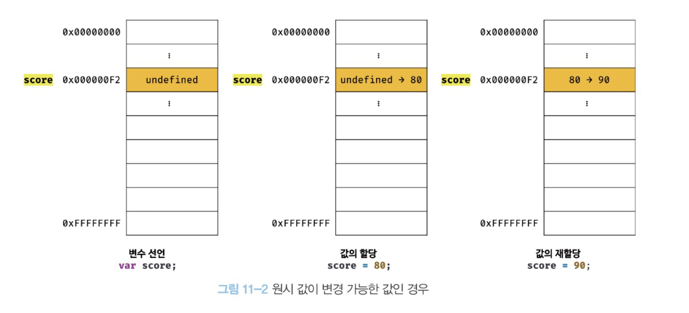
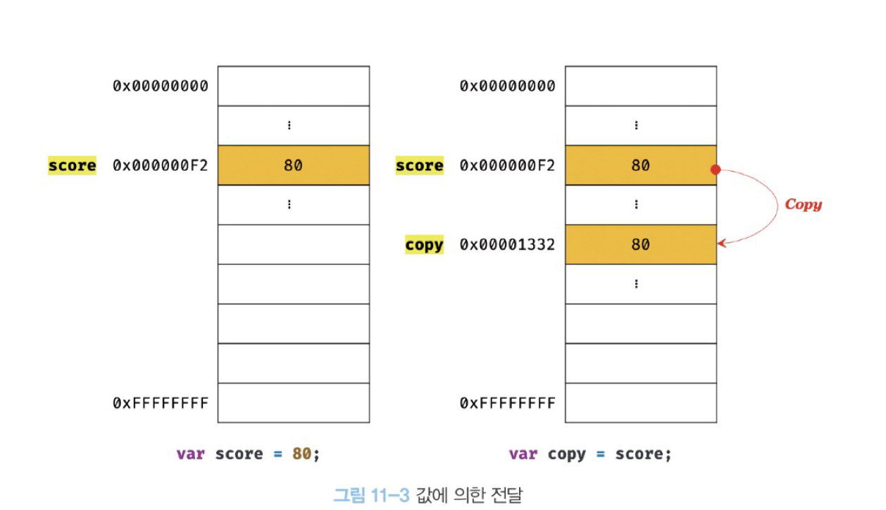
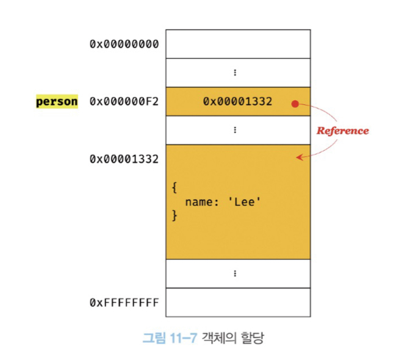
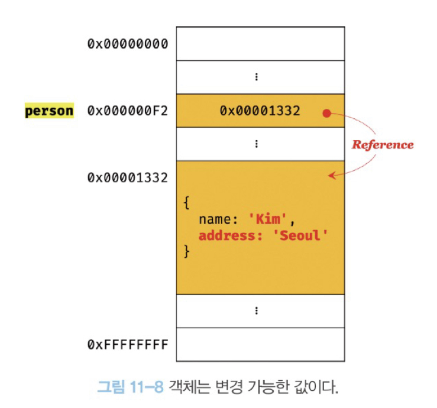

# 11장 원시 값과 객체의 비교

|             | **원시타입**                  | **객체타입**                        |
| ----------- | ----------------------------- | ----------------------------------- |
| 값 변경여부 | 변경 불가능                   | 변경 가능                           |
| 저장되는 값 | 실제 값 저장                  | 참조 값 저장                        |
| 전달방식    | 값에 의한 전달(Pass by Value) | 참조에 의한 전달(Pass by Reference) |

<br>

## 11.1 원시 값

### 11.1.1 변경 불가능한 값

- "변경이 불가능하다"는 표현은 **메모리 영역에서의 값 변경이 불가능**하다는 뜻이다.
- 원시값을 할당한 변수는 재할당 이외의 변수 값을 변경할 수 있는 방법이 없다.
- (주의❗️)"메모리 상의 값 자체의 변경"과 "재할당을 통한 변수 값의 변경"을 구별하자!
  - "메모리 상의 값의 변경"이란 한 메모리 공간에 있는 값이 바뀌는 것을 말한다.
  - "재할당을 통한 변수의 값은 변경"이란 새로운 메모리 공간에 값을 저장하고 변수에 새로운 메모리 주소로 매칭시킨다.

<br>
다음 코드가 메모리 상에서 어떻게 동작하는지 살펴보자.

```javascript
var score = 80;
score = 90;
```

- 만약 원시값이 변경 가능했다면 메모리상에서는 아래와 같이 동작할 것이다.

  

- 하지만 원시값은 변경 불가능(immutable)하다. 변수 값을 변경하려면 새로운 값을 재할당한다. 새로운 메모리 공간을 확보하고 값을 저장 후에 변수가 참조하던 메모리 공간의 주소를 변경한다.
  

<br>

### 11.1.2 문자열과 불변성

- 자바스크립트에서 문자열은 원시값이다. (다른 언어에서는 아예 문자열 타입이 존재하지 않거나 배열 또는 객체로 처리한다.)
- 자바스크립트 문자열은 유사 배열 객체이면서 이터러블이므로 각 문자에 접근할수 있다.
  ```javascript
  var str = 'string';
  str[0] = 'S'; // 이미 생성된 문자열의 일부 문자를 변경해도 반영되지 않는다.
  console.log(str); // 'string'
  ```
- 문자열이 생성된 이후에는 변경할 수 없다. 이는 예기치 못한 변경으로부터 자유롭고 데이터의 신뢰성을 보장하는 장점을 지닌다.

<br>

### 11.1.3 값에 의한 전달

- 원시값을 갖는 변수를 새로운 변수에 할당하면 원시값이 복사되어 전달된다.
  

- 두 변수의 원시 값은 서로 다른 메모리 공간에 저장된 별개의 값이 되어 어느 한쪽에서 재할당을 통해 **값을 변경하더라도 서로 간섭할 수 없다**.

  ```javascript
  var score = 80;

  // 변수 score와 변수 copy의 값은 다른 메모리 공간에 저장된 별개의 값이다.
  var copy = score;

  // 따라서 변수 score의 값을 변경하여도 변수 copy의 값에는 어떠한 영향도 주지 않는다.
  score = 100;
  console.log(score, copy); // 100  80
  console.log(score === copy); // false
  ```

---

## 11.2 객체

- 객체와 원시 값은 다른 방식으로 동작한다.
- 객체는 프로퍼티 개수가 정해져 있지 않고, 동적으로 추가되고 삭제할 수 있다. 프로퍼티 값에도 제약이 없다.
- 따라서, 객체는 원시 값처럼 확보해야 할 메모리 공간의 크기를 사전에 정해 둘 수 없다.

### 11.2.1 변경 가능한 값

- 객체를 할당한 변수에는 객체가 실제로 저장된 메모리 공간의 주소가 저장되어 있다. 이를 **참조 값**이라고 한다. 그리고 참조 값을 통해 실제 객체에 접근한다.

  ```javascript
  var person = {
    name: 'Lee';
  }
  ```

  

- 객체를 할당한 변수는 재할당 없이 객체를 직접 변경할 수 있다. 즉, 재할당 없이 프로퍼티를 동적으로 추가, 갱신, 삭제할 수 있다.

  ```javascript
  person.name = 'Kim';
  person.address = 'Seoul';
  ```

  

### 11.2.2 참조에 의한 전달

- 객체를 가리키는 변수에 새로운 변수를 할당하면 원본의 **참조값**이 복사되어 전달된다.
- 두 변수의 메모리 주소는 다르지만 메모리 공간에 저장되어 있는 참조값(객체의 메모리 주소)은 같다. 두 개의 식별자가 하나의 객체를 공유하고 있다.
- 따라서 어느 한쪽에서 객체를 변경(새로운 객체를 재할당 하는 것이 아니라 프로퍼티 값 변경, 추가, 삭제)하면 서로 영향을 주고 받는다.

```javascript
var person = {
  name: 'Joo',
};

var copy = person;
console.log(copy === person); // true -> 둘 다 동일한 객체를 가리킴

copy.name = 'Kim';
person.address = 'Seoul';

console.log(person); // { name: 'Kim', address: 'Seoul'}
console.log(copy); // { name: 'Kim', address: 'Seoul'}
```

- "값에 의한 전달"과 "참조에 의한 전달"은 **식별자가 기억하는 메모리 공간에 저장되어 있는 값**을 복사하여 전달한다는 면에서 동일하다. 그 값이 원시 값이냐 참조 값이냐의 차이만 있을 뿐이다. 그런 의미에서 본다면 자바스크립트에는 "값에 의한 전달"만 존재한다고 말할 수 있다.
- 자바스크립트에는 이 같은 동작 방식을 설명하는 정확한 용어가 존재하지 않는다. 이러한 이유로 "공유에 의한 전달"이라고 표현하는 경우도 있지만 이 용어 또한 공식적인 용어가 아니며 자바스크립트 동작 방식을 정확히 설명하지 못한다.
- 이 책에서는 **전달 되는 값의 종류가 원시값인지 참조값인지 구별해서 강조하는 의미**로 "값에 의한 전달"과 "참조에 의한 전달"로 부르기로 한다.
- 포인터가 존재하는 언어와 자바스크립트에서의 "참조에 의한 전달"은 다르게 동작한다.
  <br>

---

### 얕은 복사와 깊은 복사

**객체가 중첩인 경우**

- 얕은 복사: 객체를 프로퍼티로 값으로 갖는 객체의 경우 얕은 복사는 한 단계까지만 복사하는 것을 말한다.
- 깊은 복사: 객체에 중첩되어 있는 객체까지 모두 복사한다.

```javascript
const o = { x: { y: 1 } };

// 얕은 복사
const copy1 = { ...o };
console.log(copy1 === o); // false
console.log(copy1.x === o.x); // true

// 깊은 복사
const _ = require('lodash');
const copy2 = _.cloneDeep(o);
console.log(copy2 === o); // false
console.log(copy2.x === o.x); // false
```

**다른 변수에 값을 할당하는 경우**

- 얕은 복사: 원시값을 할당
- 깊은 복사: 객체를 복사
