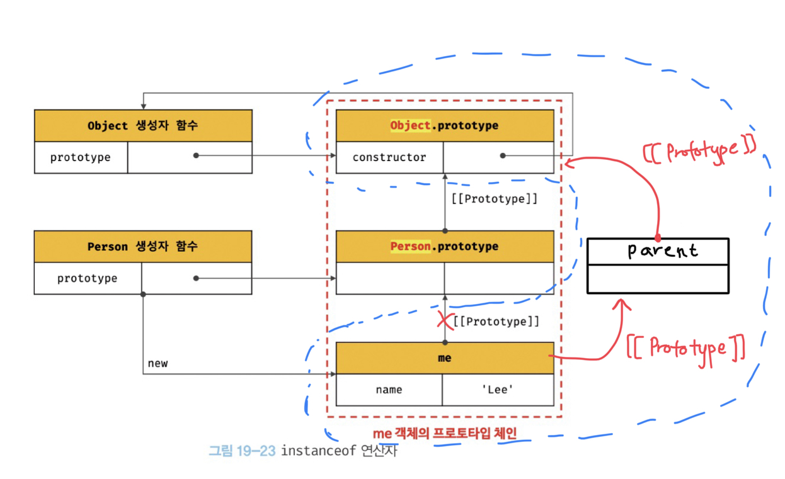
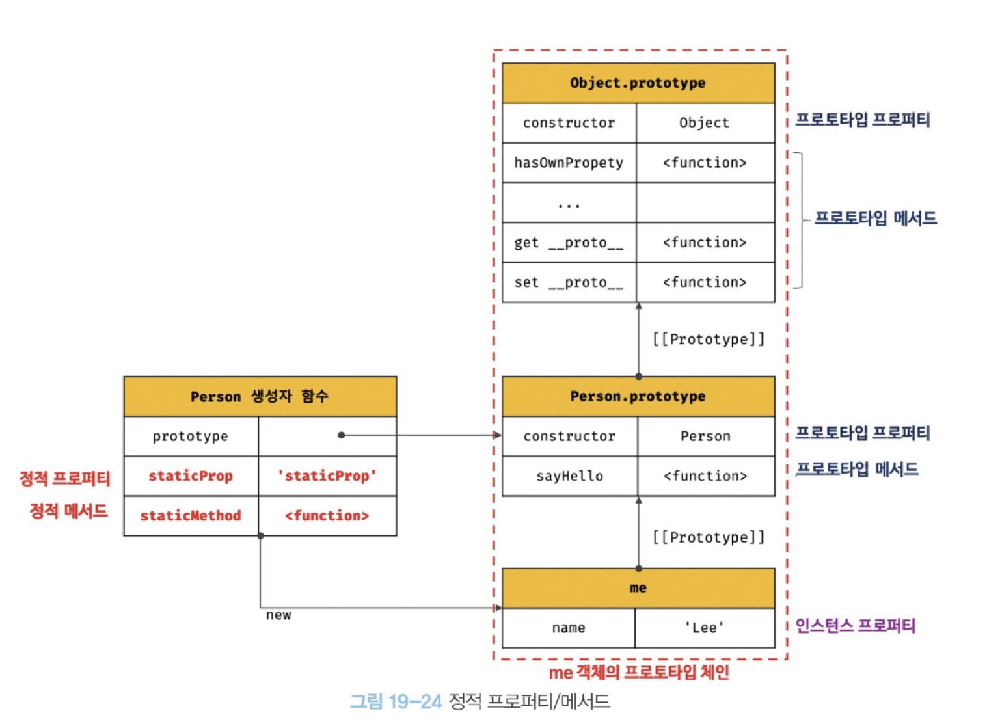

# 19장 프로토타입

## 19.1 객체지향 프로그래밍

- 추상화 : 다양한 속성 중에서 프로그램에 필요한 속성만 간추려 내어 표현하는 것.
- 객체 : 속성을 통해 여러 개의 값을 하나의 단위로 구성한 복합적인 자료구조(상태 데이터와 동작을 하나의 논리적인 단위로 묶음)
- 객체의 집합으로 프로그램을 표현하려는 프로그래밍 패러다임

```jsx
const circle = {
  radius: 5,
  //원의 지름
  getDiameter() {
    return 2 * this.radius;
  },
  //원의 둘레
  getPerimeter() {
    return 2 * Math.PI * this.radius;
  },
  //원의 넓이
  getArea() {
    return Math.PI * this.radius ** 2;
  },
};

console.log(circle);
//{radius: 5, getDiameter: ƒ, getPerimeter: ƒ, getArea: ƒ}getArea: ƒ getArea()getDiameter: ƒ getDiameter()getPerimeter: ƒ getPerimeter()radius: 5[[Prototype]]: Object
console.log(circle.getDiameter()); //10
console.log(circle.getPerimeter()); //31.41592653589793
console.log(circle.getArea()); //78.53981633974483
```

## 19.2 상속과 프로토타입

- 상속 : 어떤 객체의 프로퍼티 또는 메서드를 다른 객체가 상속받아 그대로 사용할 수 있는 것.(객체지향 프로그래밍의 핵심 개념)
- 자바스크립트는 프로토타입을 기반으로 상속을 구현하여 불필요한 중복을 제거한다.
- 상속은 코드의 재사용이란 관점에서 매우 유용하다.

```jsx
function Circle(radius) {
  this.radius = radius;
  this.getArea = function () {
    return Math.PI * this.radius ** 2;
  };
}

const circle1 = new Circle(1);
const circle2 = new Circle(2);

//Circle 생성자함수는 인스턴스를 생성할 때마다 getArea 메서드를 중복 생성하고
//모든 인스턴스가 중복 소유하게 된다. 이는 메모리 낭비다.

//프로토타입 상속
function Circle(radius) {
  this.radius = radius;
}

//프로토타입에 getArea 메서드를 추가한다.
Circle.prototype.getArea = function () {
  return Math.PI * this.radius ** 2;
};

//Circle 생성자 함수가 생성한 모든 인스턴스는
//부모 객체의 역할을 하는 프로토타입 Circle.prototype으로부터
//getArea메서드를 상속받는다.
//즉 Circle 생성자 함수가 생성하는 모든 인스턴스는 하나의 getArea 메서드를 공유한다.
const circle1 = new Circle(1);
const circle2 = new Circle(10);

console.log(circle1);
console.log(circle1.getArea());
//자신의 상태를 나타내는 radius 프로퍼티만 개별적으로 소유하고
//내용이 동일한 메서드는 상속을 통해 공유하여 사용하는 것
```

## 19.3 프로토타입 객체

- 프로토타입(프로토타입 객체)이란 어떤 객체의 부모 객체 역할을 하며 그 자식 객체에게 공유 프로퍼티(메서드 포함)를 제공한다.
- 모든 객체는 [[Prototype]]이라는 내부 슬롯을 가지며 여기에 저장되는 프로토타입은 객체 생성방식에 의해 결정된다.
- 즉, 객체가 생성될 때 객체 생성 방식에 따라 프로토타입이 결정되고 [[Prototype]]에 저장된다.
- 모든객체는 하나의 프로토타입을 갖고 생성자 함수와 열결되어 있다.
<p align="center">

- `__proto__` 접근자 프로퍼티를 통해 자신의 프로토타입에 간접적으로 접근할 수 있다.
- 프로토타입은 자신의 constructor 프로퍼티를 통해 생성자 함수에 접근할 수 있고
- 생성자 함수는 자신의 prototype 프로퍼티를 통해 프로토타입에 접근할 수 있다.

## 19.3.1 `__proto__` 접근자 프로퍼티

- 모든 객체는 `__proto__` 접근자 프로퍼티를 통해 자신의 프로토타입에 간접적으로 접근할 수 있다.

```jsx
const person = { name: 'Lee' };

console.log(person);
console.log(person.__proto__);
```

<p align="center">

- `__proto__` 는 접근자 프로퍼티다.

자체적으로 값[[Value]]를 갖지 않고 다른 데이터 프로퍼티의 값을 읽거나 저장할 때 사용하는 접근자 함수, 즉 [[Get]], [[Set]] 프로퍼티 어트리뷰트로 구성된 프로퍼티다.

`__proto__` 접근자 프로퍼티를 통해 프로토타입에 접근하면 내부적으로 `__proto__` 접근자 프로처티의 getter함수인 get `__proto__` 가 호출된다.

```jsx
console.log(Object.getOwnPropertyDescriptor(Object.prototype, '__proto__'));

//{enumerable: false, configurable: true, get: ƒ, set: ƒ}
//configurable: true
//enumerable: false
//get: ƒ __proto__()
//set: ƒ __proto__()
//[[Prototype]]: Object
```

- `__proto__` 접근자 프로퍼티는 상속을 통해 사용된다.

`__proto__` 접근자 프로퍼티는 객체 자체가 소유하고 있는게 아님.

모든 객체의 부모인 Object.prototype에 있는 Object.prototype.`__proto__` 이 접근자 프로퍼티를 상속받아서 사용할 수 있는 것이다.

```jsx
const person = { name: 'Lee' };
console.log(person.hasOwnProperty('__proto__')); //false

console.log(person.__proto__ === Object.prototype); //true
```

- `__proto__` 접근자 프로퍼티를 통해 프로토타입에 접근하는 이유

상호 참조에 의해 프로토타입 체인이 생성되는 것을 방지하기 위해서다.

```jsx
const parent = {};
const child = {};

child.__proto__ = parent;
parent.__proto__ = child;
//Uncaught TypeError:
//서로가 자신의 프로토타입이 되는 비정상적인 프로토타입 체인이 만들어진다.
```

- `__proto__`접근자 프로퍼티를 코드 내에서 직접 사용하는 것은 권장하지 않는다.

모든 객체가 `__proto__` 접근자 프로퍼티를 사용할 수 있는 것은 아니기 때문.

참조를 취득, 교체하고 싶은 경우 Object.getPrototypeOf/Object.setPrototypeOf 메서드 사용을 권장.

## 19.3.2 함수 객체의 prototype 프로퍼티

- 함수 객체만이 소유하는 prototype 프로퍼티는 생성자 함수가 생성할 인스턴스의 프로토타입을 가리킨다.
- 생성자 함수로서 호출할 수 없는 함수, non-constructor 인 화살표 함수와 ES6 메서드 축약 표현으로 정의한 메서드는 prototype 프로퍼티를 소유하지 않으며 프로토타입도 생성하지 않는다.

<p align="center">

```jsx
//생성자 함수
function Person(name) {
  this.name = name;
}

const me = new Person('Lee');

console.log(Person.prototype);
console.log(me.__proto__);
console.log(Person.prototype.constructor);
```

<p align="center">

## 19.3.3 프로토타입의 constructor 프로퍼티와 생성자 함수

- 모든 프로토타입은 constructor 프로퍼티를 갖는데 이는 자신을 참조하고 있는 생성자 함수를 가리킨다.

```jsx
//생성자 함수
function Person(name) {
  this.name = name;
}

const me = new Person('Lee');

console.log(me.constructor === Person); //true
```

## 19.4 리터럴 표기법에 의해 생성된 객체의 생성자 함수와 프로토타입

- 생성자 함수에 의해 생성된 인스턴스의 프로토타입의 constructor 프로퍼티에 의해 생성자 함수와 연결된다.

```jsx
//obj 객체를 생성한 생성자 함수는 Object
const obj = new Object();
console.log(obj.constructor === Object); //true

//add 함수 객체를 생성한 생성자 함수는 Function
const add = new Function('a', 'b', 'return a+b');
console.log(add.constructor === Function); //true

//생성자 함수
function Person(name) {
  this.name = name;
}
const me = new Person('Lee');
console.log(me.constructor === Person); //true
```

❓ 프로토타입은 이렇게 생성자 함수와 항상 연결되어야 하는데

생성자 함수를 만들지 않고 객체를 생성하는 리터럴 표기법에서는 어떻게 되는가?

```jsx
//객체 리터럴
const obj = [];

//함수 리터럴
const add = function(a,b){return a+b};
//배열 리터럴
const arr = [1,2,3];

//정규 표현식 리터럴
const regexp = \is/ig;
```

```jsx
const obj = {};
console.log(obj.constructor === Object); //true

function foo() {}
console.log(foo.constructor === Function); //true
```

객체 리터럴에 의해 생성된 객체는 사실 Object 생성자 함수로 생성되는 것은 아닐까?

추상 연산 OrdinaryObjectCreate를 호출하여 Object.prototype을 프로토타입으로 갖는 빈 객체를 생성한다.

<p align="center">

→ 객체 리터럴에 의해 생성된 객체는 Object 생성자 함수가 생성한 객체가 아니라 가상적인 생성자 함수를 갖는다고 볼 수 있다.

- 프로토타입은 생성자 함수와 더불어 생성되며 prototype, constructor 프로퍼티에 의해 연결되어 있기 때문.
- 프로토타입과 생성자 함수는 단독으로 존재할 수 없고 언제나 쌍으로 존재한다.

- 리터럴 표기법에 의해 생성된 객체의 생성자 함수와 프로토타입

| 리터럴 표기법      | 생성자 함수 | 프로토타입         |
| ------------------ | ----------- | ------------------ |
| 객체 리터럴        | Object      | Object.prototype   |
| 함수 리터럴        | Function    | Function.prototype |
| 배열 리터럴        | Array       | Array.prototype    |
| 정규 표현식 리터럴 | RegExp      | RegExp.prototype   |

리터럴 표기법으로 생성된 객체와 생성자 함수로 생성된 객체는 생성과정에 미묘한 차이만 있을 뿐 동일한 특성을 가진다.

## 19.5 프로토타입의 생성 시점

- 프로토타입은 생성자 함수가 생성되는 시점에 더불어 생성된다.
  - 프로토타입과 생성자 함수는 단독으로 존재할 수 없고 언제나 쌍으로 존재하기 때문이다.
- 사용자가 직접 정의한 사용자 정의 생성자 함수와 자바스크립트가 기본 제공하는 빌트인 생성자 함수는 생성 시점이 다르다.

### 19.5.1 사용자 정의 생성자 함수와 프로토타입 생성 시점

- 자신이 평가되어 함수 객체로 생성되는 시점에 프로토타입도 더불어 생성된다.

### 19.5.2 빌트인 생성자 함수와 프로토타입 생성 시점

- Object, String, Number, Function, Array, RegExp, Date, Promise 도 빌트인 생성자 함수가 생성되는 시점에 프로토타입이 생성된다.
- 모든 빌트인 생성자 함수는 전역 객체가 생성되는 시점에 생성된다.

## 19.6 객체 생성 방식과 프로토타입의 결정

- 객체 생성 방법
  1. 객체 리터럴
  2. Object 생성자 함수
  3. 생성자 함수
  4. Object.create메서드
  5. Class(ES6)

각 방식마다 세부적인 객체 생성방식의 차이는 있으나

### 19.6.1 객체 리터럴에 의해 생성된 객체의 프로토타입

- 객체 리터럴을 평가해 객체를 생성할 때 추상연산 OrdinaryObjectCreate를 호출한다.
- 이때 추상연산 OrdinaryObjectCreate 에 전달되는 프로토타입은 Object.prototype이다.
- 즉 객체 리터럴에 의해 생성되는 객체의 프로토타입은 Object.prototype이다.

```jsx
const obj = { x: 1 };

console.log(obj.constructor === Object); //true
console.log(obj.hasOwnProperty('x')); //true
```

### 19.6.2 Object 생성자 함수에 의해 생성된 객체의 프로토타입

### 19.6.3 생성자 함수에 의해 생성된 객체의 프로토타입

## 19.7 프로토타입 체인

- 자바스크립트는 객체의 프로퍼티에 접근하려고 할 때 해당 객체에 접근하려는 프로퍼티가 없다면 [[Prototype]] 내부 슬롯의 참조를 따라 자신의 부모 역할을 하는 프로토타입의 프로퍼티를 순차적으로 검색한다.
- 이를 프로토타입 체인이라하며 자바스크립트가 객체지향 프로그래밍의 상속을 구현하는 메커니즘이다.

```jsx
function Person(name) {
  this.name = name;
}

//프로토타입 메서드
Person.prototype.sayHello = function () {
  console.log(`hi my name is ${this.name}`);
};

const me = new Person('Lee');

console.log(me.hasOwnProperty('name')); //true
console.log(me.__proto__);
console.log(Person.prototype);
console.log(Object.prototype);
```

<p align="center">

## 19.8 오버라이딩과 프로퍼티 섀도잉

- 오버라이딩 : 상위 클래스가 가지고 있는 메서드를 하위 클래스가 재정의하여 사용하는 방식
- 프로퍼티 섀도잉 : 상속 관계에 의해 프로퍼티가 가려지는 현상

<p align="center">

```jsx
function Person(name) {
  this.name = name;
}

Person.prototype.sayHello = function () {
  console.log(`hi ${this.name}`);
};

const me = new Person('Lee');

//오버라이딩
me.sayHello = function () {
  console.log(`hey ${this.name}`);
};

me.sayHello();

console.log(me.sayHello);
//ƒ (){
//    console.log(`hey ${this.name}`);
//}

console.log(Person.prototype.sayHello);
//ƒ(){
//    console.log(`hi ${this.name}`);
//}
```

- 프로토타입 프로퍼티를 변경 또는 삭제하려면 프로토타입에 직접 접근해야 한다.

```jsx
Person.prototype.sayHello = function () {
  console.log(`hey ${this.name}`);
};
me.sayHello(); //hey Lee
```

## 19.9 프로토타입의 교체

- 프로토타입 교체를 통해 객체 간의 상속 관계를 동적으로 변경하는 꽤나 번거롭기 때문에 직접 교체하지 않는 것이 좋다.
- 상속 관계를 인위적으로 설정하려면 직접 상속, Class를 사용해 구현하면 더 편리하고 안전하다.

### 19.9.1 생성자 함수에 의한 프로토타입의 교체

```jsx
const Person = function () {
  function Person(name) {
    this.name = name;
  }

  //생성자 함수의 prototype 프로퍼티를 통해 프로토타입을 교체
  Person.prototype = {
    //아래 constructor 프로퍼티를 추가하지 않으면
    //constructor 프로퍼티와 생성자 함수간의 연결이 파괴된다.
    constructor: Person,
    sayHello() {
      console.log(`Hi! my name is ${this.name}`);
    },
  };
  return Person;
};
const me = new Person('Lee');
```

### 19.9.2 인스턴스에 의한 프로토타입의 교체

```jsx
function Person(name) {
  this.name = name;
}

const me = new Person('Lee');

//프로토타입으로 교체할 객체
const parent = {
  constructor: Person,
  sayHello() {
    console.log(`Hi! my name is ${this.name}`);
  },
};

Person.prototype = parent;

Object.setPrototypeOf(me, parent);

me.sayHello();
```

## 19.10 `instanceof` 연산자

- 문법
  ```javascript
  객체 instanceof 생성자함수;
  ```
- 우변의 생성자 함수의 prototype에 바인딩된 객체가 좌변의 객체의 프로토타입 체인 상에 존재하면 `true`로 평가되고, 아니면 `false`로 평가된다.

```javascript
// 생성자 함수
function Person(name) {
  this.name = name;
}

const me = new Person('Lee');

console.log(me instanceof Person); // true
console.log(me instanceof Object); // true

// 프로토타입으로 교체할 객체
const parent = {};

// 프로토타입의 교체
Object.setPrototypeOf(me, parent);

// me 객체는 Person 생성자 함수에 의해 생성된 인스턴스이다.
// 그러나 instanceof 연산자는 false를 반환한다.
console.log(me instanceof Person); // false
// instanceof 연산자는 상속 관계를 고려한다.
// me 객체는 Object.prototype을 상속받기 때문에 아래의 코드는 true로 평가된다.
console.log(me instanceof Object); // true
```



<br>

## 19.11 직접 상속

### 19.11.1 `Object.create`에 의한 상속

- 명시적으로 프로토타입을 지정하여 새로운 객체를 생성한다.

```javascript
Object.create(prototype[, propertiesObject])
```

- 매개변수
  - 첫번째: 생성할 객체에 프로토타입으로 지정할 객체
  - 두번째(옵션): 생성할 객체의 프로퍼티를 갖는 객체
- 장점:
  - `new` 연산자 없이 객체 생성 가능
  - 프로토타입을 지정하면서 객체 생성 (생성자 함수와 프로토타입 간의 링크 파괴 X)
  - 객체 리터럴에 의해 생성된 객체도 특정 객체를 상속 받을 수 있음
- 단점:
  - 두 번째 인자로 프로퍼티를 정의하는 것은 번거롭다.
  - 객체를 생성한 이후 프로퍼티를 추가하는 방법이 있으나 깔끔한 방법은 아니다.

```javascript
// 프로토타입이 null인 객체를 생성한다.
// 즉, 생성된 객체는 프로토타입 체인의 종점이므로 프로토타입 체인이 생성되지 않는다.
// obj → null
let obj = Object.create(null);

// obj = {};와 동일하다.
// obj → Object.prototype → null
obj = Object.create(Object.prototype);

// obj = { x: 1 };와 거의 동일
// Object.create의 두번째 매개변수로 보낼경우
// obj → Object.prototype → null
obj = Object.create(Object.prototype, {
  x: { value: 1 }, // value만 설정해주어서 writable, enumerable, configurable 자동으로 false(Object.defineProperty)
});
obj.x = 100;
console.log(obj.x); // 1 (writable: false)

// 위 코드는 아래와 거의 동일
// obj = Object.create(Object.prototype);
// obj.x = 1; 프로퍼티 동적으로 추가할경우 writable, enumerable, configurable 다 true
console.log(obj.x); // 1
console.log(Object.getPrototypeOf(obj) === Object.prototype); // true

const myProto = { x: 10 };
// 객체를 직접 상속받는다.
// obj → myProto → Object.prototype → null
obj = Object.create(myProto);

// 생성자 함수
function Person(name) {
  this.name = name;
}

// obj = new Person('Lee')와 동일하다.
// obj → Person.prototype → Object.prototype → null
obj = Object.create(Person.prototype);
obj.name = 'Lee';
console.log(obj.name); // Lee
console.log(Object.getPrototypeOf(obj) === Person.prototype); // true
```

### 19.11.2 객체 리터럴 내부에서 `__proto__`에 의한 직접 상속

- ES6에서는 객체 리터털 내부에서 `__proto__` 접근자 프로퍼티를 사용하여 직접 상속 구현할 수 있다.

```javascript
const myProto = { x: 10 };

const obj = {
  y: 20,
  // obj → myProto → Object.prototype → null
  __proto__: myProto,
};
/* 위 코드는 아래와 동일하다.
const obj = Object.create(myProto, {
  y: { value: 20, writable: true, enumerable: true, configurable: true }
});
*/
console.log(obj.x, obj.y); // 10 20
console.log(Object.getPrototypeOf(obj) === myProto); // true
```

## 19.12 정적 프로퍼티/메서드

- 정적 프로퍼티/메서드란 생성자 함수로 인스턴스를 생성하지 않아도 참조/호출할 수 있는 프로퍼티/메소드이다.
- 인스턴스로 접근 불가능하다. 시도할 경우 TypeError가 발생한다.

```javascript
function Person(name) {
  this.name = name;
}

Person.prototype.sayHello = function () {
  console.log(`Hi! My name is ${this.name}`);
};

// 정적 프로퍼티
Person.staticProp = 'static prop';
// 정적 메소드
Person.staticMethod = function () {
  console.log('staticMethod');
};

const me = new Person('Lee');

Person.staticMethod(); // staticMethod

me.staticMethod(); // TypeError: me.staticMethod is not a function
```



- 예시
  - `Object.create()`
    - `Object` 생성자 함수의 정적 메소드
    - `Object` 생성자 함수를 통해 만든 객체가 호출 불가능
  - `Object.prototype.hasOwnProperty`:
    - `Object.prototype`의 프로토타입 메소드
    - 모든 객체 호출 가능(모든 객체의 프로토타입 종점은 `Object.prototype`)
  - prototype을 #로 표기하는 경우도 있다.

## 19.13 프로퍼티 존재 확인

### 19.13.1 `in` 연산자

- 객체 내에 특정 프로퍼티 존재 여부 확인한다.
- **상속받는 모든 프로토타입의 프로퍼티 확인한다.**

```javascript
const person = {
  name: 'Joo';
}

console.log('name' in person); // true
console.log('toString' in person); // true(Object.prototype의 메소드)

```

- ES6에서 도입된 `Reflect.has` 메서드는 `in` 연산자와 동일하게 동작한다.

### 19.13.2 `Object.prototype.hasOwnProperty` 메서드

- 특정 프로퍼티가 객체 고유의 프로퍼티인지 확인한다.

```javascript
const person = {
  name: 'Joo';
}

console.log(person.hasOwnProperty('name'));; // true
console.log(person.hasOwnProperty('toString')); // false
```

## 19.14 프로퍼티 열거

### 19.14.1 `for...in` 문

```
for (변수선언문 in 객체) { ... }
```

- 객체의 프로토타입 체인 상에 존재하는 모든 프로토타입 프로퍼티 중에서 프로퍼티 어트리뷰트 [[Enumerable]]의 값이 true인 프로퍼티를 순회하며 열거한다.

  ```javascript
  const person = {
    name: 'Joo',
    address: 'Seoul',
    __proto__: { age: 20 },
  };

  for (const key in person) {
    console.log(`${key}: ${person[key]}`);
  }
  // name: Joo
  // address: Seoul
  // age: 20
  ```

- 프로퍼티 키가 심벌인 프로퍼티는 열거하지 않는다.
- 프로퍼티를 열거할 때 순서를 보장하지 않는다. 하지만, 모던 브라우저들은 순서를 보장하고 숫자(사실은 문자열)인 프로퍼티 키에 대해서는 정렬을 실시한다.
- 배열도 객체이므로 프로퍼티와 상속받은 프로퍼티가 포함될 수 있다. 따라서, 일반적인 `for`문이나 `for...of`문, `forEach`메서드 사용을 권장한다.

### 19.14.2 `Object.keys/values/entries` 메서드

- 객체 자신의 고유 프로퍼티만 열거하지 위해서는 `for...in`문보다는 `Object.keys/values/entries` 메서드를 사용할 것을 권장한다.

- **`Object.keys`**

  - 열거 가능한 **프로퍼티 키**를 배열로 반환한다.

- **`Object.keys`(ES8~)**

  - 열거 가능한 **프로퍼티 값**을 배열로 반환한다.

- **`Object.keys`(ES8~)**
  - 열거 가능한 **프로퍼티 키와 값의 쌍의 배열**을 배열로 담아 반환한다.

<br>

```javascript
const sym = Symbol();

const person = {
  name: 'Joo',
  2: 2,
  hello: {
    world: 'true',
  },
  __proto__: { age: 20 },
  1: 1,
  [sym]: 10,
  3: 3,
};

console.log(Object.keys(person));
// [ '1', '2', '3', 'name', 'hello' ]

console.log(Object.values(person));
// [ 1, 2, 3, 'Joo', { world: 'true' } ]

console.log(Object.entries(person));
/*
[
  [ '1', 1 ],
  [ '2', 2 ],
  [ '3', 3 ],
  [ 'name', 'Joo' ],
  [ 'hello', { world: 'true' } ]
]
*/
```
