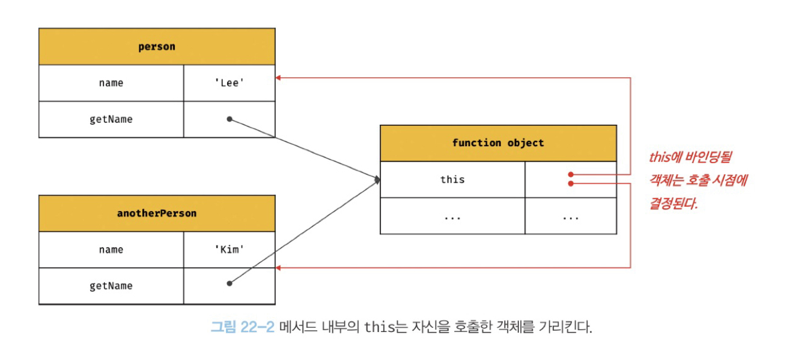

# `this`

## 22.1 `this` 키워드

- **객체**란 상태를 나타내는 프로퍼티와 동작을 나타내는 메서드를 하나의 논리적인 단위로 묶은 복합적인 자료구조이다.
  - 동작을 나타내는 메서드는 자신이 속한 객체의 상태(프로퍼티)를 참조하고 변경할 수 있어야 한다.
  - 즉, **자신이 속한 객체을 나타내는 식별자**가 필요하다.
  - 이를 위해, 자바스크립트는 `this`라는 특수한 식별자를 제공한다.
- `this`란 자신이 속한 객체 또는 자신이 생성할 인스턴스를 가리키는 자기 참조 변수이다.
- `this`는 코드 어디에서든 참조 가능하다.
- `this`가 가리키는 값, 즉 `this`바인딩(식별자와 값을 연결)은 함수 호출 방식에 의해 동적으로 결정된다.

<br>

---

## 22.2 함수 호출 방식과 `this` 바인딩

- `this` 바인딩은 함수 호출 방식에 따라 동적으로 결정된다.
- 함수 호출 방식
  1. 일반 함수 호출
  2. 메서드 호출
  3. 생성자 함수 호출
  4. `Function.prototype.apply/call/bind` 메서드에 의한 간접 호출

### 22.2.1 일반 함수 호출

- **전역객체**가 바인딩된다.
  - `this`는 객체의 프로퍼티나 메서드를 참조하기 위한 자기 참조 변수이므로 객체를 생성하지 않는 일반 함수에서 `this`는 의미가 없다. 따라서, 엄격 모드가 적용된 일반 함수 내부의 `this`에는 `undefined`가 바인딩된다.
  - 메소드 내에서 정의한 중첩 함수도 일반 함수로 호출되면 `this`에 전역객체 바인딩된다.
  - 콜백 함수 내부의 `this`에도 전역객체 바인딩된다.

```javascript
// 일반 함수 호출
function foo() {
  console.log(this); // window
  function bar() {
    console.log(this); // window
  }
  bar();
}
foo();
```

```javascript
// 메소드 내에서 정의한 중첩 함수를 일반 함수로 호출
var value = 1;

const obj = {
  value: 100,
  foo() {
    console.log("foo's this: ", this); // {value: 100, foo: f}
    console.log("foo's this.value: ", this.value); // 100

    // 메소드 내에서 정의한 중첩 함수
    function bar() {
      console.log("bar's this: ", this); // window
      console.log("bar's this.value: ", this.value); // 1
    }

    bar(); // 일반 함수 호출
  },
};

obj.foo(); // 메소드 호출
```

```javascript
// 콜백 함수 내부
function foo() {
  console.log(this); // window
  setTimeout(function () {
    // 콜백 함수 - 매개변수로 함수를 받음
    console.log(this); // window
  }, 100);
}
foo();
```

- 메서드 안의 중첩 함수 또는 콜백함수가 일반 함수로 호출될 때 `this`가 전역 객체를 바인딩하는 것은 문제가 있다. 이 함수들은 외부 함수를 돕는 헬퍼 함수의 역할을 한다. 하지만, 외부 함수인 메서드와 중첩함수/콜백함수의 `this`가 일치하지 않는다는 것은 헬퍼 함수로 동작하기 어렵게 만든다.
- 따라서, 외부 함수와 중첩함수/콜백함수의 `this` 바인딩을 일치시키기 위한 방법들은 다음과 같다.

  1. 메서드 내에서 `this`를 지역변수(`that`)에 할당

     ```javascript
     // 1. that
     var value = 1;

     const obj = {
       value: 100,
       foo() {
         // this 바인딩을 변수 that에 할당한다.
         const that = this;

         // 콜백 함수 내부에서 this 대신 that을 참조한다.
         setTimeout(function () {
           console.log(that.value); // 100
         }, 100);
       },
     };

     obj.foo();
     ```

  2. `Function.prototype.apply/call/bind` 메서드
     - 22.2.4에서 살펴보자.
  3. 화살표 함수

     ```javascript
     var value = 1;

     const obj = {
       value: 100,
       foo() {
         // 화살표 함수 내부의 this는 상위 스코프 this를 가리킨다.
         setTimeout(() => console.log(this.value), 100); // 100
       },
     };

     obj.foo();
     ```

  <br>

### 22.2.2 메소드 호출

- **메소드를 호출한 객체**(즉, 메소드 이름 앞의 마침표(.) 연산자 앞에 기술한 객체)가 바인딩된다.
- 소유한 객체가 아니라 **호출한 객체**에 바인딩 된다.
- 메서드는 프로퍼티에 바인딩된 함수이다. 함수는 곧 객체이다. 따라서, 메서드는 자신을 소유한 객체에 포함된 것이 아니라 독립적으로 존재하는 객체이다. 단지, 객체의 프로퍼티가 함수 객체를 가리키고 있을 뿐이다.



```javascript
const person = {
  name: 'Lee',
  getName() {
    return this.name;
  },
};

// 메서드 호출. 메소드를 호출한 객체는 person이다.
console.log(person.getName()); // Lee

// 새로운 객체를 생성한다.
const anotherPerson = {
  name: 'Kim',
};

// getName 메서드를 anotherPerson 객체의 메서드로 할당한다.
anotherPerson.getName = person.getName;

// 호출한 객체에 this가 바인딩된다
console.log(anotherPerson.getName()); // Kim
```

<br>

### 22.2.3 생성자 함수 호출

- **생성자 함수가 (미래에) 생성할 인스턴스**가 바인딩된다.

```javascript
// 생성자 함수
function Circle(radius) {
  // 생성자 함수 내부의 this는 생성자 함수가 생성할 인스턴스에 바인딩된다
  this.radius = radius;
  this.getDiameter = function () {
    return 2 * this.radius;
  };
}

// 인스턴스 생성
const circle1 = new Circle(5);
const circle2 = new Circle(10);

console.log(circle1.getDiameter()); // 10
console.log(circle2.getDiameter()); // 20
```

- `new` 연산자와 함께 생성자 함수를 호출하지 않으면 일반 함수로 동작한다.

```javascript
// new 연산자와 함께 호출하지 않아서 일반 함수로 동작한다.
const circle3 = Circle(15);

// 일반 함수로 호출된 Circle에 반환문이 없으므로 암묵적으로 undefined를 반환한다.
console.log(circle3); // undefined

// 일반 함수로 호출된 Circle 내부의 this는 전역 객체를 가리킨다.
console.log(radius); // 15
```

<br>

### 22.2.4 `apply/call/bind` 메소드에 의한 간접 호출

- `apply`, `call`, `bind` 메서드는 `Function.prototype`의 메서드이다. 즉, 이들 메서드는 모든 함수가 상속받아 사용할 수 있다.
- **`Function.prototype.apply`**, **`Function.prototype.call`**

  - `this`로 사용할 객체와 인수 리스트를 인수로 전달받아 함수를 호출한다.
  - 첫번째 인수로 전달한 특정 객체를 호출한 함수의 `this`에 바인딩한다.
  - 호출된 함수의 반환값을 return한다.

  ```javascript
  function getThisBinding() {
    console.log(arguments);
    return this;
  }

  // this로 사용할 객체
  const thisArg = { a: 1 };

  // 함수(getThisBinding)를 호출하면서 인수로 전달한 객체를 호출한 함수의 this에 바인딩한다.
  // apply 메소드는 호출할 함수의 인수를 배열로 묶어 전달한다.
  console.log(getThisBinding.apply(thisArg, [1, 2, 3]));
  // Arguments(3) [1, 2, 3, callee: ƒ, Symbol(Symbol.iterator): ƒ]
  // { a: 1 }

  // call 메소드는 호출할 함수의 인수를 쉼표로 구분한 리스트 형식으로 전달한다.
  console.log(getThisBinding.call(thisArg, 1, 2, 3));
  // Arguments(3) [1, 2, 3, callee: ƒ, Symbol(Symbol.iterator): ƒ]
  // { a: 1 }
  ```

- **`Function.prototype.bind`**

  - apply와 call 메소드와는 달리 함수를 호출하지 않고 `this`로 사용할 객체만을 전달한다.

  ```javascript
  function getThisBinding() {
    return this;
  }

  // this로 사용할 객체
  const thisArg = { a: 1 };

  // bind 메소드는 함수에 this로 사용할 객체를 전달한다.
  // bind 메소드는 함수를 호출하지는 않는다.
  console.log(getThisBinding.bind(thisArg)); // getThisBinding
  // bind 메소드는 함수를 호출하지는 않으므로 명시적으로 호출해야 한다.
  console.log(getThisBinding.bind(thisArg)()); // {a: 1}
  ```

  - `bind` 메서드는 위에서 살펴보았던 외부함수와 메서드 내의 중첩함수/콜백함수의 `this`가 불일치하는 문제를 해결하기 위해 유용하게 사용된다.

  ```javascript
  const person = {
    name: 'Joo',
    foo(callback) {
      // bind 메서드로 callback 함수 내부의 this 바인딩을 전달
      setTimeout(callback.bind(this), 100);
    },
  };

  person.foo(function () {
    console.log(`Hi! My name is ${this.name}`);
  });
  ```

<br>

---

👉 **정리**
|함수 호출 방식 | `this` 바인딩 |
| --------| -----|
|일반 함수 호출 | 전역 객체|
|메서드 호출 |메서드를 호출한 객체|
|생성자 함수 호출 |생성자 함수가 (미래에) 생성할 인스턴스|
|`apply/call/bind` 메서드에 의한 간접 호출 | `apply/call/bind` 메서드에 첫 번째 인수로 전달한 객체|
