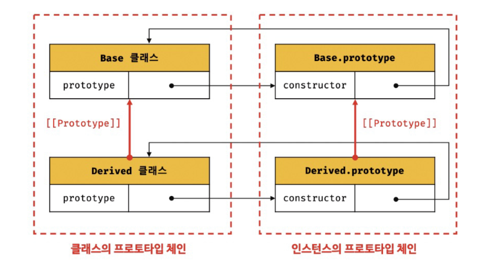

# 25장 클래스

## 25.8 상속에 의한 클래스 확장

### 25.8.1 클래스 상속과 생성자 함수 상속

- **프로토타입 기반 상속**은 프로토타입 체인을 통해 다른 객체의 자산을 상속받는 개념이다.
- **상속에 의한 클래스 확장**은 기존 클래스를 상속받아 새로운 클래스를 확장하여 정의하는 것이다. 코드 재사용 관점에서 매우 유용하다.
- 클래스와 생성자 함수는 인스턴스를 생성할 수 있는 함수라는 점에서 매우 유사하다.
- **클래스**는 상속을 통해 기존 클래스를 확장할 수 있는 문법이 기본인 `extends` 키워드가 기본적으로 제공되지만 **생성자 함수**는 그렇지 않다.

<br/>

### 25.8.2 extends 키워드

상속을 통해 클래스를 확장하려면 extends 키워드를 사용하여 상속받을 클래스를 정의한다.

```jsx
// 수퍼(베이스/부모) 클래스
class Base {}

// 서브(파생/자식) 클래스
class Derived extends Base {}
```

- 상속을 통해 확장된 클래스를 **서브클래스**라 부르고, 서브클래스에게 상속된 클래스를 **수퍼클래스**라 부른다.

extends 키워드의 역할은 수퍼클래스와 서브클래스 간의 상속 관계를 설정하는 것이다. 클래스도 프로토타입을 통해 상속 관계를 구현한다.

<br/>

<p align="center"></p>

- 수퍼클래스와 서브클래스는 인스턴스의 프로토타입 체인뿐 아니라 클래스 간의 프로토타입 체인도 생성한다.
- 이를 통해 프로토타입 메서드, 정적 메서드 모두 상속 가능하다.

<br/>

### 25.8.3 동적 상속

- `extends` 키워드는 클래스뿐만 아니라 생성자 함수를 상속받아 클래스를 확장할 수도 있다.

```jsx
// 생성자 함수
function Base(a) {
  this.a = a;
}

// 생성자 함수를 상속받는 서브클래스 (extends 키워드 앞에 반드디 클래스가 와야 함)
class Derived extends Base() {}

const derived = new Derived(1);
console.log(derived); // Derived {a: 1}
```

<br/>

### 25.8.4 서브클래스의 constructor

- 클래스에서 constructor를 생략하면 클래스에 비어있는 constructor가 암묵적으로 정의된다.

```jsx
// 수퍼클래스
class Base {
  constructor() {}
}

// 서브클래스
class Derived extends Base {
  // args는 new 연산자와 함께 클래스를 호출할 때 전달할 인수의 리스트다.
  constructor(...args) {
    super(...args);
  }
}

const derived = new Derived();
console.log(derived); // Derived {}
```

<br/>

### 25.8.5 super 키워드

- `super` 키워드는 함수처럼 호출할 수도 있고 this와 같이 식별자처럼 참조할 수 있는 특수한 키워드다.

<br/>

**super 호출**

- `super` 를 호출하면 수퍼클래스의 constructor를 호출한다.

```jsx
class Base {
  constructor(a, b) {
    this.a = a;
    this.b = b;
  }
}

class Derived extends Base {
  constructor(a, b, c) {
    super(a, b);
    this.c = c;
  }
}
const derived = new Derived(1, 2, 3);
console.log(derived); // Derived {a: 1, b: 2, c: 3}
```

<br/>

**📍 `super` 를 호출할 때 주의 사항**

1. 서브클래스에서 constructor를 생략하지 않는 경우 서브클래스의 constructor에서는 반드시 super를 호출해야 한다.

```jsx
// 잘못된 코드
class Base {}

class Derived extends Base {
  constructor() {
    console.log('constructor call');
  }
}

const derived = new Derived(); // ReferenceError

// 올바른 코드
class Base {}

class Derived extends Base {
  constructor() {
    super();
    console.log('constructor call');
  }
}

const derived = new Derived(); // constructor call
```

<br/>

2. 서브클래스의 constructor에서 super를 호출하기 전에는 this를 참조할 수 없다.

```jsx
// 잘못된 코드
class Base {}

class Derived extends Base {
  constructor() {
    this.a = 1;
    super();
  }
}
const derived = new Derived(1);

// 올바른 코드
class Base {}

class Derived extends Base {
  constructor() {
    super();
    this.a = 1;
  }
}
const derived = new Derived(1);
```

<br/>

3. super는 반드시 서브클래스의 constructor에서만 호출한다. 서브클래스가 아닌 클래스의 constructor나 함수에서 super를 호출하면 에러가 발생한다.

```jsx
class Base {
  constructor() {
    super(); // SyntaxError
  }
}

function Foo() {
  super(); // SyntaxError
}
```

<br/>

**super 참조**

- `super` 를 참조하면 수퍼클래스의 메서드를 호출할 수 있다.

<br/>

1. 서브클래스의 프로토타입 메서드 내에서 super.sayHi 는 수퍼클래스의 프로토타입 메서드 sayHi를 가리킨다.

```jsx
class Base {
  constructor(name) {
    this.name = name;
  }

  sayHi() {
    return `Hi! ${this.name}`;
  }
}

class Derived extends Base {
  sayHi() {
    return `${super.sayHi()}. how are you doing?`;
  }
}

const derived = new Derived('Lee');
console.log(derived.sayHi()); // Hi! Lee. how are you doing?
```

<br/>

2. 서브클래스의 정적 메서드 내에서 super.sayHi는 수퍼클래스의 정적 메서드 sayHi를 가리킨다.

```jsx
class Base {
  static sayHi() {
    return 'Hi';
  }
}

class Derived extends Base {
  static sayHi() {
    return `${super.sayHi()} how are you doing?`;
  }
}

console.log(Derived.sayHi()); // Hi how are you doing?
```

<br/>

### 25.8.6 상속 클래스의 인스턴스 생성 과정

```jsx
// 수퍼클래스
class Rectangle {
  constructor(width, height) {
    this.width = width;
    this.height = height;
  }

  getArea() {
    return this.width * this.height;
  }

  toString() {
    return `width = ${this.width}, height = ${this.height}`;
  }
}

// 서브클래스
class ColorRectangle extends Rectangle {
  constructor(width, height, color) {
    super(width, height);
    this.color = color;
  }

  // 메서드 오버라이딩
  toString() {
    return super.toString() + `, color = ${this.color}`;
  }
}

const colorRectangle = new ColorRectangle(2, 4, 'red');
console.log(colorRectangle); // ColorRectangle {width: 2, height: 4, color: "red"}

// 상속을 통해 getArea 메서드를 호출
console.log(colorRectangle.getArea()); // 8
// 오버라이딩된 toString 메서드를 호출
console.log(colorRectangle.toString()); // width = 2, height = 4, color = red
```

<br/>

1. 서브클래스 **colorRectangle이 new 연산자와 함께 호출**한다.
2. **서브클래스의 super 호출**한다.

   서브클래스는 자신이 직접 인스턴스를 생성하지 않고 수퍼클래스에게 인스턴스 생성을 위임한다. 따라서 서브클래스의 constructor에서 반드시 super를 호출해야 한다.

3. 수퍼클래스의 constructor 내부의 코드가 실행되기 이전에 빈 객체**(인스턴스)가 생성되고 this에 바인딩**한다.
4. **수퍼클래스의 인스턴스를 초기화**한다.
5. super의 호출이 종료되고 제어 흐름이 **서브클래스 constructor로 돌아와** super가 반환한 **인스턴스가 this에 바인딩**된다.
6. super 호출 이후, 서브클래스의 **constructor에 있는 인스턴스를 초기화**한다.
7. **인스턴스**가 바인딩된 this가 암묵적으로 **반환**된다.

<br/>

### 25.8.7 표준 빌트인 생성자 함수 확장

String, Number, Aray 같은 표준 빌트인 객체도 [[Construct]] 내부 메서드를 갖는 생성자 함수이므로 extends 키워드를 사용하여 확장할 수 있다.

```jsx
// Array 생성자 함수를 상속받아 확장한 MyArray
class MyArray extends Array {
  // 중복된 배열 요소를 제거하고 반환한다: [1, 1, 2, 3] => [1, 2, 3]
  uniq() {
    return this.filter((v, i, self) => self.indexOf(v) === i);
  }

  // 모든 배열 요소의 평균을 구한다: [1, 2, 3] => 2
  average() {
    return this.reduce((pre, cur) => pre + cur, 0) / this.length;
  }
}

const myArray = new MyArray(1, 1, 2, 3);
console.log(myArray); // MyArray(4) [1, 1, 2, 3]

// MyArray.prototype.uniq 호출
console.log(myArray.uniq()); // MyArray(3) [1, 2, 3]
// MyArray.prototype.average 호출
console.log(myArray.average()); // 1.75
```

<br/>

Array.prototype의 메서드 중에서 map, filter와 같이 새로운 배열을 반환하는 메서드가 MyArray 클래스의 인스턴스를 반환한다. 즉 메서드 체이닝을 할 수 있다.

```jsx
console.log(myArray.filter((v) => v % 2) instanceof MyArray); // true

// 메서드 체이닝
// [1, 1, 2, 3] => [ 1, 1, 3 ] => [ 1, 3 ] => 2
console.log(
  myArray
    .filter((v) => v % 2)
    .uniq()
    .average(),
); // 2
```
