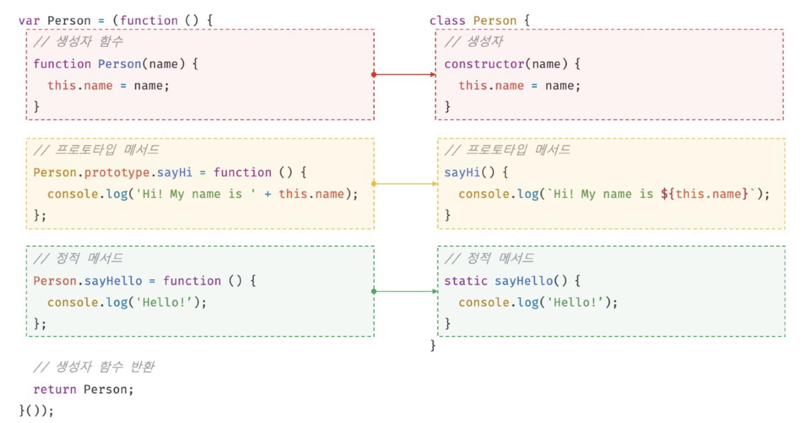
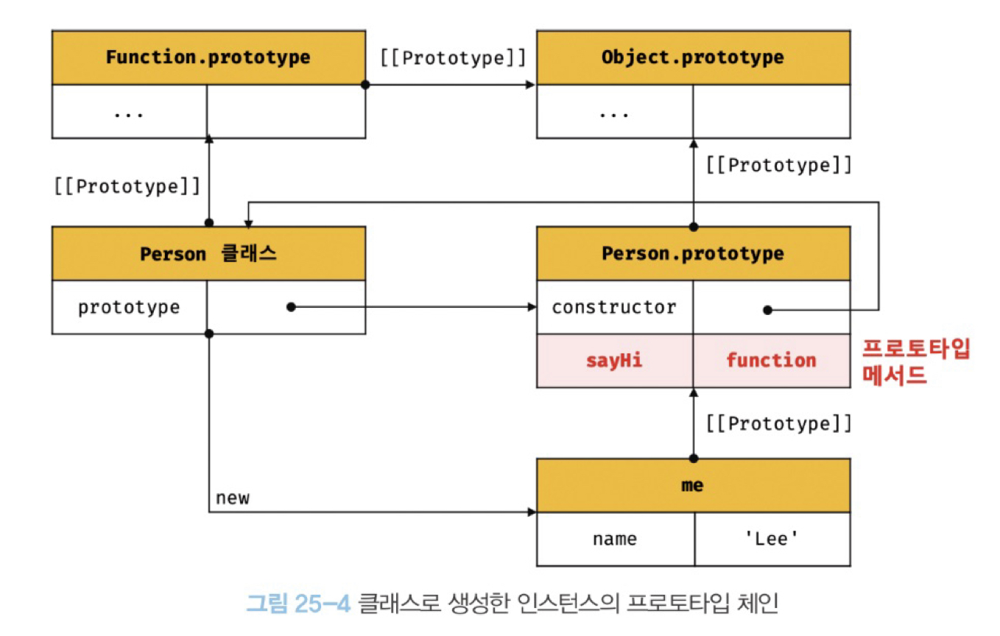
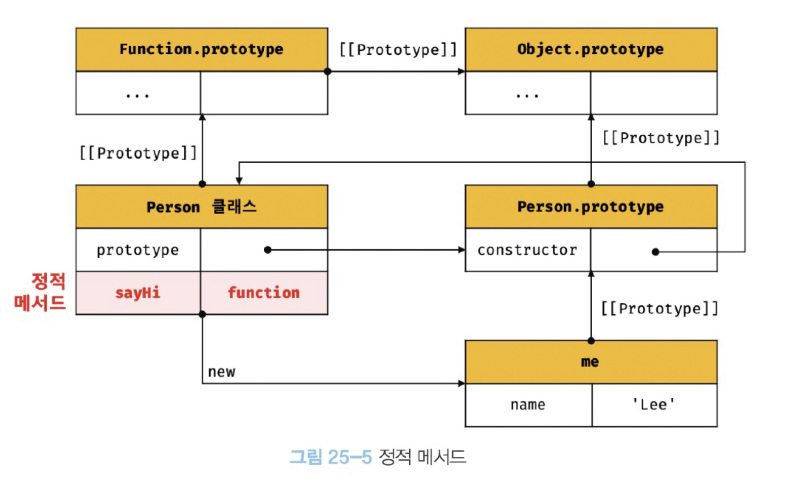
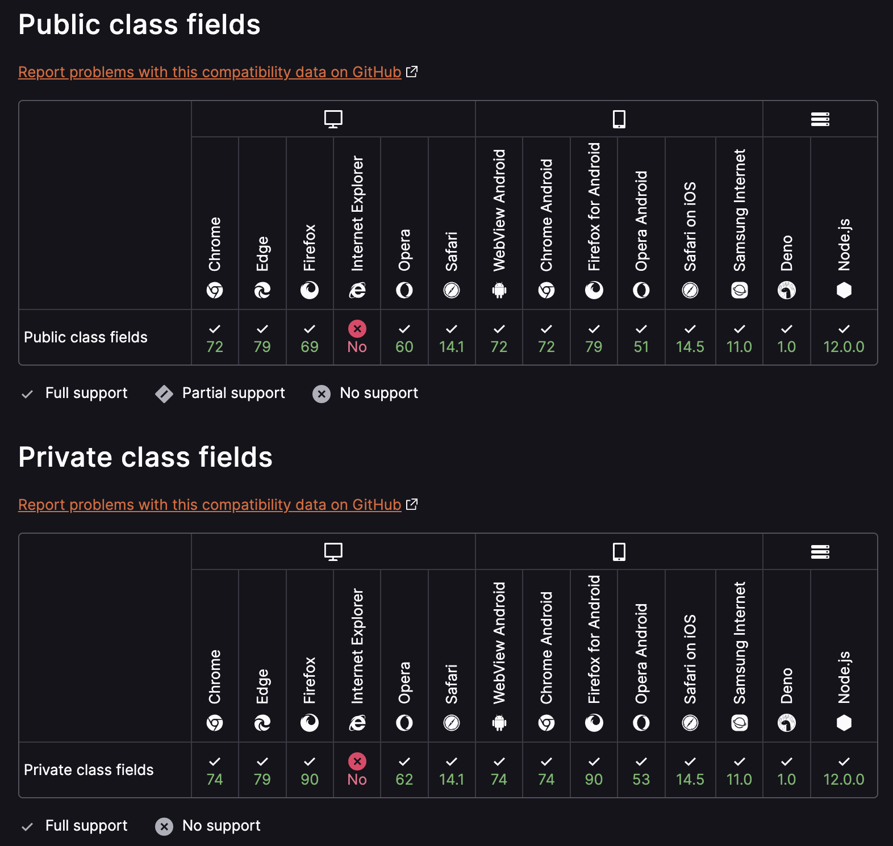

# 25장 클래스

## 25.1 클래스는 프로토타입의 문법적 설탕인가?

- 자바스크립트 = 프로토타입 기반 객체지향 언어
- 프로토타입 기반 객체지향 언어는 클래스가 필요 없는 객체지향 프로그래밍 언어. ES5에서는 생성자 함수와 프로토타입을 통해 객체지향 언어의 상속을 구현 가능
- ES6에서 도입된 클래스는 자바나 C#과 같은 클래스 기반 객체지향 프로그래밍에 익숙한 프로그래머가 더욱 빠르게 학습할 수 있도록 클래스 기반 객체지향 프로그래밍 언어와 매우 흡사한 새로운 객체 생성 메커니즘을 제시
- 그렇다고 클래스가 기존의 프로토타입 기반 객체지향 모델을 폐지하고 새롭게 클래스 기반 객체지향 모델을 제공 X
- 사실 클래스는 함수이며 기존 프로토타입 기반 패턴을 클래스 기반 패턴처럼 사용할 수 있도록 하는 문법적 설탕이라고 볼 수도 있다.
  - 문법적 설탕: 사람이 이해하기 쉽고 표현하기 쉽게 컴퓨터 언어를 디자인해 놓은 문맥. 주로 내부적인 동작은 기존과 동일하다.
- 단, 클래스와 생성자 함수는 모두 프로토타입 기반의 인스턴스를 생성하지만 정확히 동일하게 동작 X
- 클래스는 생성자 함수보다 엄격하며 생성자 함수에서는 제공하지 않는 기능도 제공

  |                                                | 클래스                                                                      | 생성자 함수                                               |
  | ---------------------------------------------- | --------------------------------------------------------------------------- | --------------------------------------------------------- |
  | `new` 연산자 없이 호출시                       | Error 발생                                                                  | 일반함수로 호출                                           |
  | 상속을 지원하는 `extends`, `super` 키워드 제공 | O                                                                           | X                                                         |
  | 호이스팅                                       | 발생하지 않는 것처럼 동작                                                   | 함수 선언문-> 함수 호이스팅, 함수 표현식 -> 변수 호이스팅 |
  | `strict mode`                                  | 암묵적으로 모든 코드에 `strict mode`, 해제 불가능                           | 암묵적으로 `strict mode` X                                |
  | `[[Enumerable]]`                               | constructor, 프로토타입 메서드, 정적 메서드의 [[Enumerable]]의 값이 `false` | -                                                         |

- 클래스는 생성자 함수 기반의 객체 생성 방식보다 견고하고 명료. 특히 `extends`와 `super` 키워드를 통해 더욱 간결하고 명료하게 상속관계를 구현
- 따라서, 클래스는 프로토타입 기반 객체 생성 패턴의 단순한 문법적 설탕이라고 보기보다는 **새로운 객체 생성 메커니즘**으로 보는 것이 좀 더 합당

---

## 25.2 클래스 정의

- `class` 키워드를 사용하여 정의
- 생성자 함수와 마찬가지로 파스칼 케이스 사용이 일반적

```javascript
// 클래스 선언문
class Person {}

// 익명 클래스 표현식
const Person = class {};

// 기명 클래스 표현식
const Person = class MyClass {};
```

- 클래스를 표현식으로 정의 -> 클래스는 값으로 사용 -> 일급 객체
- 일급객체의 특징

  1. 무명의 리터럴로 생성할 수 있다. 즉, 런타임에 생성이 가능하다.
  2. 변수나 자료구조에 저장할 수 있다.
  3. 함수의 매개변수에게 전달할 수 있다.
  4. 함수의 반환값으로 사용할 수 있다.

- 클래스는 함수다.
- 0개 이상의 메서드 정의
  - constructor(생성자)
  - 프로토타입 메서드
  - 정적 메서드

```javascript
// 클래스 선언문
class Person {
  // 생성자
  constructor(name) {
    // 인스턴스 생성 및 초기화
    this.name = name;
  }

  // 프로토타입 메서드
  sayHi() {
    console.log(`Hi! My name is ${this.name}`);
  }

  // 정적 메서드
  static sayHello() {
    console.log('Hello!');
  }
}

// 인스턴스 생성
const me = new Person('Lee');

// 프로토타입 메서드 호출
me.sayHi();

// 정적 메서드 호출
Person.sayHello();
```



---

## 25.3 클래스 호이스팅

- 클래스는 함수로 평가된다.
- 클래스 선언문: `let`, `const` 키워드로 선언한 변수처럼 호이스팅된다. 클래스 선언문 이전에 일시적 사각지대(TDZ)에 빠지기 때문에 호이스팅이 발생하지 않는 것처럼 동작한다.
- 클래스 표현식: 변수 호이스팅(`var` or `let, const`)된다.

```javascript
// 클래스 선언문 → TDZ → ReferenceError: Cannot access 'Person1' before initialization
console.log(Person1);
class Person1 {}

// 클래스 표현식('const' 키워드) → TDZ → ReferenceError: Cannot access 'Person2' before initialization
console.log(Person2);
const Person2 = class {};

// 클래스 표현식('var' 키워드) → undefined
console.log(Person3);
var Person3 = class {};
```

---

## 25.4 인스턴스 생성

- `new` 연산자와 함께 호출 → 인스턴스 생성
  - `new` 연산자 없으면 TypeError
  - 클래스 표현식인 경우 클래스 이름이 아니라 클래스를 가리키는 식별자로 호출하여 인스턴스 생성
    - 클래스 이름은 외부 코드에서 접근 불가능 하기 때문 (함수 이름과 동일)

```javascript
class Person1 {}

// new 연산자 없이 호출하면 타입 에러 발생
const me = Person1(); // TypeError: Class constructor Person cannot be invoked without `new`

const Person2 = class YourClass {};

// 함수 표현식과 마찬가지로 클래스를 가리키는 식별자로 인스턴스를 생성
const you = new Person2();

// 클래스 이름 YourClass는 함수 표현식과 동일하게 클래스 몸체 내부에서만 유효한 식별자이다
console.log(YourClass); // ReferenceError: YourClass is not defined

const we = new YourClass(); // ReferenceError: Yourclass is not defined
```

<br>

---

## 25.5 메서드

- 클래스 몸체에 0개 이상의 메서드 선언
  - `constructor`(생성자), 프로토타입 메서드, 정적 메서드

### 25.5.1 `constructor`

- 인스턴스를 생성하고 초기화하기 위한 특수한 메서드(이름 변경 X)
- `constructor` 내부의 `this`는 생성할 인스턴스를 가리킴

- 최대 한 개만 존재 가능

- 생략 가능 → 암묵적으로 디폴트 constructor -> 빈 객체

  ```javascript
  class Person {
    constructor() {}
  }

  const me = new Person();
  console.log(me); // Person {}
  ```

- 고정값으로 인스턴스 초기화

  ```javascript
  class Person {
    constructor() {
      this.name = 'Lee';
      this.address = 'Seoul';
    }
  }

  const me = new Person();
  console.log(me); // Person {name: 'Lee', address: 'Seoul'}
  ```

- 인수로 인스턴스 초기화

  ```javascript
  class Person {
    constructor(name, address) {
      this.name = name;
      this.address = address;
    }
  }

  const me = new Person('Lee', 'Seoul');
  console.log(me); // Person {name: 'Lee', address: 'Seoul'}
  ```

- `constructor`안에서 `return` 반드시 생략

  - 암묵적으로 `this`(인스턴스)를 반환하기 때문
  - `this`가 아닌 다른 값을 반환하는 것은 클래스의 기본 동작을 훼손하기 때문

  - `return` 객체 → 명시적 객체 반환

    ```javascript
    class Person {
      constructor(name) {
        this.name = name;
        return {};
      }
    }

    const me = new Person('Lee');
    console.log(me); // {}
    ```

  - `return` 원시값 → 원시값 무시. 암묵적 `this` 반환

    ```javascript
    class Person {
      constructor(name) {
        this.name = name;
        return 100;
      }
    }

    const me = new Person('Lee');
    console.log(me); // Person { name: 'Lee' }
    ```

### 25.5.2 프로토타입 메서드

- 아무런 키워드 없이 메서드 축약표현 사용 → 프로토타입의 메서드

```javascript
class Person {
  constructor(name) {
    this.name = name;
  }

  // 프로토타입 메서드
  sayHi() {
    console.log(`Hi! My name is ${this.name}`);
  }
}

const me = new Person('Lee');
me.sayHi(); // Hi! My name is Lee
```



- 인스턴스는 프로토타입 메서드를 상속받아 사용
- 프로토타입 체인은 클래스에 생성된 인스턴스에도 동일하게 적용.
- 즉, 클래스는 생성자 함수와 마찬가지 프로토타입 기반의 객체 생성 메커니즘

### 25.5.3 정적 메서드

- 정적 메서드: 인스턴스를 생성하지 않아도 호출할 수 있는 메서드
- `static` 키워드 사용하여 메서드 축약표현 사용 → 정적 메서드

```javascript
class Person {
  constructor(name) {
    this.name = name;
  }

  // 정적 메서드
  static sayHello() {
    console.log(`Hello! My name is ${this.name}`);
  }
}

Person.sayHello(); // Hello! My name is Lee
```



- 정적메서드는 인스턴스의 프로토타입 체인에 존재 X -> 인스턴스로 호출 불가능

### 25.5.4 정적 메서드와 프로토타입 메서드의 차이

1. 자신이 속해 있는 프로토타입 체인이 다름
2. 정적 메서드 → 클래스로 호출 / 프로토타입 메서드 → 인스턴스로 호출
3. 정적 메서드 → 인스턴스 프로퍼티 참조 불가능 / 프로토타입 메서드 → 인스턴스 프로퍼티 참조 가능

```javascript
// 클래스
class Person {
  // 생성자
  constructor(name) {
    this.name = name;
  }

  // 프로토타입 메서드
  sayHi() {
    console.log(`Hi! ${this.name}`);
  }

  // 정적 메서드
  static sayHello() {
    console.log(`Hello~`);
  }
}

const me = new Person('Joo');
me.sayHi(); // Hi! Joo
me.sayHello(); // TypeError: me.sayHello is not a function

Person.sayHi(); // TypeError: Person.sayHi is not a function

Person.sayHello(); // Hello~
```

- 유용한 경우
  - 프로토타입 메서드: 메서드 내부에서 인스턴스 프토퍼티(`this`)를 참조해야 할 경우.
  - 정적 메서드: 인스턴스와 상관없이 전역에서 사용할 유틸리티 함수. 인수로 무언가를 해야할 경우. 클래스 또는 생성자함수를 하나의 네임스페이스로 사용하여 정적 메서드를 모아 놓으면 이름 충돌 가능성을 줄여주고 관련 함수들을 구조화하는 효과.

### 25.5.5 클래스에서 정의한 메서드의 특징

1. `function` 키워드를 생략한 메서드 축약 표현 사용
2. 메서드 정의할 때 콤마 불필요
3. 암묵적으로 `strict mode`로 실행
4. 프로퍼티 어트리뷰트 `[[Enumerable]]`의 값: false -> `for...in`, `Object.keys`로 열거 불가능
5. 내부 메서드 `[[Construct]]` X -> non-construct -> `new` 연산자로 호출 불가능

## 25.6 클래스의 인스턴스 생성 과정

1. 인스턴스 생성과 `this` 바인딩
2. 인스턴스 초기화
3. 인스턴스 반환

```javascript
class Person {
  constructor(name) {
    // 1. 암묵적으로 인스턴스가 생성되고 this에 바인딩된다.
    console.log(this); // Person {}

    // 2. this에 바인딩되어 있는 인스턴스를 초기화한다.
    this.name = name;

    // 3. 완성된 인스턴스가 바인딩된 this가 암묵적으로 반환된다.
  }
}
```

## 25.7 프로퍼티

### 25.7.1 인스턴트 프로퍼티

- 인스턴스 프로퍼티는 `constructor` 안에서 정의
- ES6의 클래스는 접근 제한자(`private`, `public`, `protected`)를 지원 X -> 인스턴스 프로퍼티는 언제나 public

```javascript
class Person {
  constructor(name) {
    // 인스턴스 프로퍼티
    this.name = name;
  }
}

const me = new Person('Lee');

// 인스턴스 프로퍼티는 public하다.
console.log(me.name); // Lee
```

### 25.7.2 접근자 프로퍼티

- 접근자 프로퍼티: 자체적으로 값(`[[Value]]` 내부 슬롯)을 갖지 않고 다른 데이터 프로퍼티의 값을 읽거나 저장할 때 사용하는 접근자 함수로 구성된 프로퍼티
- 접근자 프로퍼티는 클래스 몸체에서 선언 → 프로토타입 메서드가 됨
- getter: `get` 키워드를 사용해 정의. 인스턴스 프로퍼티를 참조.
- setter: `set` 키워드를 사용해 정의. 인스턴스 프로퍼티를 조작.

```javascript
class Person {
  constructor(firstName, lastName) {
    // 인스턴스 프로퍼티는 constructor 안에서 정의
    this.firstName = firstName;
    this.lastName = lastName;
  }

  // 접근자 프로퍼티 → 프로토타입의 메서드
  // getter 함수
  get fullName() {
    return this.firstName + ' ' + this.lastName;
  }

  // setter 함수
  set fullName(newName) {
    [this.firstName, this.lastName] = newName.split(' ');
  }
}

const me = new Person('Jimmy', 'Joo');
console.log(me.fullName); // Jimmy Joo

me.fullName = 'Hanseul Ju';
console.log(me.firstName); // Hanseul
console.log(me.lastName); // Ju
```

### 25.7.3 클래스 필드 정의 제안

- 클래스 필드: 클래스 기반 객체지향 언어에서 클래스가 생성할 인스턴스의 프로퍼티를 가리키는 용어.
- 아래 코드를 살펴보자. 자바의 클래스 필드는 마치 클래스 내부에서 변수처럼 사용

```java
public class Person {
  // 클래스 필드
  private String firstName = "";
  private String lastName = "";

  // 생성자
  Person(String firstName, String lastName) {
    this.firstName = firstName;
    this.lastName = lastName;
  }

  public String getFullName() {
    // 클래스 필드 참조(this 없이 가능)
    return firstName + " " + lastName;
  }
}
```

- 자바스크립트에서는 클래스 필드 정의

```javascript
class Person {
  // 클래스 필드 정의
  name = 'Lee';
}

const me = new Person('Lee');
```

- 최신 브라우저(Chrome 72 이상) 또는 최신 Node.js(버전 12이상)에서 동작

  - 원래는 문법 에러(Syntax Error) 발생

- TC39 프로세스의 stage3(candidate) 제안
  - TC39: ECMAScript 관리를 담당하는 위원회. 구글, 애플 같은 브라우저 벤더와 페이스북, 트위터 같이 ECMAScript를 제대로 준수해야 하는 기업으로 구성
  - TC39 프로세스
    - ECMAScript에 새로운 표준 사양을 추가하기 위해 공식적으로 명문화해 놓은 과정
    - 0~4단계까지 총 5단계로 구성
    - stage3(candidate)까지 승급한 제안은 심각한 문제가 없는 한 변경되지 않고 대부분 stage4로 승급
    - stage4까지 승급한 제안은 큰 이변이 없는 이상, 차기 ECMAScript 버전에 포함

```javascript
class Person {
  // 클래스 필드 정의 → 인스턴스 프로퍼티가 됨
  name = 'Joo';
  // this.name = 'Joo'; → this에 클래스 필드를 바인딩해서는 안됨

  // 위 코드는 밑에 코드와 동일하다
  // constructor() {
  //   this.name = 'Joo';
  // }

  constructor() {
    // 클래스 필드를 참조하려면 this를 사용해야됨
    console.log(this.name);
    // console.log(name); → RefereceError: name is not defined
  }
}

const me = new Person();
console.log(me); // Person { name: 'Joo' }
```

- 인스턴스를 생성할 때 클래스 필드를 초기화할 필요가 있다면 constructor 밖에서 클래스 필드를 정의할 필요 X
- 어차피 constructor 내부에서 클래스 필드를 참조하여 초기값 할당

```javascript
class Person {
  // 굳이 constructor 밖에서 클래스 필드를 정의할 필요가 없다
  name;

  constructor(name) {
    this.name = name;
  }
}

const me = new Person('Lee');
console.log(me); // Person { name: 'Lee' };
```

- 함수는 일급 객체 -> 클래스 필드에 할당 가능
- 단, 클래스 필드에 함수를 할당 -> 인스턴스 메서드가 됨 ->
  권장 X

```javascript
class Person {
  name = 'Lee';

  // 클래스 필드에 함수를 할당
  getName = function () {
    return this.name;
  };

  // 위 코드는 아래와 같이 동작한다.
  // constructor() {
  //   this.name = 'Lee';
  //   this.getName = function() {
  //     return this.name;
  //   }
  // }
}

const me = new Person();
console.me(me); // Person { name: 'Lee', getName: f}
```

<br>

### 25.7.4 private 필드 정의 제안

- 클래스의 constructor 내부에 `this`를 통해 정의한 인스턴스 프로퍼티는 언제나 public
- private한 변수 앞에 **`#`** 사용
- private 필드는 반드시 클래스 몸체에 정의
  - 정의하지 하지 않은 상태로 constructor에 정의하거나 참조하면 문법 에러(SyntaxError) 발생
- TC39 프로세스의 stage3(candidate) 제안
- 최신 브라우저(Chrome 72 이상) 또는 최신 Node.js(버전 12이상)에서 동작

  ```javascript
  class Person {
    // private 필드 정의
    #name = '';

    constructor(name) {
      // private 필드 참조
      this.#name = name;
    }
  }

  const me = new Person('Joo');
  // 외부에서 참조 불가능
  console.log(me.#name); // SyntaxError
  ```

| 접근 가능성                 | public | private |
| --------------------------- | ------ | ------- |
| 클래스 내부                 | O      | O       |
| 자식 클래스 내부            | O      | X       |
| 클래스 인스턴스를 통한 접근 | O      | X       |

- 클래스 외부에서 private 직접 접근 불가능
- 단, 접근자 프로퍼티를 통해 간접적으로 접근 가능

```javascript
class Person {
  #name = '';

  constructor(name) {
    this.#name = name;
  }

  // 접근자 프로퍼티
  get name() {
    return this.#name.trim();
  }
}

const me = new Person(' Lee ');

// 접근자 프로퍼티를 통해 클래스 외부에서 간접적으로 접근 가능하다.
console.log(me.name); // Lee
```

<br>

### 25.7.5 static 필드 정의 제안

- `static` 키워드를 통해 정적 메서드는 정의 가능. 하지만, 정적 필드는 정의 불가능
- static public 필드, static private 필드, static private 메서드를 정의할 수 있는 제안
- TC39 프로세스의 stage3(candidate) 제안
- static public/private 필드 → 최신 브라우저(Chrome 72 이상) 또는 최신 Node.js(버전 12이상)에서 동작

  ```javascript
  class MyMath {
    // static public 필드
    static PI = 22 / 7;

    // static private 필드
    static #num = 10;
  }
  ```


