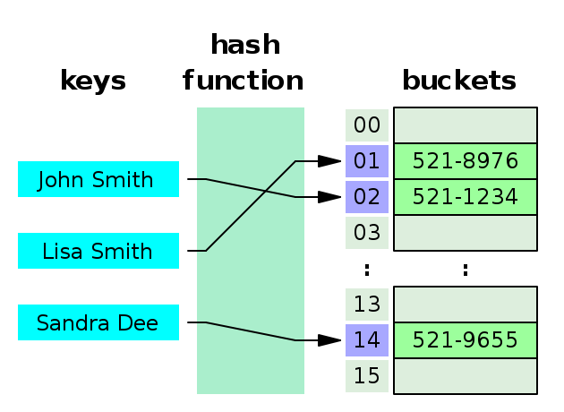

# 27장 배열
## 27.1 배열이란?
- 여러 개의 값을 순차적으로 나열한 자료 구조
### 요소(Element)
- 배열이 가지고 있는 값
- 원시값, 객체, 함수, 배열 등 자바스크립트에서 값으로 인정하는 모든 것
### 인덱스(Index)
- 배열에서 자신의 위치를 나타내는 0 이상의 정수
### length 프로퍼티
- 요소의 개수, 배열의 길이를 나타낸다.
```javascript
const arr = ['apple', 'banana', 'orange'];

arr[0] // -> 'apple'
arr[1] // -> 'banana'
arr[2] // -> 'orange'

console.log(arr.length); //3
```
### 배열은 객체 타입이다.
- 배열 리터럴, Array 생성자 함수, Array of, Array from 메서드로 생성할 수 있다.
- 배열의 생성자 함수는 Array
- 배열의 프로토타입 객체는 `Array.prototype`
```javascript
console.log(Array.prototype);

at: ƒ at()
concat: ƒ concat()
constructor: ƒ Array()
copyWithin: ƒ copyWithin()
entries: ƒ entries()
every: ƒ every()
fill: ƒ fill()
filter: ƒ filter()
find: ƒ find()
findIndex: ƒ findIndex()
findLast: ƒ findLast()
findLastIndex: ƒ findLastIndex()
flat: ƒ flat()
flatMap: ƒ flatMap()
forEach: ƒ forEach()
includes: ƒ includes()
indexOf: ƒ indexOf()
join: ƒ join()
keys: ƒ keys()
lastIndexOf: ƒ lastIndexOf()
length: 0
map: ƒ map()
pop: ƒ pop()
push: ƒ push()
reduce: ƒ reduce()
reduceRight: ƒ reduceRight()
reverse: ƒ reverse()
shift: ƒ shift()
slice: ƒ slice()
some: ƒ some()
sort: ƒ sort()
splice: ƒ splice()
toLocaleString: ƒ toLocaleString()
toString: ƒ toString()
unshift: ƒ unshift()
values: ƒ values()
Symbol(Symbol.iterator): ƒ values()
Symbol(Symbol.unscopables): {copyWithin: true, entries: true, fill: true, find: true, findIndex: true, …}
[[Prototype]]: Object
```
- 배열은 객체지만 일반 객체와는 구별되는 독특한 특징이 있다.   

배열은 값의 순서(index)와 length 프로퍼티를 갖기 때문에 순차적으로 요소에 접근하거나 원하는 요소에 접근이 가능하다.

|구분|객체|배열|
|:---:|:---:|:---:|
|구조|프로퍼티 키와 프로퍼티 값|인덱스와 요소|
|값의 참조|프로퍼티 키|인덱스|
|값의 순서|X|O|
|length 프로퍼티|X|O|

## 27.2 자바스크립트 배열은 배열이 아니다.
- 자료구조(Data Structure)의 배열
    - 밀집 배열 : 하나의 데이터 타입으로 통일되어 있고 서로 연속적으로 인접.
    - 장점 : 인덱스로 요소에 빠르게 접근할 수 있다.
    - 단점 : 요소를 삽입 or 삭제하는 경우 효율적이지 않다.(배열의 요소를 연속적으로 유지하기 위해 요소를 이동시켜야 하기 때문)

<p align="center"></p>

- 자바스크립트에서의 배열
    - 일반적인 배열의 동작을 흉내 낸 특수한 개체
    - 요소에는 여러가지 데이터 타입이 들어갈 수 있다.(메모리 공간이 동일한 크기를 갖지 않아도 된다.)
    - 배열의 요소가 연속적으로 이어져 있지 않아도 된다.(희소 배열)
    - 단점 : 해시 테이블로 구현된 객체이므로 인덱스로 요소에 접근하는 경우 일반적인 배열보다 성능적인 면에서 느리다.
    - 장점 : 요소를 삽입 또는 삭제하는 경우에는 일반적인 배열보다 빠른 성능을 기대할 수 있다.

```javascript
const arr = [
    'string',
    10,
    true,
    null,
    undefined,
    NaN,
    Infinity,
    [ ],
    {},
    function(){}
]
```
```javascript
console.log(Object.getOwnPropertyDescriptors([1,2,3]));
/*
{
    0: {value: 1, writable: true, enumerable: true, configurable: true}
    1: {value: 2, writable: true, enumerable: true, configurable: true}
    2: {value: 3, writable: true, enumerable: true, configurable: true}
    length: {value: 3, writable: true, enumerable: false, configurable: false}
    [[Prototype]]: Object
}
*/
//인덱스를 나타내는 문자열을 프로퍼티 키로 가지며
//length 프로퍼티를 갖는다.
//배열의 요소는 사실 프로퍼티 값이다.

```
> ### 해시테이블(HashTable)이란?
> (Key, Value)로 데이터를 저장하는 자료구조
> 

## 27.3 length 프로퍼티와 희소 배열
### length 프로퍼티
- length 프로퍼티의 값은 0과 2<sup>32</sup> - 1(4,294,967,296 - 1) 미만의 양의 정수
- length 프로퍼티의 값은 배열에 요소를 추가,삭제시 자동 갱신된다.
```javascript
[].length // -> 0
[1,2,3].length // -> 3
```
### 희소 배열
- 배열의 요소가 연속적으로 위치하지 않고 일부가 비어 있는 배열
- 자바스크립는 문법적으로 이를 허용.
- length와 배열 요소의 개수가 일치하지 않는다.
- 희소배열은 사용하지 않는 것이 좋음.
- **배열을 생성할 경우에는 같은 타입의 요소를 연속적으로 위치시키는 것이 성능적으로 좋다.**

```jsx
const sparse = [ , 2, , 4]

console.log(sparse) //[empty, 2, empty, 4];
console.log(sparse.length) //4
console.log(Object.getOwnPropertyDescriptors(sparse));
/*
    1: {value: 2, writable: true, enumerable: true, configurable: true}
    3: {value: 4, writable: true, enumerable: true, configurable: true}
    length: {value: 4, writable: true, enumerable: false, configurable: false}
*/
```

## 27.4 배열 생성

### 27.4.1 배열 리터럴
- 가장 일반적이고 간편한 배열 생성 방식
- 배열 리터럴은 객체 리터럴과 달리 프로퍼티 키가 없고 값만 존재한다.
```javascript
const arr = [1,2,3];
console.log(arr.length); //3

//요소가 0개일 때는 length 프로퍼티 값은 0
const arr = [];
console.log(arr.length); //0

//요소를 생략하면 희소 배열 생성
const arr = [1, ,3];
console.log(arr.length);//3
console.log(arr); //[1, empty, 3]
console.log(arr[1]); undefined
```

### 27.4.2 Array 생성자 함수
```javascript
//인수가 1개일 때
const arr = new Array(10);

console.log(arr); //(10) [empty × 10]
console.log(arr.length); //10

//인수가 2개이상 일때
const arrr = new Array(1,2,3);

console.log(arrr) //[1,2,3]
```

### 27.4.3 Array.of
- ES6
```jsx

const arr = Array.of(1);
console.log(arr); //[1]

const arrr = Array.of(1,2,3);
console.log(arrr); //[1,2,3];
```

### 27.4.4 Array.from
- ES6
- 유사 배열 객체, 이터러블 객체를 인수로 전달받아 배열로 변환하여 반환
```jsx
Array.from({length:2, 0:'a', 1:'b'});//[a,b]

Array.from('Hello'); //['H', 'e', 'l', 'l', 'o']
```

## 27.5 배열 요소의 참조
- 대괄호 표기법으로 참조
```jsx
const arr = [1,2];

console.log(arr[0]); //1
console.log(arr[1]); //2
```

## 27.6 배열 요소의 추가와 갱신
- 배열의 요소를 동적으로 추가할 수 있다. 이때 length 프로퍼티 값은 자동 갱신된다.
```jsx
const arr = [0];

arr[1] = 1;
console.log(arr);//[0,1]
console.log(arr.length); //2
```

- 인덱스는 요소의 위치를 나타내기 때문에 반드시 0 이상의 정수를 사용해야 한다. 정수 이외의 값은 프로퍼티가 생성된다.
```jsx
const arr= [];

//배열 요소의 추가
arr[0] = 1;
arr[1] = 2;

//프로퍼티 추가
arr['foo'] = 3;
arr.bar = 4;
arr[1.1] = 5;
arr[-1] = 6;

console.log(arr); //
/*
0: 1
1: 2
1.1: 5
-1: 6
bar: 4
foo: 3
length: 2
*/
```

## 27.7 배열 요소의 삭제
- delete연산자로 삭제하면 희소 배열이 생성되기 때문에
- `Array.prototype.splice` 메서드 사용을 추천한다.

## 27.8 배열 메서드
- 배열 객체의 프로토타입인 Array.prototype은 프로토타입 메서드를 제공한다.
- 결과물을 반환할 때 두가지 패턴을 가진다.
    - 원본 배열을 직접 변경하는 메서드
    - 원본 배열을 직접 변경하지 않고 새로운 배열을 생성하여 반환하는 메서드
- 원본 배열을 직접 변경하는 메서드는 상태를 직접 변경하는 부수 효과를 가지기 때문에 주의해야 한다.
- **가급적 원본 배열을 직접 변경하지 않는 메서드를 사용하는 편이 좋다.**


### 27.8.1 `Array.isArray`
- 전달된 인수가 배열이면 true, 배열이 아니면 false
```jsx
console.log(Array.isArray([])); //true
console.log(Array.isArray([1,2])); //true
console.log(Array.isArray({})); //false
```

### 27.8.2 `Array.prototype.indexOf`
- 원본 배열에서 인수로 전달된 요소를 검색하여 인덱스를 반환
    - 인수로 전달된 요소가 여러 개면 첫 번째로 검색된 요소의 인덱스를 반환
    - 인수로 전달된 요소가 없으면 `-1`을 반환
- 배열에 특정 요소가 존재하는지 확인활 때 유용
- (ES7) Array.prototype.includes 메서드가 가독성이 더 좋다.

```javascript
const arr = [1,2,2,3];
console.log(arr.indexOf(2)); 1

console.log(arr.indexOf(2,2)); 2

//배열에 특정 요소가 존재하는지 확인할 때 유용하다.
const foods = ['apple', 'banana', 'orange'];

if(foods.indexOf('orange')===-1){
    console.log('오렌지 X')
} else{
    console.log('오렌지 O')
}

//Array.prototype.includes
const fooods = ['apple', 'banana', 'orange'];

if(!foods.includes('orange')){
    console.log('오렌지 X')
} else{
    console.log('오렌지 O')
}
```

### 27.8.3 `Array.prototype.push`
- 인수로 전달받은 모든 값을 원본 배열의 마지막 요소로 추가
- 변경된 length 프로퍼티 값 반환
- 원본 배열 직접 변경
```jsx
const arr = [1,2];

let result = arr.push(3,4);
console.log(result); //4

console.log(arr); //[1,2,3,4]
```
- push 메서드 사용을 지양하는 이유
    1. 성능 면에서 좋지 않다. 추가할 요소가 하나라면 length 프로퍼티로 직접 추가하는게 더 빠르다.
    2. 배열을 직접 변경하는 부수 효과가 있기 때문에 스프레드 문법을 사용하는 편이 좋다.
```jsx
//length 프로퍼티로 배열 추가
const arr = [1,2];

arr[arr.length] = 3;

console.log(arr);//[1,2,3]

//스프레드 문법으로 추가
const arr = [1,2];

const newArr = [...arrr, 3];
console.log(newArr); //[1,2,3]
```

### 27.8.4 `Array.prototype.pop`
- 마지막 요소를 제거하고 제거한 요소를 반환
- 원본 배열이 빈 배열이면 undefined 반환
- 원본 배열 직접 변경
```jsx
const arr = [1,2];

let result = arr.pop();
console.log(result); //2
console.log(arr); //[1]
```

### 27.8.5 `Array.prototype.unshift`
- 인수로 전달받은 모든 값을 원본 배열의 선두에 요소로 추가
- 변경된 length 프로퍼티 값 반환
- 원본 배열 직접 변경
- 부수 효과가 있기 때문에 스프레드 문법을 추천
```jsx
const arr = [1,2];

let result = arr.unshift(0);
console.log(result); //3
console.log(arr); //[0,1,2]

//스프레드 문법으로 선두에 요소 추가
const arr = [1,2];

const newArr = [0, ...arr];
console.log(newArr); //[0,1,2]
```

### 27.8.6 `Array.prototype.shift`
- 원본 배열에서 첫 번째 요소를 제거하고 제거한 요소를 반환
- 원본 배열이 빈 배열이면 undefined 반환
- 원본 배열 직접 변경
```jsx
const arr = [1,2];

const result = arr.shift();
console.log(result); //1
console.log(arr); //[2]
```

### 27.8.7 `Array.prototype.concat`
- 인수로 전달된 값들을 원본 배열의 마지막 요소로 추가한 새로운 배열을 반환.
- 원본 배열 변경X, 새로운 배열 반환
- 스프레드 문법으로 대체 가능.
```jsx
const arr1 = [1,2];
const arr2 = [3,4];

let result = arr1.concat(arr2); 
console.log(result); //[1,2,3,4]

//스프레드 문법
let result2 = [...arr1, ...arr2]
console.log(result2);//[1,2,3,4]
```

> 📌 결론적으로 push/unshift, concat 메서드 대신 ES6의 스프레드 문법을 일관성 있게 사용하는 권장한다.


### 27.8.8 `Array.prototype.splice`
- 원본 배열의 중간에 요소를 추가하거나 중간에 있는 요소를 제거할 때 사용.
- 원본 배열 직접 변경
```jsx
//제거 후 새로운 요소 삽입
const arr = [1,2,3,4];
const result = arr.splice(1,2,20,30)

console.log(arr); //[1,20,30,4]

//새로운 요소 삽입
const arr = [1,2,3,4];

const result = arr.splice(1,0,100);
console.log(arr); //[1,100,2,3,4]

//요소 제거
const arr = [1,2,3,4];

const result = arr.splice(1,2);
console.log(arr); //[1,4]

```

### 27.8.9 `Array.prototype.slice`
- 인수로 전달된 범위의 요소들을 복사하여 배열로 반환.
- 원본 배열 변경X
```jsx
const arr= [1,2,3];

console.log(arr.slice(0,1)); //[1]
console.log(arr.slice(1,2)); //[2]
```

### 27.8.10 `Array.prototype.join`
- 원본 배열의 모든 요소를 문자열로 변환 후, 인수로 전달받은 문자열(구분자)로 연결한 문자열을 반환.
- 구분자는 생략가능
- 기본 구분자는 콤마(,)
```jsx
const arr= [1,2,3];

//기본 구분자 콤마
//원본 배열 arr의 모든 요소를 문자열로 변환 후 기본 구분자로 연결한 문자열 반환
console.log(arr.join()); //1,2,3

//빈 문자열로 연결
//원본 배열 arr의 모든 요소를 문자열로 변환 후, 빈 문자열로 연결한 문자열을 반환
console.log(arr.join(''));//123

//:로 연결
console.log(arr.join(':'));//1:2:3
```

### 27.8.11 `Array.prototype.reverse`
- 원본 배열의 순서를 반대로 뒤집는다
- 원본 배열 변경
```jsx
const arr= [1,2,3];

const result = arr.reverse();
console.log(arr);//[3,2,1]
console.log(result);//[3,2,1]
```

### 27.8.12 `Array.prototype.fill`
- ES6
- 인수로 전달받은 값을 배열의 처음부터 끝까지 요소로 채운다.
- 원본 배열 변경
```jsx
const arr=[1,2,3];

arr.fill(0);

console.log(arr);//[0,0,0];
```


### 27.8.13 `Array.prototype.includes`
- ES7
- 배열 내에 특정 요소가 포함되어 있으면 true, 없으면 false를 반환
```jsx
const arr=[1,2,3];

console.log(arr.includes(3));//true
console.log(arr.includes(4));//false
```

### 27.8.14 `Array.prototype.flat`
- ES10
- 인수로 전달한 깊이만큼 재귀적으로 배열을 평탄화한다.
```jsx
const result = [1,[2,3,4],5].flat();

console.log(result);//[1,2,3,4,5]
```

## 27.9 배열 고차 함수

**고차 함수** : 함수를 인수로 전달받거나 함수를 반환하는 함수

- 외부 산태의 변경이나 가변 데이터를 피하고 불변성을 지향하는 함수형 프로그래밍에 기반을 두고 있다.

<br/>

**함수형 프로그래밍**

- 조건문과 반복문을 제거
- 변수의 사용을 억제
- 순수 함수를 통해 부수 효과를 최대한 억제

<br/>

### 27.9.1 Array.prototype.sort

- `sort` 메서드는 배열의 요소를 오름차순 정렬한다.
- 원본 배열을 직접 변경한다.
- 내림차순으로 요소를 정렬하려면 `sort` 메서드를 사용하여 오름차순으로 정렬한 후 `reverse` 메서드를 사용하여 요소의 순서를 뒤집는다.

<br/>

```jsx
const fruits = ['Banana', 'Orange', 'Apple'];

// 오름차순(ascending) 정렬
fruits.sort();

// sort 메서드는 원본 배열을 직접 변경
console.log(fruits); // ['Apple', 'Banana', 'Orange']

// 내림차순(descending) 정렬
fruits.reverse();

// reverse 메서드도 원본 배열을 직접 변경
console.log(fruits); // ['Orange', 'Banana', 'Apple']
```

<br/>

- `sort` 메서드의 기본 정렬 순서는 유니코드 코드 포인트의 순서를 따른다.
  - 배열의 요소가 숫자 타입이라 할지라도 배열의 요소를 일시적으로 문자열로 변환한 후 유니코드 코드 포인트의 순서를 기준으로 정렬한다.

```jsx
// ‘1’ → U+0031
// ‘2’ → U+0032
// ‘10’ → U+0031U+0030
// 따라서 문자열 ‘2’의 유니코드 코드 포인트보다 ‘10’의 유니코드 코드 포인트보다 앞에 있기 때문에 sort 메서드로 정렬하면 [10, 2] 가 된다.

['2', '1'].sort(); // -> ["1", "2"]
[2, 1].sort(); // -> [1, 2]

['2', '10'].sort(); // -> ["10", "2"]
[2, 10].sort(); // -> [10, 2]
```

<br/>

- 숫자 요소를 정렬할 때는 `sort` 메서드에 정렬 순서를 정의하는 비교 함수를 인수로 전달해야 한다.

```jsx
const points = [40, 100, 1, 5, 2, 25, 10];

// 숫자 배열의 오름차순 정렬. 비교 함수의 반환값이 0보다 작으면 a를 우선하여 정렬한다.
points.sort((a, b) => a - b);
console.log(points); // [1, 2, 5, 10, 25, 40, 100]

// 숫자 배열의 내림차순 정렬. 비교 함수의 반환값이 0보다 작으면 b를 우선하여 정렬한다.
points.sort((a, b) => b - a);
console.log(points); // [100, 40, 25, 10, 5, 2, 1]
```

<br/>

### 27.9.2 Array.prototype.forEach

- `forEach` 메서드는 for 문을 대체할 수 있는 고차함수다.
- `forEach` 메서드는 반복문을 추상화한 고차 함수로서 내부에서 반복문을 통해 자신을 호출한 배열을 순회하면서 수행해야 할 처리를 콜백 함수로 전달받아 반복 호출한다.
- 원본 배열을 변경하지 않는다.

<br/>

```jsx
// for 문으로 배열 순회
const numbers = [1, 2, 3];
let pows = [];

for (let i = 0; i < numbers.length; i++) {
  pows.push(numbers[i] ** 2);
}
console.log(pows); // [1, 4, 9]

// forEach 메서드는 numbers 배열의 모든 요소를 순회하면서 콜백 함수를 반복 호출
const numbers = [1, 2, 3];
let pows = [];

numbers.forEach((item) => pows.push(item ** 2));
console.log(pows); // [1, 4, 9]
```

<br/>

- `forEach` 메서드는 콜백 함수를 호출할 때 3개의 인수를 순차적으로 전달한다.
  - **item** : `forEach` 메서드를 호출한 배열의 요소값
  - **index** : 인덱스
  - **arr** : `forEach` 메서드를 호출한 배열 자체 `this`

```jsx
[1, 2, 3].forEach((item, index, arr) => {
  console.log(
    `요소값: ${item}, 인덱스: ${index}, this: ${JSON.stringify(arr)}`,
  );
});
/*
요소값: 1, 인덱스: 0, this: [1,2,3]
요소값: 2, 인덱스: 1, this: [1,2,3]
요소값: 3, 인덱스: 2, this: [1,2,3]
*/
```

<br/>

### 27.9.3 Array.prototype.map

- `map` 메서드는 자신을 호출한 배열의 모든 요소를 순회하면서 인수로 전달받은 콜백 함수를 반복 호출한다.
- 콜백 함수의 반환값들로 구성된 새로운 배열을 반환한다.
- 원본 배열은 변경되지 않는다.
- `map` 메서드를 호출한 배열과 `map` 메서드가 생성하여 반환한 배열은 1:1 매핑한다.

```jsx
const numbers = [1, 4, 9];

const roots = numbers.map((item) => Math.sqrt(item));

// map 메서드는 새로운 배열을 반환한다.
console.log(roots); // [1, 2, 3]

// map 메서드는 원본 배열을 변경하지 않는다.
console.log(numbers); // [1, 4, 9]
```

<br/>

### 27.9.4 Array.prototype.filter

- `filter` 메서드는 자신을 호출한 배열의 모든 요소를 순회하면서 인수로 전달받은 콜백 함수를 반복 호출한다.
- 콜백 함수의 반환값이 true인 요소로만 구성된 새로운 배열을 반환한다.
- 원본 배열은 변경되지 않는다.

```jsx
const numbers = [1, 2, 3, 4, 5];

// numbers 배열에서 홀수인 요소만을 필터링한다(1은 true로 평가된다).
const odds = numbers.filter((item) => item % 2);
console.log(odds); // [1, 3, 5]
```

| forEach                          | map                                                               | filter                                                                            |
| -------------------------------- | ----------------------------------------------------------------- | --------------------------------------------------------------------------------- |
| undefined 을 반환                | 콜백 함수의 반환값들로 구성된 새로운 배열을 반환                  | 콜백 함수의 반환값이 true인 요소만 추출한 새로운 배열을 반환                      |
| 반복문을 대체하기 위한 고차 함수 | 요소값을 다른 값으로 매핑한 새로운 배열을 생성하기 위한 고차 함수 | 필터링 조건을 만족하는 특정 요소만 추출하여 새로운 배열을 생성하기 위한 고차 함수 |

```jsx
// filter 메서드는 콜백 함수를 호출하면서 3개(요소값, 인덱스, this)의 인수를 전달한다.
[1, 2, 3].filter((item, index, arr) => {
  console.log(
    `요소값: ${item}, 인덱스: ${index}, this: ${JSON.stringify(arr)}`,
  );
  return item % 2;
});
/*
요소값: 1, 인덱스: 0, this: [1,2,3]
요소값: 2, 인덱스: 1, this: [1,2,3]
요소값: 3, 인덱스: 2, this: [1,2,3]
*/
```

<br/>

- `filter` 메서드는 자신을 호출한 배열에서 특정 요소를 제거하기 위해 사용할 수도 있다.

```jsx
class Users {
  constructor() {
    this.users = [
      { id: 1, name: 'Lee' },
      { id: 2, name: 'Kim' },
    ];
  }

  // 요소 추출
  findById(id) {
    // id가 일치하는 사용자만 반환한다.
    return this.users.filter((user) => user.id === id);
  }

  // 요소 제거
  remove(id) {
    // id가 일치하지 않는 사용자를 제거한다.
    this.users = this.users.filter((user) => user.id !== id);
  }
}

const users = new Users();

let user = users.findById(1);
console.log(user); // [{ id: 1, name: 'Lee' }]

// id가 1인 사용자를 제거한다.
users.remove(1);

user = users.findById(1);
console.log(user); // []
```

<br/>

- `filter` 메서드를 사용해 특정 요소를 제거할 경우 특정 요소가 중복되어 있다면 중복된 요소가 모두 제거된다.
- 특정 요소를 하나만 제거하려면 `indexOf` 메서드를 통해 특정 요소의 인덱스를 취득한 다음 `splice` 메서드를 사용한다.

<br/>

### 27.9.5 Array.prototype.reduce

- `reduce` 메서드는 자신을 호출한 배열의 모든 요소를 순회하며 인수로 전달받은 콜백 함수를 반복 호출한다.
- 콜백 함수의 반환값을 다음 순회 시에 콜백 함수의 첫 번째 인수로 전달하면서 콜백 함수를 호출하여 **하나의** **결과값을 만들어 반환**한다.
- 원본 배열은 변경되지 않는다.
- `reduce` 메서드의 콜백 함수는 4개의 인수를 전달한다.
  - **accumulator** : callback 함수의 반환값을 누적
  - **currentValue** : 배열의 현재 요소
  - **index** : 배열의 현재 요소의 인덱스
  - **array** : 호출한 배열 (this)

```jsx
// 1부터 4까지 누적을 구한다.
// reduce 메서드의 콜백 함수는 4개의 인수를 전달받아 배열의 length만큼 총 4회 호출된다.
const sum = [1, 2, 3, 4].reduce(
  (accumulator, currentValue, index, array) => accumulator + currentValue,
  0,
);

console.log(sum); // 10
```

<p align="center"></p>

<br/>

- `reduce` 메서드는 자신을 호출한 배열의 모든 요소를 순회하며 하나의 결과값을 구해야 하는 경우에 사용한다.

<br/>

1. **평균 구하기**

```jsx
const values = [1, 2, 3, 4, 5, 6];

const average = values.reduce((acc, cur, i, { length }) => {
  // 마지막 순회가 아니면 누적값을 반환하고 마지막 순회면 누적값으로 평균을 구해 반환
  return i === length - 1 ? (acc + cur) / length : acc + cur;
}, 0);

console.log(average); // 3.5
```

<br/>

2. **최대값 구하기**

```jsx
const values = [1, 2, 3, 4, 5];

const max = values.reduce((acc, cur) => (acc > cur ? acc : cur), 0);

console.log(max); // 5
```

```jsx
// Math.max 메서드를 사용하는 방법이 더 직관적이다.
const values = [1, 2, 3, 4, 5];

const max = Math.max(...values);

console.log(max); // 5
```

<br/>

3. **요소의 중복 횟수 구하기**

```jsx
const fruits = ['banana', 'apple', 'orange', 'apple'];

const count = fruits.reduce((acc, cur) => {
  acc[cur] = (acc[cur] || 0) + 1;
  return acc;
}, {});

console.log(count); // {banana: 1, apple: 2, orange: 1}
```

<br/>

4. **중첩 배열 평탄화**

```jsx
const values = [1, [2, 3], 4, [5, 6]];

const flatten = values.reduce((arr, cur) => arr.concat(cur), []);
// [1] => [1, 2, 3] => [1, 2, 3, 4] => [1, 2, 3, 4, 5, 6]

console.log(flatten); // [1, 2, 3, 4 ,5, 6]
```

```jsx
// ES10에서 도입된 Array.prototype.flat 메서드를 사용하는 방법이 더 직관적이다.
[1, [2, 3, 4, 5]].flat(); // [1, 2, 3, 4, 5]

// 인수 2는 중첩 배열을 평탄화하기 위한 깊이 값이다.
[1, [2, 3, [4, 5]]].flat(2); // [1, 2, 3, 4, 5]
```

<br/>

5. **중복 요소 제거**

```jsx
const values = [1, 2, 1, 3, 5, 4, 5, 3, 4, 4];

const result = values.reduce((acc, cur, i, arr) => {
  // 순회 중인 요소의 인덱스가 자신의 인덱스라면 처음 순회하는 요소다.
  // 이 요소만 초기값으로 전달받은 배열에 담아 반환한다.
  // 순회 중인 요소의 인덱스가 자신의 인덱스가 아니라면 중복된 요소다.
  if (arr.indexOf(cur) === i) acc.push(cur);
  return acc;
}, []);

console.log(result); // [1, 2, 3, 5, 4]
```

```jsx
// filter 메서드를 사용하는 방법이 더 직관적이다.
const values = [1, 2, 1, 3, 5, 4, 5, 3, 4, 4];

const result = values.filter((v, i, arr) => arr.indexOf(v) === i);

console.log(result); // [1, 2, 3, 5, 4]
```

```jsx
// 중복되지 않는 유일한 값들의 집합인 Set을 사용할 수도 있다.
const values = [1, 2, 1, 3, 5, 4, 5, 3, 4, 4];

const result = [...new Set(values)];

console.log(result); // [1, 2, 3, 5, 4]
```

<br/>

- `reduce` 메서드를 호출할 때는 두 번째 인수로 초기값을 전달하는 것이 안전하다.

```jsx
// 초기값 생략할 경우 TypeError
const sum = [].reduce((acc, cur) => acc + cur);
// TypeError: Reduce of empty array with no initial value

const sum = [].reduce((acc, cur) => acc + cur, 0);
console.log(sum); // 0
```

<br/>

### 27.9.6 Array.prototype.some

- `some` 메서드는 자신을 호출한 배열의 요소를 순회하면서 인수로 전달된 콜백 함수를 호출한다.
- 반환값이 단 한번이라도 참이면 true, 모두 거짓이면 false를 반환한다.

```jsx
// 배열의 요소 중에 10보다 큰 요소가 1개 이상 존재하는지 확인
[5, 10, 15].some((item) => item > 10); // -> true

// 배열의 요소 중에 0보다 작은 요소가 1개 이상 존재하는지 확인
[5, 10, 15].some((item) => item < 0); // -> false

// 배열의 요소 중에 'banana'가 1개 이상 존재하는지 확인
['apple', 'banana', 'mango'].some((item) => item === 'banana'); // -> true

// some 메서드를 호출한 배열이 빈 배열인 경우 언제나 false를 반환한다.
[].some((item) => item > 3); // -> false
```

<br/>

### 27.9.7 Array.prototype.every

- `every` 메서드는 자신을 호출한 배열의 요소를 순회하면서 인수로 전달된 콜백 함수를 호출한다.
- 반환값이 모두 참이면 true, 단 한 번이라도 거짓이면 false를 반환한다.

```jsx
// 배열의 모든 요소가 3보다 큰지 확인
[5, 10, 15].every((item) => item > 3); // -> true

// 배열의 모든 요소가 10보다 큰지 확인
[5, 10, 15].every((item) => item > 10); // -> false

// every 메서드를 호출한 배열이 빈 배열인 경우 언제나 true를 반환한다.
[].every((item) => item > 3); // -> true
```

<br/>

### 27.9.8 Array.prototype.find

- `find` 메서드는 자신을 호출한 배열의 요소를 순회하면서 인수로 전달된 콜백 함수를 호출하여 반환값이 true인 첫 번째 요소를 반환한다.

```jsx
const users = [
  { id: 1, name: 'Lee' },
  { id: 2, name: 'Kim' },
  { id: 3, name: 'Choi' },
  { id: 4, name: 'Park' },
];

users.find((user) => user.id === 2);
// {id: 2, name: 'Kim'}
```

<br/>

- `filter` 메서드의 반환값은 언제나 배열이지만 `find` 메서드는 콜백 함수의 반환값이 true인 첫 번째 요소를 반환하므로 `find` 메서드의 결과값은 배열이 아닌 해당 요소값이다.

```jsx
// filter는 배열을 반환한다.
[1, 2, 2, 3].filter((item) => item === 2); // -> [2, 2]

// find는 요소를 반환한다.
[1, 2, 2, 3].find((item) => item === 2); // -> 2
```

<br/>

### 27.9.9 Array.prototype.findIndex

- `findIndex` 메서드는 자신을 호출한 배열의 요소를 순회하면서 인수로 전달된 콜백 함수를 호출하여 반환값이 true인 첫 번째 요소의 인덱스를 반환한다.
- 반환값이 true인 요소가 존재하지 않는다면 -1을 반환한다.

```jsx
const users = [
  { id: 1, name: 'Lee' },
  { id: 2, name: 'Kim' },
  { id: 2, name: 'Choi' },
  { id: 3, name: 'Park' },
];

// id가 2인 요소의 인덱스를 구한다.
users.findIndex((user) => user.id === 2); // -> 1

// name이 'Park'인 요소의 인덱스를 구한다.
users.findIndex((user) => user.name === 'Park'); // -> 3

// 위와 같이 프로퍼티 키와 프로퍼티 값으로 요소의 인덱스를 구하는 경우
// 다음과 같이 콜백 함수를 추상화할 수 있다.
function predicate(key, value) {
  // key와 value를 기억하는 클로저를 반환
  return (item) => item[key] === value;
}

// id가 2인 요소의 인덱스를 구한다.
users.findIndex(predicate('id', 2)); // -> 1

// name이 'Park'인 요소의 인덱스를 구한다.
users.findIndex(predicate('name', 'Park')); // -> 3
```

<br/>

### 27.9.10 Array.prototype.flatMap

- `flatMap` 메서드는 `map` 메서드를 통해 생성된 새로운 배열을 평탄화한다.
- 즉, `map` 메서드와 `flat` 메서드를 순차적으로 실행하는 효과가 있다.
  - `flat` 메서드 : 모든 하위 배열 요소를 지정한 깊이까지 재귀적으로 이어붙인 새로운 배열을 생성
- `flatMap` 메서드는 평탄화 깊이를 지정할 수는 없고 1단계만 평탄화한다. 중첩 배열의 평탄화 깊이를 지정해야 하면 `map` 메서드와 `flat` 메서드를 각각 호출한다.

```jsx
const arr = ['hello', 'world'];

// map과 flat을 순차적으로 실행
arr.map((x) => x.split('')).flat();
// -> ['h', 'e', 'l', 'l', 'o', 'w', 'o', 'r', 'l', 'd']

// flatMap은 map을 통해 생성된 새로운 배열을 평탄화한다.
arr.flatMap((x) => x.split(''));
// -> ['h', 'e', 'l', 'l', 'o', 'w', 'o', 'r', 'l', 'd']
```
