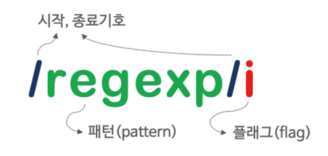

# 31장 RegExp(Regular Expression)
## 31.1 정규 표현식이란?
- 일정한 패턴을 가진 문자열의 집합을 표현하기 위해 사용하는 형식 언어 
- 정규 표현식은 문자열을 대상으로 패턴 매칭 기능을 제공한다.
- **패턴 매칭 기능** : 특정 패턴과 일치하는 문자열을 검색하거나 추출 또는 치환할 수 있는 기능을 말한다.

## 31.2 정규 표현식의 생성
- 정규 표현식 객체생성 방법
    - RegExp 생성자 함수
    ```jsx
    new RegExp(pattern[, flags])
    ```
    - 정규 표현식 리터럴 : 일반적인 방법으로 패턴과 플래그로 구성된다.
    ```jsx
    const target = 'Is this all there is?';
    const regexp = /is/i;
    ```
<p align="center"></p>

## 31.3 RegExp 메서드
### 31.3.1 RegExp.prototype.exec
- 인수로 전달받은 문자열에 대해 정규 표현식의 패턴을 검색하여 매칭 결과를 배열로 반환.
- 매칭 결과가 없는 경우 null을 반환
```jsx
//** 매칭 결과가 있는 경우에는 배열로 반환
const tel = '010-1234-5673'
const regExp = /^\d{3}-\d{4}\-\d{4}$/;

console.log(regExp.exec(tel));
//['010-1234-5673', index: 0, input: '010-1234-5673', groups: undefined]

//** 매칭 결과가 없는 경우 null을 반환
const tel = '010-1234-567팔'
const regExp = /^\d{3}-\d{4}\-\d{4}$/;

console.log(regExp.exec(tel));
//null
```

### 31.3.2 RegExp.prototype.test
- 인수로 전달받은 문자열에 대해 정규 표현식의 패턴을 검색하여 매칭 결과를 불리언 값으로 반환.
```jsx
    const tel = '010-1234-567팔'
    const regExp = /^\d{3}-\d{4}\-\d{4}$/;

    console.log(regExp.test(tel)); //false
```

### 31.3.3 String.prototype.match
- String 표준 빌트인 객체가 제공하며, 대상 문자열과 인수로 전달받은 정규 표현식과의 매칭 결과를 배열로 반환.
```jsx
    const tel = '010-1234-5678';
    const regExp = /^\d{3}-\d{4}\-\d{4}$/;

    console.log(tel.match(regExp));
    //['010-1234-5678', index: 0, input: '010-1234-5678', groups: undefined]
```

**❓exec 메서드와 match 메서드의 차이는?**
- exec 메서드는 문자열 내의 모든 패턴을 검색하는 g 플래그를 지정해도 첫 번째 매칭 결과만 반환한다.
- match 메서드는 g 플래그는 g 플래그가 지정되면 모든 매칭 결과를 배열로 반환한다.
```jsx
    const str = "1번가 3번지 201호 36세 홍길동";
    const regExp = /\d+/g;

    console.log(regExp.exec(str));
    //['1', index: 0, input: '1번가 3번지 201호 36세 홍길동', groups: undefined]

    console.log(str.match(regExp));
    //['1', '3', '201', '36']
```

## 31.4 플래그
- 플래그 : 정규 표현식의 검색 방식을 설정하기 위해 사용
- 옵션이므로 선택적으로 사용이 가능
- 플래그를 사용하지 않은 경우 대소문자를 구별해서 패턴을 검색.

|플래그|의미|설명|
|:---:|:---:|:---:|
|i|Ignore case|대소문자를 구별하지 않고 패턴을 검색|
|g|Global|대상 문자열 내에서 패턴과 일치하는 모든 문자열을 전역 검색한다.|
|m|Multi line|문자열의 행이 바뀌더라도 패턴 검색을 계속한다.|

```jsx
const target = 'Is this all there is?';

//대소문자를 구별하여 한번만 검색
console.log(target.match(/is/));
//['is', index: 5, input: 'Is this all there is?', groups: undefined]

//대소문자를 구별하지 않고 한번만 검색
console.log(target.match(/is/i));
//['Is', index: 0, input: 'Is this all there is?', groups: undefined]

//대소문자를 구별하여 전역 검색;
console.log(target.match(/is/g));
//['is', 'is']

//대소문자를 구별하지 않고 전역 검색
console.log(target.match(/is/ig));
//['Is', 'is', 'is']
```

## 31.5 패턴
- 패턴 : 문자열의 일정한 규칙을 표현하기 위해 사용
- 플래그 : 정규 표현식의 검색 방식을 설정.
- 어떤 문자열 내에 패턴과 일치하는 문자열이 존재할 때 **정규 표현식과 매치한다**라고 표현한다.

### 31.5.1 문자열 검색
- 패턴에 문자 또는 문자열을 지정하면 패턴으로 지정한 문자 또는 문자열을 검색한다.
```jsx
    const target = 'Is this all there is?';
    const regExp = /is/;

    //대소문자 구별하지 않고 검색하려면 플래그 i
    const regExp = /is/i;

    //패턴과 매치하는 모든 문자열을 전역 검색하려면 플래그 g를 사용
    const regExp = /is/ig;

    regExp.test(target); //true

    target.match(regExp);
    //['is', index: 5, input: 'Is this all there is?', groups: undefined]
```

### 31.5.2 임의의 문자열 검색
- .은 임의의 문자 한 개를 의미한다.
```jsx
const target = 'Is this all there is?';
//... 세 개로 패턴을 생성했을 때 3자리 문자열과 매치한다.
const regExp = /.../g;

console.log(target.match(regExp));
//['Is ', 'thi', 's a', 'll ', 'the', 're ', 'is?']
```

### 31.5.3 반복 검색
- `{m,n}` :  앞선 패턴이 최소 m번, 최대 n번 반복되는 문자열을 의미.
- `{n}` : 앞선 패턴이 n번 반복되는 문자열을 검색
- `{n,}` : 앞선 패턴이 n번 이상 반복되는 문자열을 검색
- `+` : 앞선 패턴이 최소 한번 이상 반복되는 문자열을 의미 (=`{1,}`) 
- `?` : 앞선 패턴이 0~1번 이상 반복되는 문자열을 의미 (=`={0,1}`)
```jsx
    const target = 'A AA B BB Aa Bb AAA';

    //* {m,n} : A 가 최소 1번, 최대 2번 반복되는 문자열을 전역 검색한다.
    const regExp = /A{1,2}/g;
    //['A', 'AA', 'A', 'AA', 'A']

    //* {n} : 앞의 문자열이 n번 반복되는 문자열을 검색한다.
    const regExp = /A{2}/g;
    //['AA', 'AA']
    
    //*{n,} :  앞선 패턴이 최소 n번 이상 반복되는 문자열을 의미한다.
    const regExp = /A{2,}/g;
    //['AA', 'AAA']

    //* + : 앞선 패턴이 한번 이상 반복되는 문자열을 의미
    const regExp = /A+/g;
    //['A', 'AA', 'A', 'AAA']

    console.log(target.match(regExp));

    //* ? : 앞선 패턴이 0번 또는 1번 이상 반복되는 문자열을 검색
     const target = 'color colour';
    //? 앞에 u가 0번 또는 1번이상이고 뒤에는 r이오는 문자열을 검색
    const regExp = /colou?r/g;

    console.log(target.match(regExp));
    //['color', 'colour']

```

### 31.5.4 OR 검색
- `|` : or을 의미
- `[]` : 대괄호 내의 문자는 or로 동작
- `[ - ]` : 범위를 지정.
```jsx
const target = 'A AA B BB Aa Bb ZZ';


//* A or B를 전역 검색
const regExp = /A|B/g;
//['A', 'A', 'A', 'B', 'B', 'B', 'A', 'B']


//* 분해되지 않은 단어 레벨로 검색
const regExp = /A+|B+/g;
//['A', 'AA', 'B', 'BB', 'A', 'B']


//* [] : A+|B+ 을 간단하게 표현할 수 있다. 
const regExp = /[AB]+/g;
//['A', 'AA', 'B', 'BB', 'A', 'B']


//* [ - ] : A~Z가 한번 이상 반복되는 문자열을 전역 검색
const regExp = /[A-Z]+/g;
['A', 'AA', 'B', 'BB', 'A', 'B', 'ZZ']


//* 대소문자 구별하지 않고 알파벳 검색
const regExp = /[A-Za-z]+/g

console.log(target.match(regExp));

```
<br>

- `\d` : 숫자
- `\D` : 숫자가 아닌 문자
- `\w` : 알파벳, 숫자, 언더스코어를 의미 `[A-Za-z0-9_]`
- `\W` : 알파벳, 숫자, 언더스코어가 아닌 문자
```jsx
const target = 'AA BB 12,345';

//* 0~9가 한번 이상 반복되는 문자열을 전역 검색
const regExp = /[0-9]+/g;
//['12', '345']

//* 쉼표 포함해서 숫자 검색
const regExp = /[0-9,]+/g;
//['12,345']

//* \d : 0~9 또는 ,가 한번이상 반복되는 문자열을 전역 검색
 const regExp = /[\d,]+/g;
 //['12,345']


//* \D
 const regExp = /[\D,]+/g;
 //['AA BB ', ',']

```

### 31.5.5 NOT 검색
- `[] 안의 ^` : 대괄호 내의 ^는 not의 의미를 갖는다.
```jsx
const target = 'AA BB 12,345';

// 0~9가 한번 이상 반복되는 문자열을 전역 검색
const regExp = /[^0-9]+/g;

console.log(target.match(regExp));
//['AA BB ', ',']
```

### 31.5.6 시작 위치로 검색
 - `[] 밖의 ^` 문자열의 시작을 의미
 ```jsx
 const target = 'https://poiemaweb.com';

// 'https' 로 시작하는지 검사
const regExp = /^https/;

console.log(regExp.test(target)) //true
 ```

 ### 31.5.7 마지막 위치로 검색
 - `$` : 문자열의 마지막을 의미
 ```jsx
 const target = 'https://poiemaweb.com';

// 'com'으로 끝나는지 검사
const regExp = /com$/;

console.log(regExp.test(target)) //true
```

## 31.6 자주 사용하는 정규표현식
### 31.6.1 특정 단어로 시작하는지 검사
- `^` : 문자열의 시작을 의미
- `?` : 앞선 패턴이 0 or 1번 이상 반복되는지 검사
```jsx
const url = 'https://example.com';

// http:// or https://로 시작하는지 검사
/^https?:\/\//.test(url); //true

/^(http|https):\/\//.test(url); //true
```

### 31.6.2 특정 단어로 끝나는지 검사
- `$` : 문자열의 마지막을 의미
```jsx
const fileName = 'index.html';

/html$/.test(fileName); // true
```

### 31.6.3 숫자로만 이루어진 문자열인지 검사
- `[] 바깥의 ^` : 문자열의 시작
- `$` : 문자열의 마지막
- `\d\` : 숫자
- `+` : 앞선 패던이 최소 한번 이상 반복되는 문자열
```jsx
const target = '12345';

/^\d+$/.test(target);//true
```

### 31.6.4 하나 이상의 공백으로 시작하는지 검사
- `\s` : 공백문자를 의미
```jsx
const target = ' Hi';

/^\s/.test(target); //true
```

### 31.6.5 아이디로 사용 가능한지 검사
- 알파벳 대소문자, 숫자로 시작하고 끝나며 4~10자리인지 검사
```jsx
const id = 'abc123';

/^[A-Za-z0-9]{4,10}$/.test(id);//true
```

### 31.6.6 메일 주소 형식에 맞는지 검사
```jsx
const email = 'ungmo2@gmail.com';

/^[0-9a-zA-Z]([-_\.]?[0-9a-zA-Z])*@[0-9a-zA-Z]([-_\.]?[0-9a-zA-Z])*\.[a-zA-Z]{2,3}$/.test(eamil);
```

### 31.6.7 핸드폰 번호 형식에 맞는지 검사
```jsx
const cellphone = '010-1234-5678'

/^\d{3}-\d{3,4}-\d{4}$/.test(cellphone); //true
```

### 31.6.8 특수 문자 포함 여부 검사
```jsx
const target = 'abc#123';

//a-z, A-Z, 0-9 이외의 문자가 특수문자다.
(/[^A-Za-z0-9]/ig).test(target);//true

// 특수문자를 선택적으로 검사하기
const regExp = /[\{\}\[\]\/?.,;:|\)*~`!^\-_+<>@\#$%&\\\=\(\'\"]/g;

//특수문자 제거는 replace 메서드를 사용
target.replace(/[^A-Za-z0-9]/ig,'')
```


