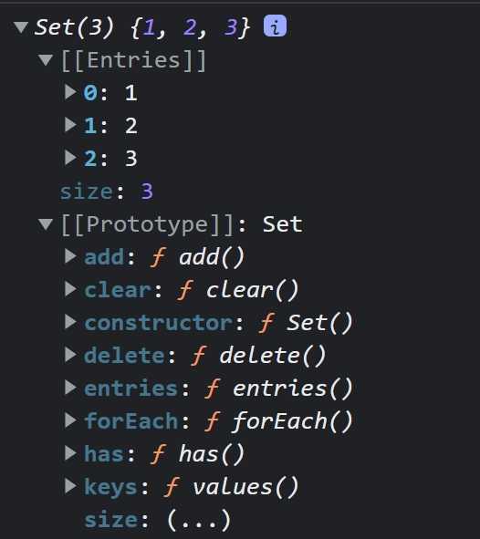
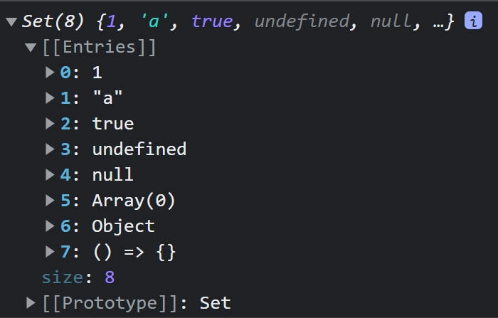

# 37장 Set과 Map
## 37.1 Set
- Set 객체는 중복되지 않는 유일한 값들의 집합

|구분|배열|Set 객체|
|:---:|:---:|:---:|
|동일한 값을 중복하여 포함할 수 있다.|O|X|
|요소 순서에 의미가 있다.|O|X|
|인덱스로 요소에 접근할 수 있다.|O|X|

- Set 객체의 특성은 수학적 집합의 특성과 일치한다. Set을 통해 교집합, 합집합, 차집합, 여집합 등을 구할 수 있다.

### 37.1.1 Set 객체의 생성
- 생성자 함수로 생성할 수 있으며 인수로는 이터러블을 전달받아 Set 객체를 생성한다.
- 이때 이터러블의 중복된 값은 Set 객체의 요소로 저장하지 않는다.
```jsx
const set1 = new Set([1,2,3,3]);
console.log(set1); //Set(3) {1, 2, 3}

const set2 = new Set('hello');
console.log(set2);//Set(4) {'h', 'e', 'l', 'o'}
```
- 중복을 허용하지 않기 때문에 배열에서 중복된 요소를 제거할 때 유용하다.
```jsx
//일반적으로 중복된 요소를 제거할 때
const uniq = (array) => array.filter((v,i,self) => self.indexOf(v) ===i);
console.log(uniq([2,1,1,1,2,4,6])); //(4) [2, 1, 4, 6]

//Set 객체로 중복된 요소 제거하기
const uniq = array => [...new Set(array)];
console.log(uniq([2,1,1,1,2,4,6]));//(4) [2, 1, 4, 6]
```

### 37.1.2 요소 개수 확인
- Set 객체의 요소 개수를 확인할 때는 Set.prototype.size 프로퍼티를 사용한다.
```jsx
console.log(new Set([1,2,3]));
```

<p align="center"></p>

```jsx
const { size } = new Set([1,2,3,3]);
console.log(size); //3
```

### 37.1.3 요소 추가
- Set 객체에 요소를 추가할 때는 Set.prototype.add 메서드를 사용한다.

```jsx
const set = new Set();
console.log(set); //Set(0) {size: 0}

set.add(1);
console.log(set); //Set(1) {1}
```

- add 메서드는 새로운 요소가 추가된 Set 객체를 반환한다.따라서 add 메서드를 호출한 후에 add 메서드를 연속적으로 호출할 수 있다.
```jsx
const set = new Set();

set.add(1).add(2);
console.log(set); //Set(2) {1, 2}

//중복된 요소를 추가하는것은 허용하지 않는다. 이때 에러 발생없이 무시한다.
const set = new Set();

set.add(1).add(2).add(2);
console.log(set); //Set(2) {1, 2}

```
- Set 객체는 객체나 배열과 같이 자바스크립트의 모든 값을 요소로 저장할 수 있다.
```jsx
const set = new Set();
set
    .add(1)
    .add('a')
    .add(true)
    .add(undefined)
    .add(null)
    .add([])
    .add({})
    .add(() => {})

console.log(set);
```

<p align="center"></p>

### 37.1.4 요소 존재 여부 확인
- Set 객체에 특정 요소가 존재하는지 확인하려면 `Set.prototype.has` 메서드를 사용한다.
```jsx
const set = new Set([1,2,3]);

console.log(set.has(2)); //true
console.log(set.has(4)); //false
```

### 37.1.5 요소 삭제
- Set 객체의 특정 요소를 삭제하려면 `Set.prototype.delete` 메서드를 사용.
```jsx
const set = new Set([1,2,3]);

set.delete(2);
console.log(set);//Set(2) {1, 3}

set.delete(1);
console.log(set);//Set(1) {3}
```
- delete 메서드는 삭제 성공여부를 나타내는 불리언값을 반환하기 때문에 add 메서드처럼 연속적으로 사용할 수 없다.
```jsx
const set = new Set([1,2,3]);

console.log(set.delete(1)) //true
console.log(set.delete(0)) //false

set.delete(2).delete(3);//Uncaught TypeError
```

### 37.1.6 요소 일괄 삭제
- Set 객체의 모든 요소를 일괄 삭제하려면 Set.prototype.clear 메서드를 사용.
```jsx
const set = new Set([1,2,3]);

set.clear();
console.log(set); //Set(0) {size: 0}
```

### 37.1.7 요소 순회
- Set 객체의 요소를 순회할 때는 `Set.prototype.forEach` 메서드를 사용한다.
- 이때 forEach 메서드의 콜백 함수는 3개의 인수를 전달받는다.
    - 첫 번째 인수 : 현재 순회 중인 요소값
    - 두 번째 인수 : 현재 순회 중인 요소값
    - 세 번째 인수 : 현재 순회 중인 Set 객체 자체

```jsx
const set = new Set([1,2,3]);

set.forEach((v,v2,set) => console.log(v,v2,set));
/*
    1 1 Set(3) {1, 2, 3}
    2 2 Set(3) {1, 2, 3}
    3 3 Set(3) {1, 2, 3}
*/
```

- Set 객체는 이터러블이기 때문에 for...of문으로 순회할 수 있으며
- 스프레드 문법과 배열 디스트럭처링의 대상이 될 수도 있다.
```jsx
const set = new Set([1,2,3]);

for (const value of set){
    console.log(value); //1 2 3
}

//스프레드 문법으로 사용이 가능하다.
console.log(...set);// 1 2 3

//디스트럭처링 할당이 가능하다.
const [a, ...rest] = set;
console.log(a);//1
console.log(rest);//[2,3]
```

### 37.1.8 집합 연산
- Set 객체는 수학적 집합을 구현하기 위한 자료구조다. 따라서 Set 객체를 통해 교집합, 합집합, 차집합 등을 구현할 수 있다.

#### 교집합
```jsx
Set.prototype.intersection = function(set){
    const result  = new Set();

    for(const value of set){
        if(this.has(value)) result.add(value);
    }
    return result;
}

const setA = new Set([1,2,3,4]);
const setB = new Set([2,4]);

//SetA와 SetB의 교집합
console.log(setA.intersection(setB)); //Set(2) {2, 4}
console.log(setB.intersection(setA)); //Set(2) {2, 4}

//filter 메서드로 더 간단하게 교집합 구현이 가능하다.
Set.prototype.intersection = function(set){
    return new Set([...this].filter(v => set.has(v)));
}

const setA = new Set([1,2,3,4]);
const setB = new Set([2,4]);

console.log(setA.intersection(setB)); //Set(2) {2, 4}
console.log(setB.intersection(setA)); //Set(2) {2, 4}
```

```jsx
Array.prototype.intersection = function(array){
    return this.filter((v,i) => );
}

const arrA = [1,2,3,4];
const arrB = [1,2,4];

console.log(arrA.intersection(arrB));
```

#### 합집합
```jsx
Set.prototype.union = function(set){
    const result = new Set(this);
    
    for(const value of set){
        //중복된 요소들은 자동으로 제거되기 때문에 합집합으로 구현이 가능.
        result.add(value);
    }
    return result;
}

const setA = new Set([1,2,3,4]);
const setB = new Set([2,4]);

console.log(setA.union(setB)); //Set(4) {1, 2, 3, 4}
console.log(setB.union(setA)); //Set(4) {2, 4, 1, 3}

//또는 다음과 같은 방법으로도 구현 가능
Set.prototype.union = function(set){
    return new Set([...this, ...set]);
};

const setA = new Set([1,2,3,4]);
const setB = new Set([2,4]);

console.log(setA.union(setB)); //Set(4) {1, 2, 3, 4}
console.log(setB.union(setA)); //Set(4) {2, 4, 1, 3}

```

#### 차집합
- 차집합 A-B는 집합 A에는 존재하지만 집합 B에는 존재하지 않는 요소로 구성된다.
```jsx
Set.prototype.difference = function(set){
    const result = new Set(this);

    for(const value of set){
        result.delete(value);
    }

    return result;
};

const setA = new Set([1,2,3,4]);
const setB = new Set([2,4]);

console.log(setA.difference(setB)); //Set(2) {1, 3}
console.log(setB.difference(setA)); //Set(0) {}

//filter로 더 간단하게 구현하기
Set.prototype.difference = function(set){
    return new Set([...this].filter(v=> !set.has(v)));
}

const setA = new Set([1,2,3,4]);
const setB = new Set([2,4]);

console.log(setA.difference(setB)); //Set(2) {1, 3}
console.log(setB.difference(setA)); //Set(0) {}
```

#### 부분 집합과 상위 집합
- 집합 A가 집합 B에 포함되는 경우(A⊂B) 집합 A는 집합 B의 부분 집합이며
- 집합 B는 집합 A의 상위 집합이다.
```jsx
Set.prototype.isSuperset = function(subset){
    for(const value of subset){
        if(!this.has(value)) return false;
    }

    return true;
}

const setA = new Set([1,2,3,4]);
const setB = new Set([2,4]);

console.log(setA.isSuperset(setB)) //true
//setB는 setA의 부분집합이다. B⊂A
console.log(setB.isSuperset(setA)) //false

//every 메소드를 이용한 다른 방법
//`every`배열 안의 모든 요소가 주어진 판별 함수를 통과하는지 테스트

Set.prototype.isSuperset = function(subset){
    const supersetArr = [...this];
    return [...subset].every(v => supersetArr.includes(v));
}

const setA = new Set([1,2,3,4]);
const setB = new Set([2,4]);


console.log(setA.isSuperset(setB))//true
console.log(setB.isSuperset(setA))//false
```


❓ 중복 요소에 대한 차이점 말고는 array와 딱히 달라보이는게 없는데?
- array와 set의 성능 테스트에서 요소를 추가, 변경할 때는 array가 더 빨랐다.  
- 요소를 제거할 때는 set으로 연산하는 것이 훨씬 빨랐다.

❓ES6에서 Set은 대체 왜 만들어진건가?
- 중복 없이 고유한 값들로 구성된 집합을 만들 필요가 생긴다.
- 이때 요소를 추가할 때 중복검사를 하는 과정을 추가하며 집합을 만들때보다 set.add(value)를 통해 요소를 추가하는게 속도가 더 빨랐다.

- [참고한 사이트](https://velog.io/@nittre/%EC%9E%90%EB%B0%94%EC%8A%A4%ED%81%AC%EB%A6%BD%ED%8A%B8-Array-VS-Set)

## 37.2 Map
- Map 객체는 키와 값의 쌍으로 이루어진 컬렉션
- Map 객체는 객체와 유사하지만 차이점이 있다.

|구분|객체|Map 객체|
|:---:|:---:|:---:|
|키로 사용할 수 있는 값|문자열 또는 심벌값|객체를 포함한 모든 값|
|이터러블|X|O|
|요소 개수 확인|Object.keys(obj).length|map.size|

### 37.2.1 Map 객체의 생성
- Map 객체는 Map 생성자 함수로 생성한다.
- Map 생성자 함수는 이터러블을 인수로 전달받아 Map 객체를 생성한다.
- 이때 인수로 전달되는 이터러블은 키와 값의 쌍으로 이루어진 요소로 구성되어야 한다.
- 중복된 키를 갖는 요소가 존재할 수 없다.

```jsx
const map1 = new Map([['key1', 'value1'], ['key2', 'value2']]);
console.log(map1) //Map(2) {'key1' => 'value1', 'key2' => 'value2'}

//키와 값의 쌍으로 이루어진 요소로 구성되어야 한다.
const map2 = new Map([1,2]); //Uncaught TypeError: Iterator value 1 is not an entry object

//중복된 키는 가질 수 없다.
const map3 = new Map([['key1', 'val1'], ['key1','val2']]);
console.log(map3); //Map(1) {'key1' => 'val2'}
```

### 37.2.2 요소 개수 확인
- Map 객체의 요소 개수를 확인할 때는 `Map.prototype.size` 프로퍼티를 사용.
```jsx
const map = new Map([['key1', 'value1'], ['key2', 'value2']]);
console.log(map.size); //2
```

### 37.2.3 요소 추가
- Map 객체에 요소를 추가할 때는 `Map.prototype.set` 메서드 사용
```jsx
const map = new Map();
console.log(map); //Map(0) {size: 0}

map.set('key1','val1');
console.log(map); //Map(1) {'key1' => 'val1'}

// set 메서드는 새로운 Map 객체를 생성하기 때문에 연속 호출 가능
map.set('key2','val2').set('key3', 'val3');
console.log(map); //Map(3) {'key1' => 'val1', 'key2' => 'val2', 'key3' => 'val3'}
```

- Map 객체에서는 중복된 키를 갖는 요소가 존재할 수 없기 때문에 중복된 키를 갖는 요소를 추가하면 값이 덮어 써지고 에러가 발생하지 않는다.
```jsx
const map = new Map();

map.set('key1','val1').set('key1','val2');

console.log(map); //Map(1) {'key1' => 'val2'}
```

- Map 객체는 키 타입에 제한이 없다. 따라서 객체를 포함한 모든 값을 키로 사용할 수 있다.
```jsx
const map = new Map();

const lee = {name:'Lee'};
const kim = {name:'Kim'};

map.set(lee, 'developer').set(kim, 'designer');

console.log(map); //Map(2) {{name:'Lee'} => "developer", {name:"Kim"} => "designer"}
```

### 37.2.4 요소 취득
- Map 객체에서 키값을 취득하려면 `Map.prototype.get` 메서드를 사용.
```jsx
const map = new Map();

const lee = {name:'Lee'};
const kim = {name:'Kim'};

map.set(lee, 'developer').set(kim, 'designer');

console.log(map.get(lee)); //developer
console.log(map.get(kim)); //designer
```

### 37.2.5 요소 존재 여부 확인
- Map 객체에 특정 요소가 존재하는지 확인하려면 `Map.prototype.has` 메서드를 사용
- has 메서드는 특정 요소의 존재 여부를 불리언 값으로 반환한다.
```jsx
const map = new Map();

const lee = {name:'Lee'};
const kim = {name:'Kim'};

map.set(lee, 'developer').set(kim, 'designer');

console.log(map.has(lee)); //true
console.log(map.has('yang')); //false
```

### 37.2.6 요소 삭제
- Map 객체의 요소를 삭제하려면 `Map.prototype.delete` 메서드를 사용.
```jsx
const map = new Map();

const lee = {name:'Lee'};
const kim = {name:'Kim'};

map.set(lee, 'developer').set(kim, 'designer');

map.delete(lee);
console.log(map); //Map(1) {{name:'Kim'} => 'designer'};
```

### 37.2.7 요소 일괄 삭제
- `Map.prototype.clear` 메서드 사용
```jsx
const map = new Map();

const lee = {name:'Lee'};
const kim = {name:'Kim'};

map.set(lee, 'developer').set(kim, 'designer');


map.clear();
console.log(map);//Map(0) {size: 0}
```

### 37.2.8 요소 순회
- Map 객체의 요소를 순회하려면 Map.prototype.forEach 메서드를 사용.
- forEach 메서드의 콜백함수는 3개의 인수를 전달받는다.
    - 첫 번째 인수 : 현재 순회 중인 요소값
    - 두 번째 인수 : 현재 순회 중인 요소키
    - 세 번째 인수 : 현재 순회 중인 Map 객체 자체

```jsx

const map = new Map();

const lee = {name:'Lee'};
const kim = {name:'Kim'};
map.set(lee, 'developer').set(kim, 'designer');

map.forEach((v,k,map) => console.log(v)); //developer designer
map.forEach((v,k,map) => console.log(k)); //{name: 'Lee'} {name: 'Kim'}
map.forEach((v,k,map) => console.log(map)); 
//Map(2) {{…} => 'developer', {…} => 'designer'}
//Map(2) {{…} => 'developer', {…} => 'designer'}
```

- Map 객체는 이터러블이다. 따라서 for...of 문으로 순회할 수 있으며, 스프레드 문법과 배열 디스트럭처링 할당의 대상이 될 수도 있다.
```jsx
const lee = {name:'Lee'};
const kim = {name:'kim'};

const map = new Map([[lee,'developer'], [kim,'designer']]);

for(const entry of map){
    console.log(entry); //[{name: 'Lee'}, 'developer'] [{name: 'kim'}, 'designer']
}

console.log([...map]) //[[{name: 'Lee'}, 'developer']], [[{name: 'kim'}, 'designer']]

const [a,b] = map;
console.log(a,b);////[{name: 'Lee'}, 'developer'] [{name: 'kim'}, 'designer']
```

❓ Map과 Object는 언제 사용해야될까?
- 데이터를 저장하기 위한 간단한 구조만 필요하고 모든 키가 문자열일 경우 Object가 훨씬 빠름.
- 객체에 함수가 들어갈 경우 Object를 사용할수밖에 없다.
- JSON은 Object를 직접적으로 지원하고 있지만 Map은 아직이다.
- Map은 순서를 기억하기 때문에 요소 순서가 중요한 경우 Map이 더 고려된다.
- Map은 키를 문자열이 아닌 다른 타입으로 설정해야 할 때 사용하면 좋다.
- [참고사이트](https://medium.com/front-end-weekly/es6-map-vs-object-what-and-when-b80621932373)
