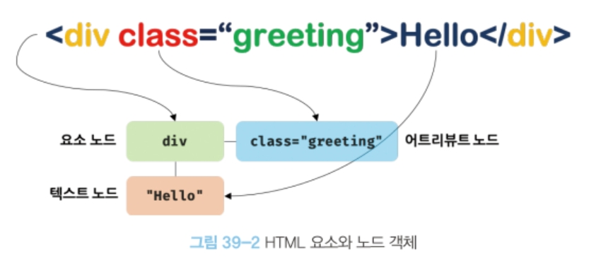
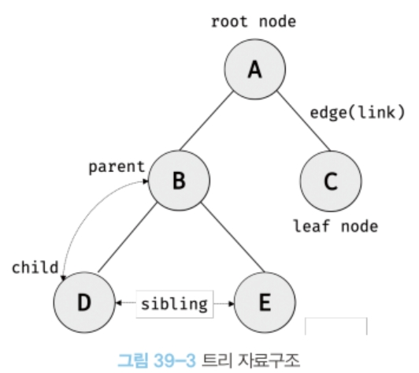
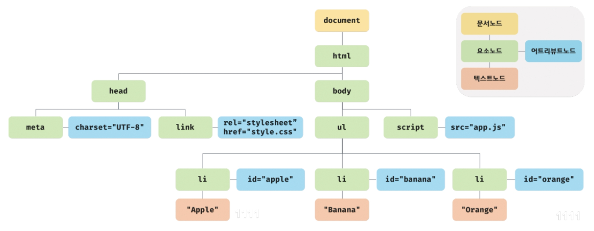
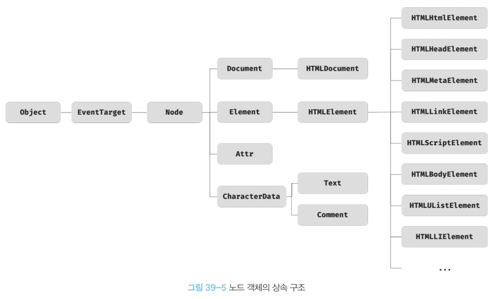
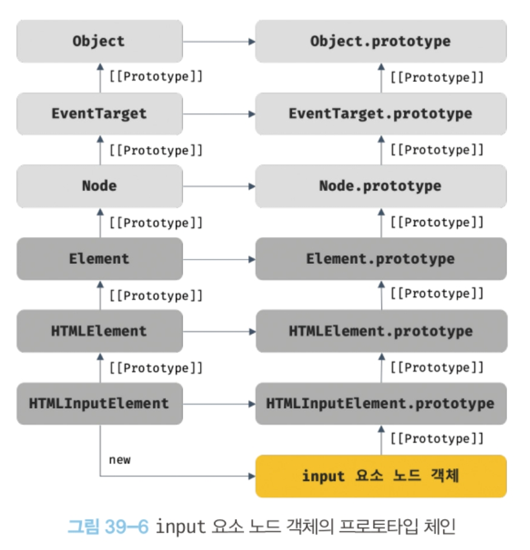
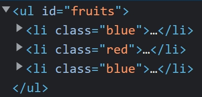
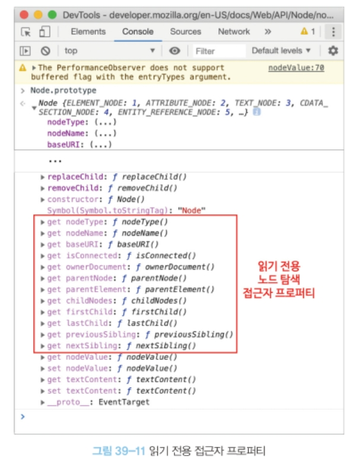

# 39장 DOM
- 브라우저의 렌더링 엔진은 HTML 문서를 파싱하여 브라우저가 이해할 수 있는 자료구조인 DOM을 생성.
- DOM(Document Object Model)은 HTML 문서의 계층적 구조와 정보를 표현하며 이를 제어할 수 있는 API, 즉 프로퍼티와 메서드를 제공하는 트리 자료구조다.

## 39.1 노드
### 39.1.1 HTML 요소와 노드 객체
- HTML 요소는 HTML 문서를 구성하는 개별적인 요소를 의미
- HTML 요소는 렌더링 엔진에 의해 파싱되어 DOM을 구성하는 요소 노드 객체로 변환된다. 이때 HTML 요소의 어트리뷰트는 어트리뷰트 노드로, HTML 요소의 텍스트 콘텐츠는 텍스트 노드로 변환된다.
<p align="center"></p>
- HTML 요소는 중첩관계를 가지며 이때 계층적인 부자 관계가 형성된다.
- HTML 요소 간의 부자 관계를 반영하여 HTML 문서의 구성 요소인 HTML 요소를 객체화한 모든 노드 객체들을 트리 자료로 구성한다.
<br><br>

#### **트리 자료구조(Tree Data Structure)**
<p align="center"></p>

- 트리 자료구조는 부모 노드와 자식 노드로 구성되어 노드 간의 계층적 구조를 표현하는 비선형 자료구조
- 최상위 노드는 부모 노드가 없으며, **루트 노드**라 한다.
- 자식 노드가 없는 노드를 **리프 노드**라 한다.
- **노드 객체들로 루성된 트리 자료구조를 DOM**이라 한다. 노드 객체의 트리로 구조화되어 있기 때문에 DOM을 DOM 트리라고도 부른다.

### 39.1.2 노드 객체의 타입
```html
<!DOCTYPE html>
<html>
<head>
    <meta charset="UTF-8">
    <link rel="stylesheet" href="style.css">
</head>
<body>
    <ul>
        <li id="apple">Apple</li>
        <li id="banana">banana</li>
        <li id="orange">Orange</li>
    </ul>
<script src="app.js"></script>
</body>
</html>
```
<p align="center"></p>

#### 문서 노드
- DOM 트리의 최상위에 존재하는 루트 노드.
- document 객체를 가리킨다.
- document 객체는 브라우저가 렌더링한 HTML 문서 전체를 가리키는 객체로서 전역 객체 window의 document 프로퍼티에 바인딩되어 있다. 따라서 문서 노드는 window.document 또는 document로 참조할 수 있다.
- 문서 노드, 즉 document 객체는 DOM 트리의 루트 노드이므로 DOM 트리의 노드들에 접근하기 위한 진입점 역할을 담당한다.즉 요소, 어트리뷰트, 텍스트 노드에 접근하려면 문서 노드를 통해야 한다.

#### 요소 노드
- HTML 요소를 가리키는 객체
- 요소 노드는 HTML 요소 간의 중첩에 의해 부자 관계를 가지며, 이 부자 관계를 통해 정보를 구조화한다. 따라서 요소 노드는 문서의 구조를 표현한다고 할 수 있다.

#### 어트리뷰트 노드
- 어트리뷰트 노드는 HTML 요소의 어트리뷰트를 가리키는 객체.
- 요소 노드는 부모 노드와 연결되어 있지만 어트리뷰트 노드는 요소 노드에만 연결되어 있다.
- 어트리뷰트 노드에 접근하여 어트리뷰트를 참조하거나 변경하려면 먼저 요소 노드에 접근해야 한다.

#### 텍스트 노드
- HTML 요소의 텍스트를 가리키는 객체다.
- 텍스트 노드는 요소 노드의 자식 노드이며, 자식 노드를 가질 수 없는 리프 노드다.
- 즉, 텍스트 노드는 DOM 트리의 최종단이다.
- 따라서 텍스트 노드에 접근하려면 먼저 부모 노드인 요소 노드에 접근해야 한다.

### 39.1.3 노드 객체의 상속 구조
- DOM은 HTML 문서의 계층적 구조와 정보를 표현하며, 이를 제어할 수 있는 API, 즉 프로퍼티와 메서드를 제공하는 트리 자료구조라고 했다.
- DOM을 구성하는 노드 객체는 구조와 정보를 제어할 수 있는 DOM API를 사용할 수 있다.
- 이를 통해 노드 객체는 자신의 부모, 형제, 자식을 탐색할 수 있으며, 자신의 어트리뷰트와 텍스트를 조작할 수도 있다.
- DOM을 구성하는 노드 객체는 ECMAScript 사양에 정의된 표준 빌트인 객체가 아니라 브라우저 환경에서 추가적으로 제공하는 호스트 객체다.
- 하지만 노드 객체도 자바스크립트 객체이므로 프로토타입에 의한 상속 구조를 갖는다. 

<p align="center"></p>

- 모든 노드 객체는 Object, EventTarget, Node 인터페이스를 상속받는다.
- 문서 노드는 Document, HTMLDocument 인터페이스를 상속받고
- 어트리뷰트 노드는 Attr,
- 텍스트 노드는 CharacterData 인터페이스를 상속받는다.
- 요소 노드는 Element 인터페이스를 상속받고 HTMLElement와 태그의 종류별로 세분화된 인터페이스를 상속받는다.

<p align="center"></p>

- input 요소 노드 객체는 다양한 특성을 갖는 객체이며, 이러한 특성을 나타내는 기능들을 상속을 통해 제공받는다.

|input 요소 노드 객체의 특성|프로토타입을 제공하는 객체|
|:---:|:---:|
|객체|Object|
|이벤트를 발생시키는 객체|EventTarget|
|트리 자료구조의 노드 객체|Node|
|브라우저가 렌더링할 수 있는 웹 문서의 요소를 표현하는 객체|Element|
|웹 문서의 요소 중에서 HTML 요소를 표현하는 객체|HTMLElement|
|HTML 요소 중에서 input 요소를 표현하는 객체|HTMLInputElement|

- DOM은 HTML 문서의 계층적 구조와 정보를 표현하는 것은 물론 노드 객체의 종류, 즉 노드 타입에 따라 필요한 기능을 프로퍼티와 메서드의 집합인 DOM API로 제공한다. 이 DOM API를 통해 HTML 구조나 내용 또는 스타일 등을 동적으로 조작할 수 있다.

## 39.2 요소 노드 취득
- HTML의 구조나 내용 또는 스타일 등을 동적으로 조작하려면 요소 노드를 취해야 한다.
### 39.2.1 id를 이용한 요소 노드 취득
- `Document.prototype.getElementById`
- 인수로 전달한 id 어트리뷰트 값을 갖는 하나의 요소 노드를 탐색하여 반환.

```html
<body>
    <ul>
        <li id="apple">Apple</li>
        <li id="banana">Banana</li>
        <li id="orange">Orange</li>
    </ul>
<script>
    //id 값이 'banana'인 요소 노드를 탐색하여 반환한다.
    //두 번째 li 요소가 파싱되어 생성된 요소 노드가 반환된다.
    const $elem = document.getElementById('banana');

    //취득한 요소 노드의 style.color 프로퍼티 값을 변경한다.
    $elem.style.color = 'red';

    //** 인수로 전달된 id 값을 갖는 HTML 요소가 존재하지 않는 경우 null을 반환
    const $elem2 = document.getElementById('grape');
    console.log($elem2); //null

</script>
</body>
```

- HTML 요소에 id 어트리뷰트를 부여하면 id 값과 동일한 이름의 전역 변수가 암묵적으로 선언되고 해당 노드 객체가 할당되는 부수 효과가 있다.

```html
<body>
    <div id="foo"></div>
<script>

    console.log(foo === document.getElementById('foo'));
    //true

</script>
</body>

```

### 39.2.2 태그 이름을 이용한 요소 노드 취득
- `Document.prototype.getElementsByTagName`
- `Element.prototype.getElementsByTagName`
- 인수로 전달한 태그 이름을 갖는 모든 요소들을 탐색하여 반환
- Elements가 복수형인 것에서 알 수 있듯이 getElementsByTagName 메서드는 여러 개의 요소 노드 객체를 갖는 DOM 컬렉션 객체인 HTMLCollection 객체를 반환한다.
```html
<body>
    <ul>
        <li id="apple">Apple</li>
        <li id="banana">Banana</li>
        <li id="orange">Orange</li>
    </ul>

    <script>
        //태그 이름이 li인 요소 노드를 모두 탐색하여 반환한다.
        //탐색된 요소 노드들은 HTMLCollection 객체에 담겨 반환된다.
        //HTMLCollection 객체는 유사 배열 객체이면서 이터러블이다.
        const $elems = document.getElementsByTagName('li');

        //취득한 모든 요소 노드의 style.color 프로퍼티 값을 변경한다.
        //HTMLCollection 객체를 배열로 변환하여 순회하며 color 프로퍼티 값을 변경한다.
        [...$elems].forEach(elem => elem.style.color = 'red');

    </script>
</body>
```

### 39.2.3 class를 이용한 요소 노드 취득
- `Document.prototype.getElementsByClassName`
- `Element.prototype.getElementsByClassName`
- 메서드는 인수로 전달한 class 어트리뷰트 값을 갖는 모든 요소 노드들을 탐색하여 반환.
- 인수로 전달할 class 값은 공백으로 구분하여 여러 개의 class를 지정할 수 있다.
- 여러 개의 요소 노드 객체를 갖는 DOM 컬렉션 객체인 HTMLCollection 객체를 반환한다.

```html
<body>
    <ul>
        <li class="fruit apple">Apple</li>
        <li class="fruit banana">Banana</li>
        <li class="fruit orange">Orange</li>
    </ul>

    <script>
        const $elems = document.getElementsByClassName('fruit');
        // console.log($elems)
        
        [...$elems].forEach(elem => elem.style.color = 'red');
    </script>
</body>
```

### 39.2.4 CSS 선택자를 이용한 요소 노드 취득
- `Document.prototype.querySelector`/`Element.prototype.querySelector`
- 인수로 전달한 CSS 선택자를 만족시키는 하나의 요소 노드를 탐색하여 반환
```html
<body>
    <ul>
        <li class="fruit apple">Apple</li>
        <li class="fruit banana">Banana</li>
        <li class="fruit orange">Orange</li>
    </ul>

    <script>
        const $elem = document.querySelector('.banana');

        $elem.style.color = 'red';
    </script>
</body>
```

- `Document.prototype.querySelectorAll`/`Element.prototype.querySelectorAll`
- 인수로 전달한 CSS 선택자를 만족시키는 모든 요소 노드를 탐색하여 반환.
- 여러 개의 요소 노드 객체를 갖는 DOM 컬렉션 객체인 NodeList 객체를 반환한다.
- NodeList 객체는 유사 배열 객체이면서 이터러블이다.

```html
<body>
    <ul>
        <li class="fruit apple">Apple</li>
        <li class="fruit banana">Banana</li>
        <li class="fruit orange">Orange</li>
    </ul>

    <script>
        const $elems = document.querySelectorAll('ul>li');
        console.log($elems)

        $elems.forEach(el => el.style.color='red');
    </script>
</body
```
- `getElementById`, `getElementsByTagName`, `getElementsByClassName` 메서드들보다 CSS 선택자 문법을 사용하는 `querySelector`, `querySelectorAll` 메서드 사용을 더 권장하고 있다.
- 속도는 느리나 CSS 선택자 문법으로 좀 더 구체적인 조건과 일관된 방식으로 요소 노드를 취득할 수 있기 때문.

### 39.2.5 특정 요소 노드를 취득할 수 있는지 확인
- `Element.prototype.matches` 메서드는 인수로 전달한 CSS 선택자를 통해 특정 요소 노드를 취득할 수 있는지 확인.

```html
<body>
    <ul id="fruits">
        <li class="apple">Apple</li>
        <li class="banana">Banana</li>
        <li class="orange">Orange</li>
    </ul>

    <script>
        const $apple = document.querySelector('.apple');

        console.log($apple.matches('#fruits > li.apple'));//true
        console.log($apple.matches('#fruits>li.banana'));//false
    </script>
</body>
```

### 39.2.6 HTMLCollection과 NodeList
- DOM 컬렉션 객체인 HTMLCollection과 NodeList는 DOM API가 여러 개의 결과값을 반환하기 위한 DOM 컬렉션 객체다.
- HTMLCollection과 NodeList는 모두 유사 배열 객체이면서 이터러블이다.

#### **HTMLCollection**
- getElementsByTagName, getElementsByClassName 메서드가 반환하는 HTMLCollection 객체는
- 노드 객체의 상태 변화를 실시간으로 반영하는 살아 있는 DOM 컬렉션이다.

```html
<body>
    <ul id="fruits">
        <li class="red">Apple</li>
        <li class="red">Banana</li>
        <li class="red">Orange</li>
    </ul>

    <script>
        const $elems = document.getElementsByClassName('red');

        console.log($elems);//HTMLCollection(3) [li.red, li.red, li.red]

        for(let i=0; i<$elems.length; i++){
            $elems[i].className = 'blue';
        }
        console.log($elems) //HTMLCollection [li.red]
        
    </script>
</body>
```
<p align="center"></p>
- HTMLCollection 객체는 실시간으로 노드 객체의 상태 변경을 반영하여 요소를 제거할 수 있기 때문에 HTMLCollection 객체를 for 문으로 순회하면서 노드 객체의 상태를 변경해야 할 때 주의해야 한다.
- 해결책은 HTMLCollection 객체를 사용하지 않거나 배열로 변환하여 배열 고차함수를 사용할 수 있다.

#### **NodeList**
- HTMLCollection 객체의 부작용을 해결하기 위해 querySelectorAll 메서드를 사용하는 방법도 있다.
- querySelectorAll 메서드는 NodeList 객체를 반환하며 실시간으로 노드 객체의 상태 변경을 하지않는다.
```html
<body>
    <ul id="fruits">
        <li class="red">Apple</li>
        <li class="red">Banana</li>
        <li class="red">Orange</li>
    </ul>

    <script>
        const $elems = document.querySelectorAll('.red');

        console.log($elems);//NodeList(3) [li.red, li.red, li.red]

        for(let i=0; i<$elems.length; i++){
            $elems[i].className = 'blue';
        }
        console.log($elems) //NodeList(3) [li.blue, li.blue, li.blue]
        
    </script>
</body>
```
- 노드 객체의 상태 변경과 상관없이 안전하게 DOM 컬렉션을 사용하려면 HTMLCollection이나 NodeList 객체를 배열로 변환하여 사용하는 것을 권장한다.

## 39.3 노드 탐색
- 요소 노드를 취득한 다음, 취득한 요소 노드를 기점으로 DOM 트리의 노드를 옮겨 다니며 부모, 형제 노드 등을 탐색할 수 있다.
- DOM 트리 상의 노드를 탐색할 수 있도록 Node, Element 인터페이스는 트리 탐색 프로퍼티를 제공한다.
- Node.prototype : parentNode, previousSibling, firstChild, childNodes
- Element.prototype : previousElementSibling, nextElementSibling, children
<p align="center"></p>
- 노드 탐색 프로퍼티는 setter 없이 getter만 존재하여 참조만 가능한 읽기 전용 접근자 프로퍼티다.
<p align="center"></p>


### 39.3.1 공백 텍스트 노드
- HTML 요소 사이의 스페이스, 탭, 줄바꿈 등의 공백 문자는 텍스트 노드를 생성한다. 이를 공백 텍스트 노드라 한다.
- 노드를 탐색할 때 공백 문자가 생성한 공백 텍스트 노드에 주의해야 한다.
```html
<ul id="fruits">
    <li class="apple">Apple</li>
    <li class="banana">Banana</li>
    <li class="orange">Orange</li>
</ul>
```
<p align="center"></p>

### 39.3.2 자식 노드 탐색

|프로퍼티|설명|
|:---:|:---|
|Node.prototype.childNodes|- 자식 노드를 모두 탐색하여 DOM 컬렉션 객체인 NodeList에 담아 반환한다.<br> - childeNodes 프로퍼티가 반환한 NodeList에는 요소 노드뿐만 아니라 텍스트 노드도 포함되어 있을 수 있다.|
|Element.prototype.children|- 자식 요소 중에서 노드만 모두 탐색하여 DOM 컬렉션 객체인 HTMLCollection에 담아 반환한다.<br> - children 프로퍼티가 반환한 HTMLCollection에는 텍스트 노드가 포함되지 않는다.|
|Node.prototype.firstChild|첫 번째 자식 노드를 반환한다. firstChild 프로퍼티가 반환한 노드는 텍스트 노드이거나 요소 노드다.|
|Node.prototype.lastChild|- 마지막 자식 노드를 반환한다.<br> - 반환한 노드는 텍스트 노드이거나 요소 노드다.|
|Element.prototype.firstElementChild|- 첫 번째 자식 요소 노드를 반환한다.<br> - firstElementChild 프로퍼티는 요소 노드만 반환한다.|
|Element.prototype.lastElementChild|- 마지막 자식 요소 노드를 반환한다.<br> - lastElementChild 프로퍼티는 요소 노드만 반환한다.|

```html
<ul id="fruits">
    <li class="apple">Apple</li>
    <li class="banana">Banana</li>
    <li class="orange">Orange</li>
</ul>
<script>
    const $fruits = document.getElementById('fruits');

    console.log($fruits.childNodes);
    //NodeList(7) [text, li.apple, text, li.banana, text, li.orange, text]
    
    console.log($fruits.children);
    //HTMLCollection(3) [li.apple, li.banana, li.orange]

    console.log($fruits.firstChild);
    //#text
    
    console.log($fruits.lastChild);
    //#text
    
    console.log($fruits.firstElementChild);
    //li.apple

    console.log($fruits.lastElementChild);
    //li.orange

</script>
```


### 39.3.3 자식 노드 존재 확인
- `Node.prototype.hasChildNodes` 메서드를 사용한다.
- 자식 노드가 존재하면 true, 자식 노드가 존재하지 않으면 false를 반환한다.
- 자식 노드 중에 텍스트 노드가 아닌 요소 노드가 존재하는지 확인하려면 `children.length` 또는 Element 인터페이스의 `childElementCount` 프로퍼티를 사용한다.
```html
    <ul id="fruits"></ul>
    <script>
        const $fruits = document.getElementById('fruits');
        
        // hasChildNodes 메서드는 텍스트 노드를 포함하여 자식 노드의 존재를 확인
        console.log($fruits.hasChildNodes());

        //자식 노드 중에 텍스트 노드가 아닌 요소 노드가 존재하는지 확인한다.
        console.log(!!$fruits.children.length);
        console.log(!!$fruits.childElementCount);

    </script>
```

### 39.3.4 요소 노드의 텍스트 노드 탐색
- 요소 노드의 텍스트 노드는 요소 노드의 자식 노드이기 때문에 firstChild 프로퍼티로 접근할 수 있다.
```html
    <ul id="foo">Hello</ul>
    <script>
        console.log(document.getElementById('foo').firstChild); //#text

    </script>
```

### 39.3.5 부모 노드 탐색
- `Node.prototype.parentNode` 프로퍼티를 사용한다.
```html
    <ul id="fruits">
        <li class="apple">Apple</li>
        <li class="banana">Banana</li>
        <li class="orange">Orange</li>
    </ul>
    <script>
        const $banana = document.querySelector('.banana');

        console.log($banana.parentNode); //ul#fruits
    </script>
```

### 39.3.6 형제 노드 탐색
- 부모 노드가 같은 형제 노드를 탐색하려면 다음과 같은 노드 탐색 프로퍼티를 사용한다.

|프로퍼티|설명|
|:---:|:---|
|Node.prototype.previousSibling|- 형제 노드 중에서 이전 형제 노드를 탐색하여 반환<br> - 요소 노드, 텍스트 노드 반환|
|Node.prototype.nextSibling|- 형제 노드 중에서 자신의 다음 형제 노드를 탐색하여 반환<br> - 요소 노드, 텍스트 노드 반환|
|Element.prototype.previousElementSibling|형제 요소 노드 중에서 자신의 이전 형제 요소 노드를 탐색하여 반환한다.<br> - 요소 노드만 반환|
|Element.prototype.nextElementSibling|형제 요소 노드 중에서 자신의 다음 형제 요소 노드를 탐색하여 반환한다.<br> - 요소 노드만 반환|

```html
<ul id="fruits">

    <li class="apple">Apple</li>
    <li class="banana">Banana</li>
    <li class="orange">Orange</li>
</ul>
<script>
    const $fruits = document.getElementById('fruits');

    const {firstChild} = $fruits;
    console.log(firstChild);//#text

    const {nextSibling} = firstChild;
    console.log(nextSibling); //li.apple

    const {previousSibling} = nextSibling;
    console.log(previousSibling); //#text

    const {firstElementChild} = $fruits;
    console.log(firstElementChild);//li.apple

    const {nextElementSibling} = firstElementChild;
    console.log(nextElementSibling);//li.banana
    
    const{previousElementSibling} = nextElementSibling;
    console.log(previousElementSibling) //li.apple
</script>
```

## 39.4 노드 정보 취득
|프로퍼티|설명|
|:---:|:---|
|Node.prototype.nodeType|노드 객체의 종류, 즉 노드 타입을 나타내는 상수를 반환한다. 노드 타입 상수는 Node에 정의되어 있다.|
|Node.prototype.nodeName|노드의 이름을 문자열로 반환한다.|

## 39.5 요소 노드의 텍스트 조작
### 39.5.1 nodeValue
- 텍스트 노드의 텍스트 값을 반환한다.
- 따라서 문서 노드나, 요소 노드의 nodeValue 프로퍼티를 참조하면 null을 반환한다.

```html
<body>
    <div id="foo">Hello</div>

    <script>
        //문서 노드
        console.log(document.nodeValue); //null

        //요소 노드
        const $foo = document.getElementById('foo');
        console.log($foo.nodeValue); //null

        //텍스트 노드는 요소 노드의 자식노드이기때문에
        //요소 노드에서 firstChild 프로퍼티를 사용하여 탐색한 뒤
        //텍스트 노드를 취득한다.
        const $textNode = $foo.firstChild;
        console.log($textNode.nodeValue); //Hello
    </script>
</body>
```

### 39.5.2 textContent
- 요소 노드 textContent 프로퍼티를 참조하면 요소 노드의 콘텐츠 영역 내의 텍스트를 모두 반환한다.
- 이때 HTML 마크업은 무시된다.
- nodeValue 프로퍼티 코드보다 간단하다.
```html
    <div id="foo">Hello <span>World!</span></div>

    <script>
        console.log(document.getElementById('foo').textContent); //Hello World!
    </script>
```