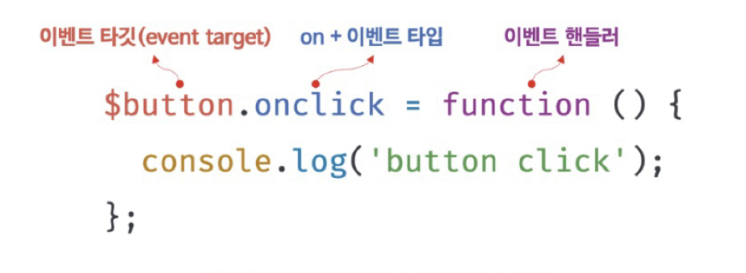
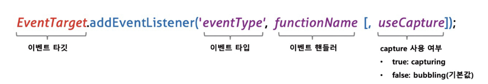
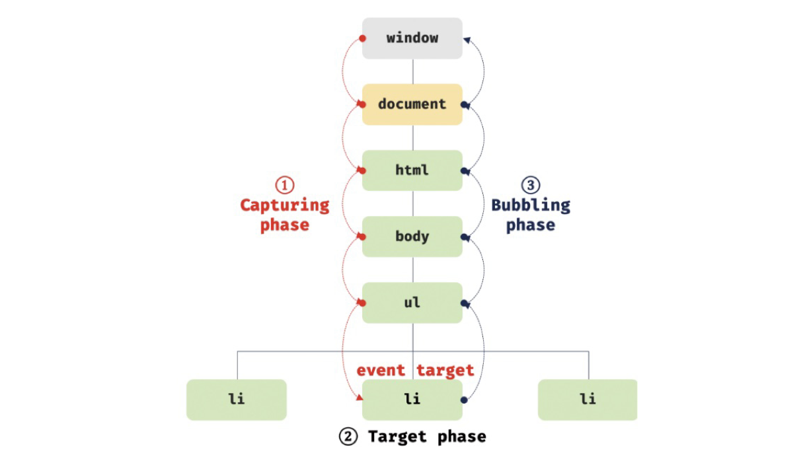

## 40.1 이벤트 드리븐 프로그래밍

- 이벤트가 발생했을 때 호출될 함수를 **이벤트 핸들러**라 한다.
- Window, Document, HTMLElement 타입의 객체는 onclick과 같이 특정 이벤트에 대응하는 다양한 **이벤트 핸들러 프로퍼티**를 갖고있다.
- 이벤트 핸들러 프로퍼티에 함수를 할당하면 해당 이벤트가 발생했을 때 할당한 함수가 브러우저에 의해 호출된다.
  <br/>

## 40.2 이벤트 타입

- **이벤트 타입**은 이벤트의 종류를 나타내는 문자열이다. 이벤트 타입에 대한 상세 목록은 [MDN의 Event reference](https://developer.mozilla.org/ko/docs/Web/Events) 에서 확인할 수 있다.

<br/>

## 40.3 이벤트 핸들러 등록

- 이벤트가 발생했을 때 브라우저에게 이벤트 핸들러의 호출을 위임하는 것을 **이벤트 핸들러 등록**이라 한다.
- 이벤트 핸들러를 등록하는 방법은 3가지다.

<br/>

### 40.3.1 이벤트 핸들러 어트리뷰트 방식

- HTML 요소의 어트리뷰트 중에는 이벤트에 대응하는 **이벤트 핸들러 어트리뷰트**가 있다.
- 이벤트 핸들러 어트리뷰트 값으로 **함수 호출문 등의 문을 할당**하면 이벤트 핸들러가 등록된다.

```html
<!DOCTYPE html>
<html lang="en">
  <body>
    <button onclick="sayHi('Lee')">Click me!</button>
    <script>
      function sayHi(name) {
        console.log(`Hi! ${name}.`);
      }
    </script>
  </body>
</html>
```

<br/>

- 이벤트 핸들러 어트리뷰트 값은 사실 암묵적으로 생성될 이벤트 핸들러의 함수 몸체를 의미한다.

  1. `onclick="sayHi('Lee')"` 어트리뷰트는 파싱되어 다음과 같은 함수를 암묵적으로 생성한다.

     ```jsx
     function onclick(event) {
       sayHi('Lee');
     }
     ```

  2. 이벤트 핸들러 어트리뷰트 이름과 동일한 키 `onclick` 이벤트 핸들러 프로퍼티에 할당한다.

  ⇒ 이처럼 동작하는 이유는 이벤트 핸들러에 **인수를 전달**하기 위해서다.

    <br/>

- Angular/React/Svelte/Vue.js 같은 프레임워크/라이브러리에서는 이벤트 핸들러 어트리뷰트 방식으로 이벤트를 처리한다.

```jsx
<!-- Angular -->
<button (click)="handleClick($event)">Save</button>

<!-- React -->
<button onClick={handleClick}>Save</button>

<!-- Svelte -->
<button on:click={handleClick}>Save</button>

<!-- Vue.js -->
<button v-on:click="handleClick($event)">Save</button>
```

<br/>

### 40.3.2 이벤트 핸들러 프로퍼티 방식

- window 객체와 Docum. nt, HTMLElement 타입의 DOM 노드 객체는 이벤트에 대응하는 **이벤트 핸들러 프로퍼티**를 가지고 있다.
- **이벤트 핸들러 프로퍼티**에 함수를 바인딩하면 이벤트 핸들러가 등록된다.

```html
<!DOCTYPE html>
<html lang="en">
  <body>
    <button>Click me!</button>
    <script>
      const $button = document.querySelector('button');

      // 이벤트 핸들러 프로퍼티에 이벤트 핸들러를 바인딩
      $button.onclick = function () {
        console.log('button click');
      };
    </script>
  </body>
</html>
```

<br/>

- 이벤트 핸들러를 등록하기 위해서는
  - **이벤트 타깃** : 이벤트를 발생시킬 객체
  - **이벤트 타입** : 이벤트의 종류를 나타내는 문자열
  - **이벤트 핸들러**

<p align="center"></p>

- 반드시 이벤트 타깃에 핸들러를 바인딩해야 하는 것은 아니다. 이벤트 핸들러는 이벤트 타깃 또는 전파된 이벤트를 캐치랑 DOM 노드 객체에 바인딩한다. (40.6, 40.7절 참고)

<br/>

### 40.3.3 addEventListenet 메서드 방식

- DOM Level 2에서 도입된 `EventTarget.prototype.addEventListener` 메서드를 사용하여 이벤트 핸들러를 등록할 수 있다.

- `addEventListenet` 메서드 매개변수
  - 이벤트 타입 : 이벤트의 종류를 나타내는 문자열 (on 접두사 X)
  - 이벤트 핸들러
  - capture 사용여부 : 이벤트를 캐치할 이벤트 전파 단계(캡처링 또는 버블링)

<p align="center"></p>

```html
<!DOCTYPE html>
<html lang="en">
  <body>
    <button>Click me!</button>
    <script>
      const $button = document.querySelector('button');

      // 이벤트 핸들러 프로퍼티 방식
      // $button.onclick = function () {
      //   console.log('button click');
      // };

      $button.addEventListener('click', function () {
        console.log('button click');
      });
    </script>
  </body>
</html>
```

<br/>

## 40.4 이벤트 핸들러 제거

- `addEventListener` 메서드로 등록한 이벤트 핸들러를 제거하려면 `EventTarget.prototype.removeEventListener` 메서드를 사용한다.
- 단, `addEvenetListener` 메서드에 전달한 인수와 `removeEventListener` 메서드에 전달한 인수가 일치하지 않으면 이벤트 핸들러가 제거되지 않는다.

```html
<!DOCTYPE html>
<html lang="en">
  <body>
    <button>Click me!</button>
    <script>
      const $button = document.querySelector('button');

      const handleClick = () => console.log('button click');

      // 이벤트 핸들러 등록
      $button.addEventListener('click', handleClick);

      // 이벤트 핸들러 제거
      // addEventListener 메서드에 전달한 인수와 removeEventListener 메서드에
      // 전달한 인수가 일치하지 않으면 이벤트 핸들러가 제거되지 않는다.
      $button.removeEventListener('click', handleClick, true); // 실패
      $button.removeEventListener('click', handleClick); // 성공
    </script>
  </body>
</html>
```

- 이벤트 핸들러를 제거하려면 이벤트 핸들러의 참조를 변수나 자료구조에 저장하고 있어야 한다.

```jsx
// 이벤트 핸들러 등록 (제거 안됨)
$button.addEventListener('click', () => console.log('button click'));
// 등록한 이벤트 핸들러를 참조할 수 없으므로 제거할 수 없다.

// 1. 기명 함수를 이벤트 핸들러로 등록
$button.addEventListener('click', function foo() {
  console.log('button click');
  // 이벤트 핸들러를 제거한다. 따라서 이벤트 핸들러는 단 한번만 호출된다.
  $button.removeEventListener('click', foo);
});

// 2. 무명 함수를 이벤트 핸들러로 등록
$button.addEventtListener('click', function () {
  console.log('button click');
  // 이벤트 핸들러를 제거한다. 따라서 이벤트 핸들러는 단 한번만 호출된다.
  // arguments.callee는 호출된 함수, 즉 함수 자신을 가리킨다.
  // 코드 최적화를 방해하므로 strict mode에서 사용이 금지된다.
  $button.removeEventListener('click', arguments.callee);
});
```

- 이벤트 핸들러 프로퍼티 방식으로 등록한 이벤트 핸들러는 이벤트 핸들러 프로퍼티에 null을 할당하여 제거한다.

```html
<!DOCTYPE html>
<html lang="en">
  <body>
    <button>Click me!</button>
    <script>
      const $button = document.querySelector('button');

      const handleClick = () => console.log('button click');

      // 이벤트 핸들러 프로퍼티 방식으로 이벤트 핸들러 등록
      $button.onclick = handleClick;

      // removeEventListener 메서드로 이벤트 핸들러를 제거할 수 없다.
      $button.removeEventListener('click', handleClick);

      // 이벤트 핸들러 프로퍼티에 null을 할당하여 이벤트 핸들러를 제거한다.
      $button.onclick = null;
      $button;
    </script>
  </body>
</html>
```

<br/>

## 40.5 이벤트 객체

- 이벤트가 발생하면 이벤트에 관련한 다양한 정보를 담고 있는 이벤트 객체가 동적으로 생성된다.
- 생성된 이벤트 객체는 이벤트 핸들러의 첫 번째 인수로 전달된다.

```html
<!DOCTYPE html>
<html lang="en">
  <body>
    <p>클릭하세요. 클릭한 곳의 좌표가 표시됩니다.</p>
    <em class="message"></em>
    <script>
      const $msg = document.querySelector('.message');

      // 클릭 이벤트에 의해 생성된 이벤트 객체는 이벤트 핸들러의 첫 번째 인수로 전달되어
      // 매개변수 e에 암묵적으로 할당된다.
      function showCoords(e) {
        $msg.textContent = `clientX: ${e.clientX}, clientY: ${e.clientY}`;
      }

      document.onclick = showCoords;
    </script>
  </body>
</html>
```

- 이벤트 핸들러 어트리뷰트 방식의 경우 첫번째 매개변수 이름이 반드시 event이어야 한다.

```html
<!DOCTYPE html>
<html lang="en">
  <head>
    <style>
      html,
      body {
        height: 100%;
      }
    </style>
  </head>
  <!-- 이벤트 핸들러 어트리뷰트 방식의 경우 event가 아닌 다른 이름으로는 이벤트 객체를 전달받지 못한다. -->
  <body onclick="showCoords(event)">
    <p>클릭하세요. 클릭한 곳의 좌표가 표시됩니다.</p>
    <em class="message"></em>
    <script>
         const $msg = document.querySelector('.message');

         // 클릭 이벤트에 의해 생성된 이벤트 객체는 이벤트 핸들러의 첫 번째 인수로 전달된다.
         function showCoords(e) {
           $msg.textContent = `clientX : ${e.clientX}, clientY : ${e.clientY}`;
         }
      .
    </script>
  </body>
</html>
```

<br/>

### 40.5.1 이벤트 객체의 상속 구조

- 이벤트가 발생하면 이벤트 타입에 따라 다양한 타입의 이벤트 객체가 생성된다.

<p align="center"></p>

- Event, . IEvent, MouseEvent 등 모두 생성자 함수다. 따라서 생성자 함수를 호출하여 이벤트 객체를 생성할 수 있다.

```html
<!DOCTYPE html>
<html>
  <body>
    <script>
      // Event 생성자 함수를 호출하여 foo 이벤트 타입의 Event 객체를 생성한다.
      let e = new Event('foo');
      console.log(e);
      // Event {isTrusted: false, type: "foo", target: null, ...}
      console.log(e.type); // "foo"
      console.log(e instanceof Event); // true
      console.log(e instanceof Object); // true

      // FocusEvent 생성자 함수를 호출하여 focus 이벤트 타입의 FocusEvent 객체를 생성한다.
      e = new FocusEvent('focus');
      console.log(e);
      // FocusEvent {isTrusted: false, relatedTarget: null, view: null, ...}

      // MouseEvent 생성자 함수를 호출하여 click 이벤트 타입의 MouseEvent 객체를 생성한다.
      e = new MouseEvent('click');
      console.log(e);
      // MouseEvent {isTrusted: false, screenX: 0, screenY: 0, clientX: 0, ... }

      // KeyboardEvent 생성자 함수를 호출하여 keyup 이벤트 타입의 KeyboardEvent 객체를
      // 생성한다.
      e = new KeyboardEvent('keyup');
      console.log(e);
      // KeyboardEvent {isTrusted: false, key: "", code: "", ctrlKey: false, ...}

      // InputEvent 생성자 함수를 호출하여 change 이벤트 타입의 InputEvent 객체를 생성한다.
      e = new InputEvent('change');
      console.log(e);
      // InputEvent {isTrusted: false, data: null, inputType: "", ...}
    </script>
  </body>
</html>
```

- Event 인터페이스는 DOM 내에서 발생한 이벤트에 의해 생성되는 이벤트 객체를 나타낸다.
- Event 인터페이스에는 모든 이벤트 객체의 공통 프로퍼티가 정의되어 있고 FocusEvent, MouseEvent, KeyboardEvent, WheelEvent 같은 하위 인터페이스에는 이벤트 타입에 따라 고유한 프로퍼티가 정의되어 있다.
  <br/>

### 40.5.2 이벤트 객체의 공통 프로퍼티.

- Event 인터페이스의 이벤트 관련 프로퍼티는 모든 이벤트 객체가 상속받는 공통 프로퍼티다.
- 이벤트 객체의 공. 프로퍼티는 다음과 같다.

| 공통 프로퍼티    | 설명                                                                        | 타입          |
| ---------------- | --------------------------------------------------------------------------- | ------------- |
| type             | 이벤트 타입                                                                 | string        |
| target           | 이벤트를 발생시킨 DOM 요소                                                  | DOM 요소 노드 |
| currentTarget    | 이벤트 핸들러가 바인딩된 DOM 요소                                           | DOM 요소 노드 |
| eventPhase       | 이벤트 전파 단계                                                            | number        |
| bubbles          | 이벤트를 버블링으로 전파하는지 여부                                         | boolean       |
| cancelable       | preventDefault 메서드를 호출하여 이벤트의 기본 동작을 취소할 수 있는지 여부 | boolean       |
| defaultPrevented | preventDefault 메서드를 호출하여 이벤트를 취소했는지 여부                   | boolean       |
| isTrusted        | 사용자의 행위에 의해 발생한 이벤트인지 여부                                 | boolean       |
| timeStamp        | 이벤트가 발생한 시각                                                        | number        |

<br/>

## 40.6 이벤트 전파

- **이벤트 전파**는 DOM 트리 상에 존재하는 DOM 요소 노드에서 발생한 이벤트가 DOM 트리를 통해 전파되는 것을 말. 다.

```html
<!DOCTYPE html>
<html lang="en">
  <body>
    <ul id="fruits">
      <li id="apple">Apple</li>
      <li id="banana">Banana</li>
      <li id="orange">Orange</li>
    </ul>
  </body>
</html>
```

- ul 요소의 두 번째 자식 요소인 li 요소를 클릭하면 이벤트가 발생한다.
- 이때 **생성된 이벤트 객체는 이벤트를 발생시킨 DOM 요소 이벤트 타깃을 중심으로 DOM 트리를 통해 전파된다.**
- 이벤트 전파는 이벤트가 전파되는 방향에 따라 3단계로 구분할 수 있다.
  - 캡처링 단계: 이벤트가 상위 요소에서 하위 요소 방향으로 전파
  - 타겟 단계: 이벤트가 이벤트 타겟에 도달
  - 버블링 단계: 이벤트가 하위 요소에서 상위 요소로 전파

<p align="center"></p>

```html
<!DOCTYPE html>
<html>
  <body>
    <ul id="fruits">
      <li id="apple">Apple</li>
      <li id="banana">Banana</li>
      <li id="orange">Orange</li>
    </ul>
    <script>
      const $fruits = document.getElementById('fruits');
      const $banana = document.getElementById('banana');

      // #fruits 요소의 하위 요소인 li 요소를 클릭한 경우
      // 캡처링 단계의 이벤트를 캐치한다.
      $fruits.addEventListener(
        'click',
        (e) => {
          console.log(`이벤트 단계: ${e.eventPhase}`); // 1: 캡처링 단계
          console.log(`이벤트 타깃: ${e.target}`); // [object HTMLLIElement]
          console.log(`커런트 타깃: ${e.currentTarget}`); // [object HTMLUListElement]
        },
        true,
      );

      // 타깃 단계의 이벤트를 캐치한다.
      $banana.addEventListener('click', (e) => {
        console.log(`이벤트 단계: ${e.eventPhase}`); // 2: 타깃 단계
        console.log(`이벤트 타깃: ${e.target}`); // [object HTMLLIElement]
        console.log(`커런트 타깃: ${e.currentTarget}`); // [object HTMLLIElement]
      });

      // 버블링 단계의 이벤트를 캐치한다.
      $fruits.addEventListener('click', (e) => {
        console.log(`이벤트 단계: ${e.eventPhase}`); // 3: 버블링 단계
        console.log(`이벤트 타깃: ${e.target}`); // [object HTMLLIElement]
        console.log(`커런트 타깃: ${e.currentTarget}`); // [object HTMLUListElement]
      });
    </script>
  </body>
</html>
```

- 이벤트 타깃은 li 요소이고 커런트 타깃은 ul 요소다.
  <br/>

## 40.7 이벤트 위임

```html
<!DOCTYPE html>
<html>
  <head>
    <style>
      #fruits {
        display: flex;
        list-style-type: none;
        padding: 0;
      }

      #fruits li {
        width: 100px;
        cursor: pointer;
      }

      #fruits .active {
        color: red;
        text-decoration: underline;
      }
    </style>
  </head>
  <body>
    <nav>
      <ul id="fruits">
        <li id="apple" class="active">Apple</li>
        <li id="banana">Banana</li>
        <li id="orange">Orange</li>
      </ul>
    </nav>
    <div>선택된 내비게이션 아이템: <em class="msg">apple</em></div>
    <script>
      const $fruits = document.getElementById('fruits');
      const $msg = document.querySelector('.msg');

      // 사용자 클릭에 의해 선택된 내비게이션 아이템(li 요소)에 active 클래스를 추가하고
      // 그 외의 모든 내비게이션 아이템의 active 클래스를 제거한다.
      function activate({ target }) {
        [...$fruits.children].forEach(($fruit) => {
          $fruit.classList.toggle('active', $fruit === target);
          $msg.textContent = target.id;
        });
      }

      // 모든 내비게이션 아이템(li 요소)에 이벤트 핸들러를 등록한다.
      document.getElementById('apple').onclick = activate;
      document.getElementById('banana').onclick = activate;
      document.getElementById('orange').onclick = activate;
      // 많은 DOM 요소에 이벤트 핸들러를 등록하므로 성능 저하의 원인이 되며, 유지보수에도 부적합하다.
      // 이벤트 위임을 사용해 코드를 수정할 수 있다.
    </script>
  </body>
</html>
```

- 이벤트 위임은 여러 개의 하위 DOM 요소에 각각 이벤트 핸들러를 등록하는 대신 하나의 상위 DOM 요소에 이벤트 핸들러를 등록하는 방법을 말한다.
- 이벤트 위임을 통해 상위 DOM 요소에 이벤트 핸들러를 등록하면 여러 개의 하위 DOM 요소에 이벤트 핸들러를 등록할 필요가 없다.
- 이벤트에 반응이 필요한 DOM 요소에 한정하여 이벤트 핸들러가 실행되도록 이벤트 타깃을 검사할 필요가 있다.

```html
<!DOCTYPE html>
<html>
  <head>
    <style>
      #fruits {
        display: flex;
        list-style-type: none;
        padding: 0;
      }

      #fruits li {
        width: 100px;
        cursor: pointer;
      }

      #fruits .active {
        color: red;
        text-decoration: underline;
      }
    </style>
  </head>
  <body>
    <nav>
      <ul id="fruits">
        <li id="apple" class="active">Apple</li>
        <li id="banana">Banana</li>
        <li id="orange">Orange</li>
      </ul>
    </nav>
    <div>선택된 내비게이션 아이템: <em class="msg">apple</em></div>
    <script>
      const $fruits = document.getElementById('fruits');
      const $msg = document.querySelector('.msg');

      // 사용자 클릭에 의해 선택된 내비게이션 아이템(li 요소)에 active 클래스를 추가하고
      // 그 외의 모든 내비게이션 아이템의 active 클래스를 제거한다.
      function activate({ target }) {
        // 이벤트를 발생시킨 요소(target)가 ul#fruits의 자식 요소가 아니라면 무시한다.
        if (!target.matches('#fruits > li')) return;

        [...$fruits.children].forEach(($fruit) => {
          $fruit.classList.toggle('active', $fruit === target);
          $msg.textContent = target.id;
        });
      }

      // 이벤트 위임: 상위 요소(ul#fruits)는 하위 요소의 이벤트를 캐치할 수 있다.
      $fruits.onclick = activate;
    </script>
  </body>
</html>
```

<br/>

## 40.8 DOM 요소의 기본 동작 조작

### 40.8.1 DOM 요소의 기본 동작 중단

- DOM 요소는 저마다 기본 동작이 있다. 이벤트 객체의 `preventDefault` 메서드는 이러한 DOM 요소의 기본 동작을 중단시킨다.

```html
<!DOCTYPE html>
<html>
  <body>
    <a href="https://www.google.com">go</a>
    <input type="checkbox" />
    <script>
      document.querySelector('a').onclick = (e) => {
        // a 요소의 기본 동작을 중단한다.
        e.preventDefault();
      };

      document.querySelector('input[type=checkbox]').onclick = (e) => {
        // checkbox 요소의 기본 동작을 중단한다.
        e.preventDefault();
      };
    </script>
  </body>
</html>
```

<br/>

### 40.8.2 이벤트 전파 방지

- 이벤트 객체의 `stopPropagation` 메서드는 이벤트 전파를 중지시킨다.

```html
<!DOCTYPE html>
<html>
  <body>
    <div class="container">
      <button class="btn1">Button 1</button>
      <button class="btn2">Button 2</button>
      <button class="btn3">Button 3</button>
    </div>
    <script>
      // 이벤트 위임. 클릭된 하위 버튼 요소의 color를 변경한다.
      document.querySelector('.container').onclick = ({ target }) => {
        if (!target.matches('.container > button')) return;
        target.style.color = 'red';
      };

      // .btn2 요소는 이벤트를 전파하지 않으므로 상위 요소에서 이벤트를 캐치할 수 없다.
      document.querySelector('.btn2').onclick = (e) => {
        e.stopPropagation(); // 이벤트 전파 중단
        e.target.style.color = 'blue';
      };
    </script>
  </body>
</html>
```

<br/>

## 40.9 이벤트 핸들러 내부의 this

### 40.9.1 이벤트 핸들러 어트리뷰트 방식

```html
<!DOCTYPE html>
<html>
  <body>
    <button onclick="handleClick(this)">Click me</button>
    <script>
      function handleClick(button) {
        console.log(this); // Window {window: Window, self: Window, document: document, name: '', location: Location, …}
        console.log(button); // <button onclick="handleClick(this)">Click me</button>
      }
    </script>
  </body>
</html>
```

- 일반 함수로서 호출되는 함수 내부의 this는 전역 객체를 가리키므로, handleClick 함수 내부의 this는 전역 객체 window를 가리킨다.
- 단, 이벤트 핸들러를 호출할 때 인수로 전달한 this는 이벤트를 바인딩한 DOM 요소를 가리킨다.
  <br/>

### 40.9.2 이벤트 핸들러 프로퍼티 방식과 addEventListener 메서드 방식

- 이벤트 핸들러 프로퍼티 방식과 addEventListener 메서드 방식 모두 이벤트 핸들러 내부의 this는 이벤트를 바인딩한 DOM 요소를 가리킨다.

```html
<!DOCTYPE html>
<html>
  <body>
    <button class="btn1">0</button>
    <button class="btn2">0</button>
    <script>
      const $button1 = document.querySelector('.btn1');
      const $button2 = document.querySelector('.btn2');

      // 이벤트 핸들러 프로퍼티 방식
      $button1.onclick = function (e) {
        // this는 이벤트를 바인딩한 DOM 요소를 가리킨다.
        console.log(this); // $button1
        console.log(e.currentTarget); // $button1
        console.log(this === e.currentTarget); // true

        // $button1의 textContent를 1 증가시킨다.
        ++this.textContent;
      };

      // addEventListener 메서드 방식
      $button2.addEventListener('click', function (e) {
        // this는 이벤트를 바인딩한 DOM 요소를 가리킨다.
        console.log(this); // $button2
        console.log(e.currentTarget); // $button2
        console.log(this === e.currentTarget); // true

        // $button2의 textContent를 1 증가시킨다.
        ++this.textContent;
      });
    </script>
  </body>
</html>
```

- 화살표 함수로 정의한 이벤트 핸들러 내부의 this는 상위 스코프릐 this를 가리킨다. 화살표 함수는 함수 자체의 this 바인딩을 갖지 않는다.

```html
<!DOCTYPE html>
<html>
  <body>
    <button class="btn1">0</button>
    <button class="btn2">0</button>
    <script>
      const $button1 = document.querySelector('.btn1');
      const $button2 = document.querySelector('.btn2');

      // 이벤트 핸들러 프로퍼티 방식
      $button1.onclick = (e) => {
        // 화살표 함수 내부의 this는 상위 스코프의 this를 가리킨다.
        console.log(this); // window
        console.log(e.currentTarget); // $button1
        console.log(this === e.currentTarget); // false

        // this는 window를 가리키므로 window.textContent에 NaN(undefined + 1)을 할당한다.
        ++this.textContent;
      };

      // addEventListener 메서드 방식
      $button2.addEventListener('click', (e) => {
        // 화살표 함수 내부의 this는 상위 스코프의 this를 가리킨다.
        console.log(this); // window
        console.log(e.currentTarget); // $button2
        console.log(this === e.currentTarget); // false

        // this는 window를 가리키므로 window.textContent에 NaN(undefined + 1)을 할당한다.
        ++this.textContent;
      });
    </script>
  </body>
</html>
```

<br/>

## 40.10 이벤트 핸들러에 인수 전달

- 함수에 인수를 전달하려면 함수를 호출할 때 전달해야 한다.

```html
<!DOCTYPE html>
<html>
  <body>
    <label>User name <input type="text" /></label>
    <em class="message"></em>
    <script>
      const MIN_USER_NAME_LENGTH = 5; // 이름 최소 길이
      const $input = document.querySelector('input[type=text]');
      const $msg = document.querySelector('.message');

      const checkUserNameLength = (min) => {
        $msg.textContent =
          $input.value.length < min ? `이름은 ${min}자 이상 입력해 주세요` : '';
      };

      // 이벤트 핸들러 내부에서 함수를 호출하면서 인수를 전달한다.
      $input.onblur = () => {
        checkUserNameLength(MIN_USER_NAME_LENGTH);
      };
    </script>
  </body>
</html>
```

<br/>

## 40.11 커스텀 이벤트

### 40.11.1 커스텀 이벤트 생성

- 이벤트 객체는 Event, UIEvent, MouseEvent 같은 이벤트 생성자 함수로 생성할 수 있다. 명시적으로 생성한 이벤트 객체에 개발자의 의도로 임의의 이벤트 타입을 지정해주는 것을 **커스텀 이벤트**라 한다.
- 이벤트 생성자 함수는 첫 번째 인수로 이벤트 타입을 나타내는 문자열을 전달받는다.

```jsx
// KeyboardEvent 생성자 함수로 keyup 이벤트 타입의 커스텀 이벤트 객체를 생성
const keyboardEvent = new KeyboardEvent('keyup');
console.log(keyboardEvent.type); // keyup

// CustomEvent 생성자 함수로 foo 이벤트 타입의 커스텀 이벤트 객체를 생성
// 이벤트 타입을 나타내는 문자열은 기존 이벤트 타입을 사용할 수 있고,
// 임의의 문자열을 사용할 수도 있다.
const customEvent = new CustomEvent('foo');
console.log(customEvent.type); // foo
```

<br/>

## 40.11.2 커스텀 이벤트 디스패치

- 생성된 커스텀 이벤트는 dispatchEvent 메서드로 디스패치 할 수 있다.
- 일반적으로 이벤트 핸들러는 비동기 방식으로 동작하지만 dispatchEvent 메서드는 이벤트 핸들러를 동기 방식으로 호출한다.

```html
<!DOCTYPE html>
<html>
  <body>
    <button class="btn">Click me</button>
    <script>
      const $button = document.querySelector('.btn');

      // 버튼 요소에 click 커스텀 이벤트 핸들러를 등록
      // 커스텀 이벤트를 디스패치하기 이전에 이벤트 핸들러를 등록해야 한다.
      $button.addEventListener('click', (e) => {
        console.log(e); // MouseEvent {isTrusted: false, screenX: 0, ...}
        alert(`${e} Clicked!`);
      });

      // 커스텀 이벤트 생성
      const customEvent = new MouseEvent('click');

      // 커스텀 이벤트 디스패치(동기 처리). click 이벤트가 발생한다.
      $button.dispatchEvent(customEvent);
    </script>
  </body>
</html>
```
