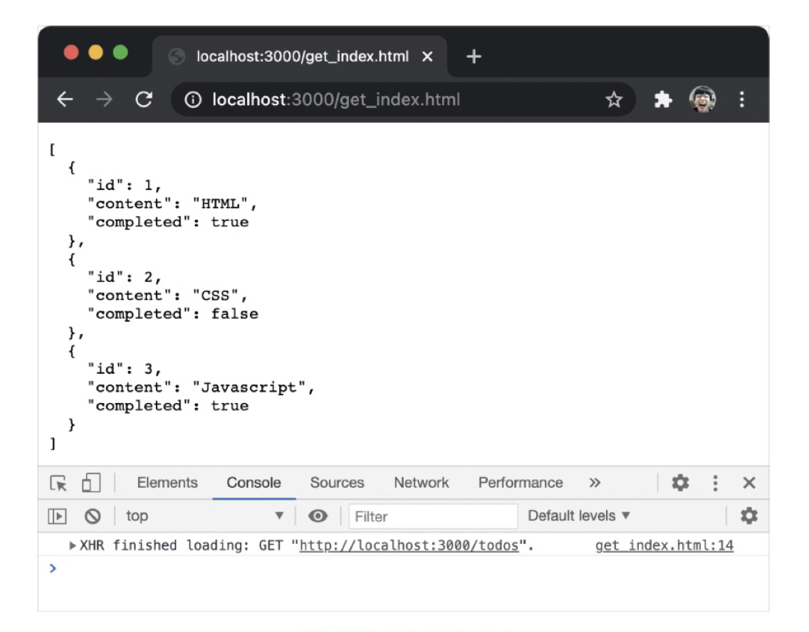
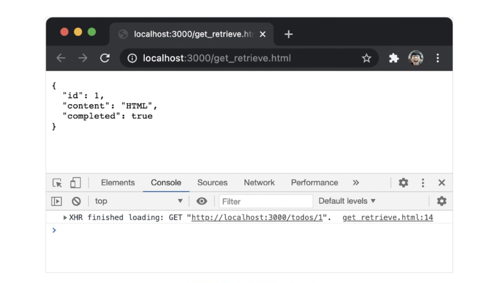
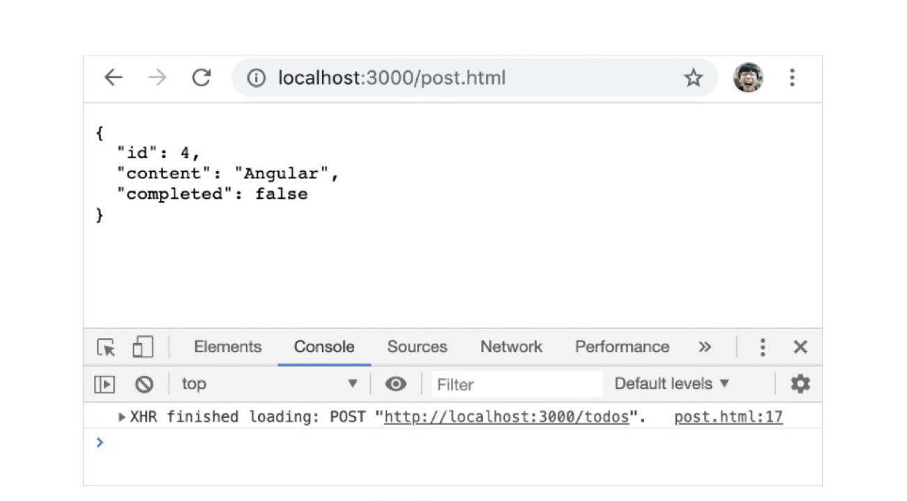
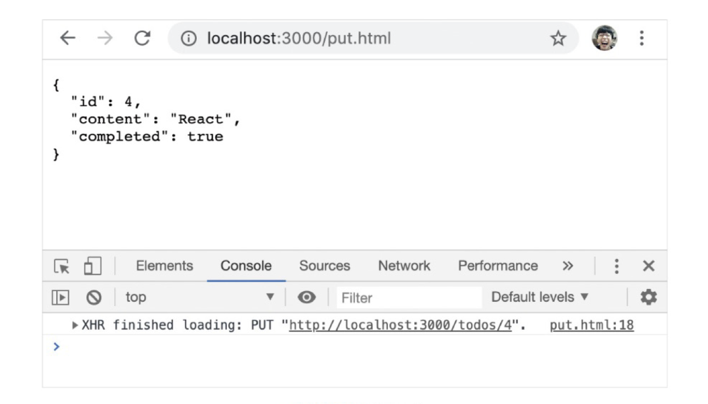
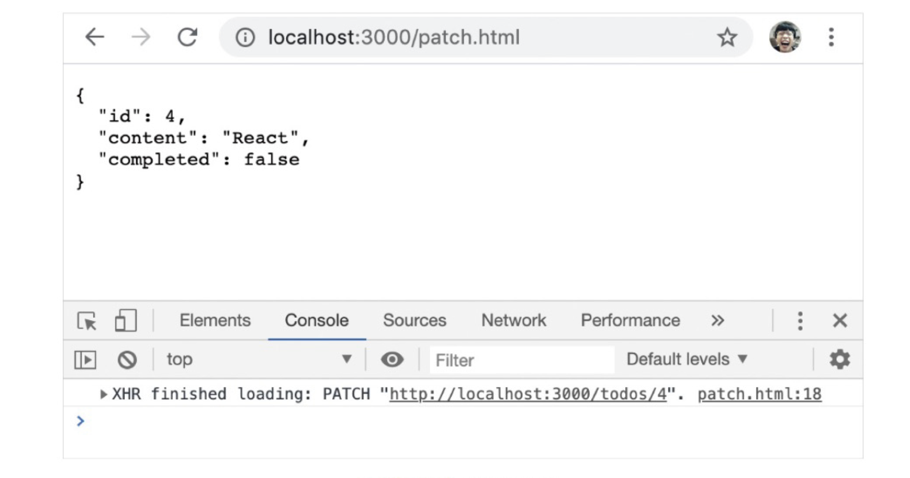
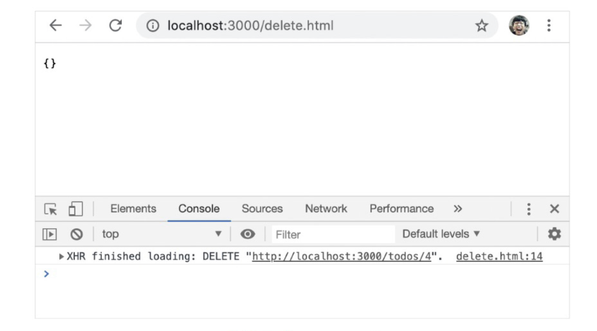

# 44장 REST API

- `REST` 는 HTTP를 기반으로 클라이언트가 서버의 리소스에 접근하는 방식을 규정한 아키텍처이다.
- `REST API` 는 REST를 기반으로 서비스 API를 구현한 것을 의미한다.
- REST의 기본원칙을 성실히 지킨 서비스 디자인을 ‘RESTful’이라고 표현한다.

<br/>

## 44.1 REST API의 구성

- REST API는 자원, 행위, 표현의 3가지 요소로 구성된다.
- REST는 자체 표현 구조로 구성되어 REST API만으로 HTTP 요청의 내용을 이해할 수 있다.

  <br/>

| 구성 요소 | 내용                           | 표현 방법        |
| --------- | ------------------------------ | ---------------- |
| 자원      | 자원                           | URI              |
| 행위      | 자원에 대한 행위               | HTTP 요청 메서드 |
| 표현      | 자원에 대한 행위의 구체적 내용 | 페이로드         |

<br/>

## 44.2 REST API 설계 원칙

1. **URI는 리소스를 표현해야 한다.**
   - URI는 리소스를 표현하는 데 중점을 둔다.
   - 리소스를 식별할 수 있는 이름은 명사를 사용한다.

```jsx
# bad
GET /getTodos/1
GET /todos/show/1

# good
GET /todos/1
```

<br/>

2. **리소스에 대한 행위는 HTTP 요청 메서드로 표현한다.**
   - HTTP 요청 메서드는 클라이언트가 서버에게 요청의 종류와 목적을 알리는 방법이다.
   - 요청 메서드를 사용하여 CRUD를 구현한다.

| HTTP 요청 메서드 | 종류           | 목적                  | 페이로드(전송되는 데이터) |
| ---------------- | -------------- | --------------------- | ------------------------- |
| GET              | index/retrieve | 모든/특정 리소스 취득 | X                         |
| POST             | create         | 리소스 생성           | O                         |
| PUT              | replace        | 리소스의 전체 교체    | O                         |
| PATCH            | modify         | 리소스의 일부 수정    | O                         |
| DELETE           | delete         | 모든/특정 리소스 삭제 | X                         |

<br/>

```jsx
# bad
GET /todos/delete/1

#good
DELETE /todos/1
```

<br/>

## 44.3 JSON Server를 이용한 REST API 실습

### 44.3.1 JSON Server 설치

- JSON Server는 json 파일을 사용하여 가상 REST API 서버를 구축할 수 있는 툴이다.

```jsx
$ mkdir json-server-exam && cd json-server-exam
$ npm init -y
$ npm install json-server --save-dev
```

<br/>

### 44.3.2 db.json 파일 생성

```json
{
  "todos": [
    {
      "id": 1,
      "content": "HTML",
      "completed": true
    },
    {
      "id": 2,
      "content": "CSS",
      "completed": false
    },
    {
      "id": 3,
      "content": "Javascript",
      "completed": true
    }
  ]
}
```

<br/>

### 44.3.3 JSON Server 실행

```json
$ npm start
```

<br/>

### 44.3.4 GET 요청 : 모든/특정 리소스 취득

```html
<!DOCTYPE html>
<html>
  <body>
    <pre></pre>
    <script>
      // XMLHttpRequest 객체 생성
      const xhr = new XMLHttpRequest();

      // HTTP 요청 초기화
      // todos 리소스에서 모든 todo를 취득(index)
      xhr.open('GET', '/todos');

      // HTTP 요청 전송
      xhr.send();

      // load 이벤트는 요청이 성공적으로 완료된 경우 발생한다.
      xhr.onload = () => {
        // status 프로퍼티 값이 200이면 정상적으로 응답된 상태다.
        if (xhr.status === 200) {
          document.querySelector('pre').textContent = xhr.response;
        } else {
          console.error('Error', xhr.status, xhr.statusText);
        }
      };
    </script>
  </body>
</html>
```

<p align="center"></p>
<br/>

```html
<!DOCTYPE html>
<html>
  <body>
    <pre></pre>
    <script>
      // XMLHttpRequest 객체 생성
      const xhr = new XMLHttpRequest();

      // HTTP 요청 초기화
      // todos 리소스에서 id를 사용하여 특정 todo를 취득(retrieve)
      xhr.open('GET', '/todos/1');

      // HTTP 요청 전송
      xhr.send();

      // load 이벤트는 요청이 성공적으로 완료된 경우 발생한다.
      xhr.onload = () => {
        // status 프로퍼티 값이 200이면 정상적으로 응답된 상태다.
        if (xhr.status === 200) {
          document.querySelector('pre').textContent = xhr.response;
        } else {
          console.error('Error', xhr.status, xhr.statusText);
        }
      };
    </script>
  </body>
</html>
```

<p align="center"></p>
<br/>

### 44.3.5 POST 요청 : 리소스 생성

```html
<!DOCTYPE html>
<html>
  <body>
    <pre></pre>
    <script>
      // XMLHttpRequest 객체 생성
      const xhr = new XMLHttpRequest();

      // HTTP 요청 초기화
      // todos 리소스에 새로운 todo를 생성
      xhr.open('POST', '/todos');

      // 요청 몸체에 담아 서버로 전송할 페이로드의 MIME 타입을 지정
      xhr.setRequestHeader('content-type', 'application/json');

      // HTTP 요청 전송
      // 새로운 todo를 생성하기 위해 페이로드를 서버에 전송해야 한다.
      xhr.send(JSON.stringify({ id: 4, content: 'Angular', completed: false }));

      // load 이벤트는 요청이 성공적으로 완료된 경우 발생한다.
      xhr.onload = () => {
        // status 프로퍼티 값이 200(OK) 또는 201(Created)이면 정상적으로 응답된 상태다.
        if (xhr.status === 200 || xhr.status === 201) {
          document.querySelector('pre').textContent = xhr.response;
        } else {
          console.error('Error', xhr.status, xhr.statusText);
        }
      };
    </script>
  </body>
</html>
```

<p align="center"></p>
<br/>

### 44.3.6 PUT 요청 : 리소스의 전체 교체

```html
<!DOCTYPE html>
<html>
  <body>
    <pre></pre>
    <script>
      // XMLHttpRequest 객체 생성
      const xhr = new XMLHttpRequest();

      // HTTP 요청 초기화
      // todos 리소스에서 id로 todo를 특정하여 id를 제외한 리소스 전체를 교체
      xhr.open('PUT', '/todos/4');

      // 요청 몸체에 담아 서버로 전송할 페이로드의 MIME 타입을 지정
      xhr.setRequestHeader('content-type', 'application/json');

      // HTTP 요청 전송
      // 리소스 전체를 교체하기 위해 페이로드를 서버에 전송해야 한다.
      xhr.send(JSON.stringify({ id: 4, content: 'React', completed: true }));

      // load 이벤트는 요청이 성공적으로 완료된 경우 발생한다.
      xhr.onload = () => {
        // status 프로퍼티 값이 200이면 정상적으로 응답된 상태다.
        if (xhr.status === 200) {
          document.querySelector('pre').textContent = xhr.response;
        } else {
          console.error('Error', xhr.status, xhr.statusText);
        }
      };
    </script>
  </body>
</html>
```

<p align="center"></p>
<br/>

### 44.3.7 PATCH 요청 : 리소스의 일부 수정

```html
<!DOCTYPE html>
<html>
  <body>
    <pre></pre>
    <script>
      // XMLHttpRequest 객체 생성
      const xhr = new XMLHttpRequest();

      // HTTP 요청 초기화
      // todos 리소스의 id로 todo를 특정하여 completed만 수정
      xhr.open('PATCH', '/todos/4');

      // 요청 몸체에 담아 서버로 전송할 페이로드의 MIME 타입을 지정
      xhr.setRequestHeader('content-type', 'application/json');

      // HTTP 요청 전송
      // 리소스를 수정하기 위해 페이로드를 서버에 전송해야 한다.
      xhr.send(JSON.stringify({ completed: false }));

      // load 이벤트는 요청이 성공적으로 완료된 경우 발생한다.
      xhr.onload = () => {
        // status 프로퍼티 값이 200이면 정상적으로 응답된 상태다.
        if (xhr.status === 200) {
          document.querySelector('pre').textContent = xhr.response;
        } else {
          console.error('Error', xhr.status, xhr.statusText);
        }
      };
    </script>
  </body>
</html>
```

<p align="center"></p>
<br/>

### 44.3.8 DELETE 요청 : 모든/특정 리소스 삭제

```html
<!DOCTYPE html>
<html>
  <body>
    <pre></pre>
    <script>
      // XMLHttpRequest 객체 생성
      const xhr = new XMLHttpRequest();

      // HTTP 요청 초기화
      // todos 리소스에서 id를 사용하여 todo를 삭제한다.
      xhr.open('DELETE', '/todos/4');

      // HTTP 요청 전송
      xhr.send();

      // load 이벤트는 요청이 성공적으로 완료된 경우 발생한다.
      xhr.onload = () => {
        // status 프로퍼티 값이 200이면 정상적으로 응답된 상태다.
        if (xhr.status === 200) {
          document.querySelector('pre').textContent = xhr.response;
        } else {
          console.error('Error', xhr.status, xhr.statusText);
        }
      };
    </script>
  </body>
</html>
```

<p align="center"></p>
