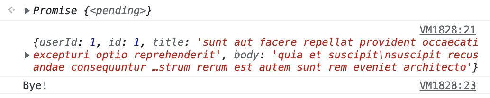

# 45장 프로미스

자바스크립트는 비동기 처리를 위한 하나의 패턴으로 콜백 함수를 사용하지만, 콜백 패턴은 콜백 헬로 인해 가독성이 나쁘고 여러 개의 비동기 처리를 한 번에 처리하는데도 한계가 있다.

ES6에서는 비동기 처리를 위한 또 다른 패턴으로 프로미스를 도입했다.

<br/>

## 45.1 비동기 처리를 위한 콜백 패턴의 단점

1. **콜백 헬** : 콜백 함수 호출이 중첩되어 복잡도가 높아지는 현상
2. **에러 처리의 한계**

<br/>

## 45.2 프로미스의 생성

- Promise 생성자 함수를 new 연선자와 함께 호출하면 프로미스를 생성한다.
- Promise 생성자 함수는 비동기 처리를 수행할 콜백 함수를 인수로 전달받는데 이 콜백 함수는 **resolve**와 **reject** 함수를 인수로 전달받는다.

```jsx
// 프로미스 생성
const promise = new Promise((resolve, reject) => {
	// Promise 함수의 콜백 함수 내부에서 비동기 처리를 수행한다.
  if(/* 비동기 처리 성공 */) {
		resolve('result');
	} else {  /* 비동기 처리 실패 */
		reject('failure reason');
	}
})
```

- Promise 생성자 함수가 인수로 전달받은 콜백 함수 내부에서 비동기 처리를 수행한다.

```jsx
// GET 요청을 위한 비동기 함수
const promiseGet = (url) => {
  return new Promise((resolve, reject) => {
    const xhr = new XMLHttpRequest();
    xhr.open('GET', url);
    xhr.send();

    xhr.onload = () => {
      if (xhr.status === 200) {
        // 성공적으로 응답을 전달받으면 resolve 함수를 호출한다.
        resolve(JSON.parse(xhr.response));
      } else {
        // 에러 처리를 위해 reject 함수를 호출한다.
        reject(new Error(xhr.status));
      }
    };
  });
};

// promiseGet 함수는 프로미스를 반환한다.
promiseGet('https://jsonplaceholder.typicode.com/posts/1');
```

- 비동기 함수인 promiseGet은 함수 내부에서 프로미스를 생성하고 반환한다. 비동기 처리는 Promise 생성자 함수가 인수로 전달받은 콜백 함수 내부에서 수행한다.

<br/>

| 프로미스의 상태 정보 | 의미                                  | 상태 변경 조건                   |
| -------------------- | ------------------------------------- | -------------------------------- |
| pending              | 비동기 터리가 아직 수행되지 않은 상태 | 프로미스가 생성된 직후 기본 상태 |
| fulfilled            | 비동기 처리가 수행된 상태(성공)       | resolve 함수 호출                |
| rejected             | 비동기 처리가 수행된 상태(실패)       | reject 함수 호출                 |

- fulfilled 또는 rejected 상태를 settled 상태라고 한다. pending이 아닌 상태로 비동기 처리가 수행된 상태를 말한다.

<br/>

## 45.3 프로미스의 후속 처리 메서드

- 프로미스의 비동기 처리 상태가 변화하면 이에 따른 후속 처리를 해야 한다. 이를 위해 프로미스는 후속 메서드 then, catch, finally를 제공한다.
- 프로미스의 비동기 처리 상태가 변화하면 후속 처리 메서드에 인수로 전달한 콜백 함수가 선택적으로 호출된다.

<br/>

### 45.3.1 Promise.prototype.then

- 첫 번째 콜백 함수는 프로미스가 **fulfilled** 상태가 되면 호출된다. 이때 콜백 함수는 프로미스의 비동기 처리 결과를 인수로 전달받는다. → 성공 처리 콜백 함수
- 두 번째 콜백 함수는 프로미스가 **rejected** 상태가 되면 호출된다. 이때 콜백 함수는 프로미스의 에러를 인수로 전달받는다. → 실패 처리 콜백 함수

```jsx
new Promise((resolve) => resolve('fulfilled')).then(
  (v) => console.log(v),
  (e) => console.error(e),
); // fulfilled

new Promise((_, reject) => reject(new Error('rejected'))).then(
  (v) => console.log(v),
  (e) => console.error(e),
); // Error: rejected
```

- then 메서드는 언제나 프로미스를 반환한다.

<br/>

### 45.3.2 Promise.prototype.catch

- catch 메서드의 콜백 함수는 프로미스가 **rejected** 상태인 경우만 호출된다.
- catch 메서드는 then(undefined, onRejected)과 동일하게 동작한다.

```jsx
new Promise((_, reject) => reject(new Error('rejected'))).catch((e) =>
  console.log(e),
); // Error: rejected
```

<br/>

### 45.3.3 Promise.prototype.finally

- finally 메서드의 콜백 함수는 프로미스의 성공 도는 실패와 상관없이 무조건 한 번 호출된다. → 프로미스의 상태와 상관없이 공통적으로 수행해야 할 처리 내용이 있을 때 유용

```jsx
new Promise(() => {}).finally(() => console.log('finally')); // finally
```

프로미스로 구현한 비동기 함수 get을 사용해 후속 처리를 구현해보자.

```jsx
const promiseGet = (url) => {
  return new Promise((resolve, reject) => {
    const xhr = new XMLHttpRequest();
    xhr.open('GET', url);
    xhr.send();

    xhr.onload = () => {
      if (xhr.status === 200) {
        // 성공적으로 응답을 전달받으면 resolve 함수를 호출한다.
        resolve(JSON.parse(xhr.response));
      } else {
        // 에러 처리를 위해 reject 함수를 호출한다.
        reject(new Error(xhr.status));
      }
    };
  });
};

// promiseGet 함수는 프로미스를 반환한다.
promiseGet('https://jsonplaceholder.typicode.com/posts/1')
  .then((res) => console.log(res))
  .catch((err) => console.error(err))
  .finally(() => console.log('Bye!'));
```

<p align="center"></p>

<br/>

## 45.4 프로미스의 에러 처리

비동기 처리 결과에 대한 후속 처리는 프로미스가 제공하는 후속 처리 메서드 then, catch, finally를 사용하여 수행한다. 비동기 처리에서 발생한 에러는 then 메서드의 두 번째 콜백 함수로 처리할 수 있다.

```jsx
const wrongUrl = 'https://jsonplaceholder.typicode.com/XXX/1';

// 부적절한 URL이 지정되었기 때문에 에러가 발생한다.
promiseGet(wrongUrl).then(
  (res) => console.log(res),
  (err) => console.error(err),
); // Error: 404
```

비동기 처리에서 발생한 에러는 프로미스의 후속 처리 메서드 catch를 사용해 처리할 수도 있다.

```jsx
const wrongUrl = 'https://jsonplaceholder.typicode.com/XXX/1';

// 부적절한 URL이 지정되었기 때문에 에러가 발생한다.
promiseGet(wrongUrl)
  .then((res) => console.log(res))
  .catch((err) => console.error(err)); // Error: 404
```

<br/>

## 45.5 프로미스 체이닝

프로미스는 then, catch, finally 후속 처리 메서드를 통해 콜백 헬을 해결한다.

```jsx
const url = 'https://jsonplaceholder.typicode.com';

// id가 1인 post의 userId를 취득
promiseGet(`${user}/posts/1`)
  // 취득한 post의 userId로 user 정보를 취득
  .then(({ userId }) => promiseGet(`${url}/users/${userId}`))
  .then((userInfo) => console.log(userInfo))
  .catch((err) => console.error(err));
```

위 예제에서 then → then → catch 순서로 후속 처리 메서드를 호출했다. then, catch, finally 후속 처리 메서드는 언제나 프로미스를 반환하므로 연속적으로 호출할 수있다. 이를 **프로미스 체이닝**이라 한다.

<br/>

| 후속 처리 메서드 | 콜백 함수의 인수                                                           | 후속 처리 메서드의 반환값                   |
| ---------------- | -------------------------------------------------------------------------- | ------------------------------------------- |
| then             | promiseGet 함수가 반환한 프로미스가 resolve한 값                           | 콜백 함수가 반환한 프로미스                 |
| then             | 첫번째 then 메서드가 반환한 프로미스가 resolve한 값                        | 콜백 함수가 반환한 값을 resolve 한 프로미스 |
| catch            | promiseGet 함수 또는 앞선 후속 처리 메서드가 반환한 프로미스가 reject한 값 | 콜백 함수가 반환한 값을 resolve한 프로미스  |

이처럼 then, catch, finally 후속 처리 메서드는 콜백 함수가 반환한 프로미스를 반환한다.

콜백 패턴은 가독성이 좋지 않다. 이 문제는 ES8에서 도입된 async/await를 통해 해결할 수 있다.

```jsx
const url = 'https://jsonplaceholder.typicode.com';

(async () => {
  // id가 1인 post의 userId를 취득
  const { userId } = await promiseGet(`${url}/posts/1`);

  // 취득한 post의 userId로 user 정보를 취득
  const userInfo = await promiseGet(`${url}/users/${userId}`);

  console.log(userInfo);
})();
```

<br/>

## 45.6 프로미스의 정적 메서드

### 45.6.1 Promise.resolve / Promise.reject

`Promise.resolve` 메서드는 인수로 전달받은 값을 resolve하는 프로미스를 생성한다.

```jsx
// 배열을 resolve하는 프로미스를 생성
const resolvedPromise = Promise.resolve([1, 2, 3]);
resolvedPromise.then(console.log); // [1, 2, 3]

// 위 예제와 동일하게 동작
const resolvedPromise = new Promise((resolve) => resolve([1, 2, 3]));
resolvedPromise.then(console.log); // [1, 2, 3]
```

`Promise.reject` 메서드는 인수로 전달받은 값을 reject하는 프로미스를 생성한다.

```jsx
// 에러 객체를 reject하는 프로미스를 생성
const rejectedPromise = Promise.reject(new Error('Error!'));
rejectedPromise.catch(console.log); // Error: Error!

// 위 예제와 동일하게 동작
const rejectedPromise = new Promise((_, reject) => reject(new Error('Error!')));
rejectedPromise.catch(console.log); // Error: Error!
```

<br/>

### 45.6.2 Promise.all

`Promise.all` 메서드는 여러 개의 비동기 처리를 모두 병렬 처리할 때 사용한다.

```jsx
const requestData1 = () =>
  new Promise((resolve) => setTimeout(() => resolve(1), 3000));
const requestData2 = () =>
  new Promise((resolve) => setTimeout(() => resolve(2), 2000));
const requestData3 = () =>
  new Promise((resolve) => setTimeout(() => resolve(3), 1000));

// 세 개의 비동기 처리를 순차적으로 처리
const res = [];
requestData1()
  .then((data) => {
    res.push(data);
    return requestData2();
  })
  .then((data) => {
    res.push(data);
    return requestData3();
  })
  .then((data) => {
    res.push(data);
    console.log(res); // [1, 2, 3] ⇒ 약 6초 소요
  })
  .catch(console.error);
```

세 개의 비동기 처리를 순차적으로 처리한다. 따라서 첫 번째 비동기 처리에 3초, 두 번째 비동기 처리에 2초, 세 번째 비동기 처리에 1초가 소요되어 총 6초 이상이 소요된다.

```jsx
// Promise.all 메서드를 사용해 세 개의 비동기 처리를 병렬로 처리
const requestData1 = () =>
  new Promise((resolve) => setTimeout(() => resolve(1), 3000));
const requestData2 = () =>
  new Promise((resolve) => setTimeout(() => resolve(2), 2000));
const requestData3 = () =>
  new Promise((resolve) => setTimeout(() => resolve(3), 1000));

Promise.all([requestData1(), requestData2(), requestData3()])
  .then(console.log) // [ 1, 2, 3 ] ⇒ 약 3초 소요
  .catch(console.error);
```

`Promise.all` 메서드는 프로미스를 요소로 갖는 배열 등의 이터러블을 인수로 전달받는다. 그리고 전달받은 모든 프로미스가 모두 fulfilled 상태가 되면 모든 처리 결과를 배열에 저장해 새로운 프로미스를 반환한다.

<br/>

### 43.6.3 Promise.race

`Promise.race` 메서드는 `Promise.all` 메서드와 동일하게 프로미스를 요소로 갖는 배열 등의 이터러블을 인수로 전달받는다. `Promise.race`는 모든 프로미스가 fulfilled 상태가 되는 것을 기다리는 것이 아니라 가장 먼저 fulfilled 상태가 된 프로미스의 처리 결과를 resolve하는 새로운 프로미스를 반환한다.

```jsx
Promise.race([
  new Promise((resolve) => setTimeout(() => resolve(1), 3000)), // 1
  new Promise((resolve) => setTimeout(() => resolve(2), 2000)), // 2
  new Promise((resolve) => setTimeout(() => resolve(3), 1000)), // 3
])
  .then(console.log) // 3
  .catch(console.log);
```

<br/>

### 45.6.4 Promise.allSettled

`Promise.allSettled` 메서드는 프로미스를 요소로 갖는 배열 등의 이터러블을 인수로 전달받는다. 전달받은 프로미스가 모두 settled 상태(비동기 처리가 수행된 상태. fulfilled 또는 rejected 상태)가 되면 처리 결과를 배열로 반환한다.

- 프로미스가 fulfilled 상태인 경우 비동기 처리 상태를 나타내는 status 프로퍼티와 처리 결과를 나타내는 value 프로퍼티를 갖는다.
- 프뢰스가 rejected 상태인 경우 비동기 처리 상태를 나타내는 status 프로퍼티와 에러를 나타내는 reason 프로퍼티를 갖는다.

```jsx
Promise.allSettled([
  new Promise((resolve) => setTimeout(() => resolve(1), 2000)),
  new Promise((_, reject) =>
    setTimeout(() => reject(new Error('Error!')), 1000),
  ),
]).then(console.log);
/*
[
  {status: "fulfilled", value: 1},
  {status: "rejected", reason: Error: Error! at <anonymous>:3:54}
]
*/
```

<br/>

## 45.7 마이크로태스크 큐

```jsx
setTimeout(() => console.log(1), 0);

Promise.resolve()
  .then(() => console.log(2))
  .then(() => console.log(3));
```

- 1 → 2 → 3의 순으로 출력될 것처럼 보이지만 2 → 3 → 1 의 순으로 출력된다.
- 이유는 프로미스의 후속 처리 메서드의 콜백 함수는 태스크 큐가 아니라 마이크로태스크 큐에 저장되기 때문이다.
- 마이크로태스크 큐는 태스크 큐보다 우선순위가 높다.

<br/>

## 45.8 fetch

- fetch 함수는 XMLHttpRequest 객체와 마찬가지로 HTTP 요청 전송 기능을 제공하는 클라이언트 사이드 Web API다.
- fetch 함수에는 HTTP 요청을 전송할 URL과 HTTP 요청 메서드, HTTP 요청 헤더, 페이로드 등을 설정할 객체를 전달한다.
- fetch 함수는 HTTP 응답을 나타내는 Response 객체를 래핑한 Promise 객체를 반환한다.

```jsx
// fetch 함수를 통해 HTTP요청을 전송하는 코드
const request = {
  get(url) {
    return fetch(url);
  },
  post(url, payload) {
    return fetch(url, {
      method: 'POST',
      headers: { 'content-Type': 'application/json' },
      body: JSON.stringify(payload),
    });
  },
  patch(url, payload) {
    return fetch(url, {
      method: 'PATCH',
      headers: { 'content-Type': 'application/json' },
      body: JSON.stringify(payload),
    });
  },
  delete(url) {
    return fetch(url, { method: 'DELETE' });
  },
};
```

fetch 함수에 첫 번째 인수로 HTTP 요청을 전송할 URL과 두 번째 인수로 HTTP 요청 메서드, HTTP 요청 헤더, 페이로드 등을 설정한 객체를 전달한다.
