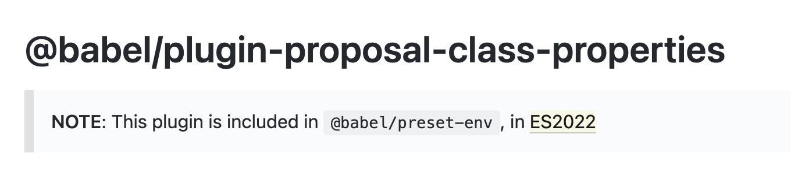

# 49장 Babel과 Webpack을 이용한 ES6+/ES.NEXT 개발 환경 구축
- 대부분의 브라우저에서는 ES6사양을 지원한다.
- 하지만 IE11의 ES6 지원율은 11%이며 구형 브라우저에서는 지원율이 제각각이다.
-
## 49.1 Babel
- ES6+/ES.NEXT로 구현된 최신 사양의 소스코드를 IE 같은 구형 브라우저에서도 동작하는 ES5 사양의 소스코드로 변환(트랜스파일링) 해준다.
```jsx
//ES6(화살표 함수, 지수 연산자)
[1,2,3].map(n => n ** n);

//ES5
[1,2,3].map(function(n){
    return Math.pow(n,n)
})
```

### 49.1.1 Babel 설치
```markdown
# 프로젝트 폴더 생성
$ mkdir esnext-project && cd esnext-project

# package.json 생성
$ npm init -y

# babel-core, babel-cli 설치
$ npm install @babel/core @babel/cli

# 버전 지정 설치
npm install --save-dev @babel/core@7.10.3 @babel/cli@7.10.3 
```

#### 49.1.2 Babel 프리셋 설치와 babel.config.json 설정 파일 작성
- Babel 프리셋 : @babel/preset-env, 함께 사용되어야 하는 Babel 플러그인을 모아 둔 것.
- Babel이 제공하는 공식 Babel 프리셋은 다음과 같다.
```markdown
- @babel/preset-env
- @babel/preset-flow
- @babel/preset-react
- @babel/preset-typescript
```
- 프로젝트 지원 환경은 BrowSerslist 형식으로 .browserslistrc 파일에 상세히 설정할 수 있다.
```markdown
# @babel/preset-env 설치
$ npm install --save-dev @babel/preset-env

```
- package.json
```json
{
  "name": "esnext-project",
  "version": "1.0.0",
  "dependencies": {
    "@babel/cli": "^7.17.6",
    "@babel/core": "^7.17.9",
    "@babel/preset-env": "^7.16.11"
  }
}
```
- 프리셋 설치 후 babel.config.json에서 설정할 수 있다.
```json
{
  "presets" : ["@babel/preset-env"]
}
```

### 49.1.3 트랜스파일링
- 트랜스파일링을 할 때 npm scripts에 Babel CLI 명령어를 등록하여 사용할 수 있다.
- package.json
```json
{
  "name": "esnext-project",
  "version": "1.0.0",
  "scripts" : {
    "build" : "babel src/js -w -d dist/js"
  },
  "dependencies": {
    "@babel/cli": "^7.17.6",
    "@babel/core": "^7.17.9",
    "@babel/preset-env": "^7.16.11"
  }
}
```
- src/js(타깃 폴더)에 있는 모든 자바스크립트 파일들을 트랜스파일링한 후 그 결과물을 dist/js 폴더에 저장한다.
- -w : --watch, 타깃 폴더에 있는 모드 js 파일들의 변경을 감지하여 자동으로 트랜스파일한다.
- -d : --out-dir, 트랜스파일링된 결과물이 저장될 폴더를 지정. 지정된 폴더가 없을시 자동 생성한다.

- 예제 파일 만든 후 npm run build
- 정상적으로 트랜스파일링 되었다.
### 49.1.4 Babel 플러그인 설치
- 현재 preset-env에서는 아래 플러그인을 지원하고 있었다.
<p align="center"></p>

- 필요한 플러그인을 설치
```
$ npm install --save-dev @babel/plugin-proposal-class-properties
```
- babel.config.json 설정 파일에 추가
```
{
  "presets": ["@babel/preset-env"],
  "plugins": ["babel/plugin-proposal-class-properties"]
}

```

- main.js를 실행.
```
$ node dist/js/main

3.141592653589793
36.4621596072079
{ a: 1, b: 2, x: { c: 3, d: 4 } }
10
```
- 플러그인을 설치했다면 babel.config.json 설정 파일에 추가해야 한다.
### 49.1.5 브라우저에서 모듈 로딩 테스트
- 위 예제의 모듈 기능은 Node.js 환경에서 동작한 것이고 Babel이 모듈을 트랜스파일링한 것도 Node.js가 기본 지원하는 CommonJS 방식의 모듈 로딩 시스템에 따른 것이다.
```jsx
"use strict";

var _lib = require("./lib");

console.log(_lib.pi);
console.log((0, _lib.power)(_lib.pi, _lib.pi));
var f = new _lib.Foo();
console.log(f.foo());
console.log(f.bar());
```

- 브라우저는 CommonJS 방식의 require 함수를 지원하지 않으므로 브라우저에서 실행시 에러가 발생한다.
- 이러한 문제는 Webpack을 통해 해결할 수 있다.


## npm, yarn
- package.json
프로젝트 관리, 어떤 모듈을 사용했고, 그 버전을 기록해놓음으로써 어디에서나 동일한 개발환경에서 작업할 수 있도록 해준다.
- npm(Node Package Manager)
node.js로 만들어진 모듈을 쉽게 설치하고 관리할 수 있게 도와주는 관리자.
- package-lock.json
package.json에서는 버전정보를 저장할 때 version range를 사용.(버전이 12면 12이상의 버전을 사용하겠다~)
그래서 동일한 개발환경에서 작업해야할 때 package.json에서 다른 버전으로 설치될 위험이 있으며 이는 곧 문제를 야기할 수 있다.
그래서 package-lock.json에서는 정확한 버전명을 명시하고 있으며, npm i 시 이 lock 파일을 참고하여 모듈을 설치하게 된다.
- 결론 package-lock.json을 꼭 같이 레포지토리에 커밋하자.
-https://junwoo45.github.io/

## 49.2 Webpack
- 의존 관계에 있는 자바스크립트, css, 이미지 등의 리소스들을 하나의 파일로 번들링하는 모듈 번들러.
- 여러 개의 js 파일을 하나로 번들링하기 때문에 html에 script 태그로 여러개의 js 파일을 로드해야하는 번거로움도 사라진다.

### 49.2.1 Webpack 설치
```jsx
$ npm install --save-dev webpack webpack-cli
```
-package.json
```jsx
  "devDependencies": {
    "@babel/cli": "^7.17.6",
    "@babel/core": "^7.17.9",
    "@babel/plugin-proposal-class-properties": "^7.16.7",
    "@babel/preset-env": "^7.16.11",
    "webpack": "^5.72.0",
    "webpack-cli": "^4.9.2"
  }
```
### 49.2.2 babel-loader 설치
- Webpack이 모듈을 번들링할 때 Babel을 사용해서 트랜스파일링되도록 babel-loader를 설치한다.
```
npm install --save-dev babel-loader
```

- npm scripts를 변경하여 Babel 대신 Webpack이 실행되도록 설정한다.
```jsx
"scripts": {
    "build": "webpack -w"
  },
```
### 49.2.3 webpack.config.js 설정 파일 작성
-`webpack.config.js`는 Webpack이 실행될 때 참조하는 설정 파일이다.
```jsx
const path = require('path');

module.exports = {
    //entry file
    entry: './src/js/main.js',
    //번들링된 js 파일의 이름과 저장될 경로(path)를 지정
    output:{
        path: path.resolve(__dirname, 'dist/js'),
        filename:'bundle.js'
    },
    module:{
        rules:[
            {
                // test:∧.js$/,
                include:[
                    path.resolve(__dirname, 'src/js')
                ],
                exclude:/node_modules/,
                use:{
                    loader:'babel-loader',
                    options:{
                        presets:['@babel/preset-env'],
                        // plugins:['@babel/plugin-proposal-class-properties']
                    }
                }
            }
        ]
    },
    devtool: 'source-map',
    mode:'development'
}

```
- npm run build로 번들링을 시키면 dist/js에 bundle.js라는 번들링파일이 생긴다. 이것을 html script 태그로 로드시켜주면 된다.

### 49.2.4 babel-pollyfill 설치
- babel로 트랜스파일링을해도 브라우저에서 지원하지 않는 코드가 남아있을 수 있다.
- ES6에서 추가된 Promise, Object.assign, Array.from 등은 ES5에서 대체할 수 있는 기능이 없기 때문.
- 따라서 IE나 구형 브라우저에서도 이런 기능들을 사용하기 위해서는 @babel/polyfill을 설치해야한다.
```
$ npm install @babel/polyfill
```
- 폴리필은 개발 환경 뿐만 아니라 실제 운영 환경에서도 사용해야한다. 따라서 의존성(dependencies)으로 설치.
- ES6의 import를 사용하는 경우에는 진입점의 선두에서 먼저 폴리필을 로드.
```jsx
//src/js/main.js
import "babel/polyfill";
import {pi, power, Foo} from './lib';
```

- Webpack 사용시 webpack.config.js 파일의 entry배열에 폴리필을 추가
```jsx
const path = require('path');

module.exports = {
  entry:['@babel/polyfill', './src/js/main.js'],
  ...
}