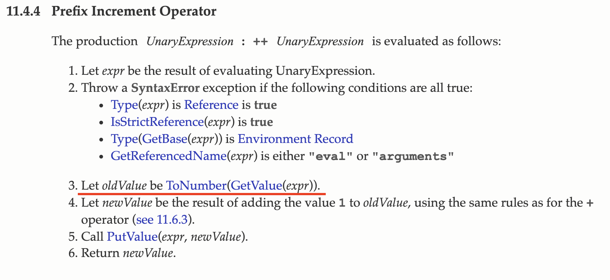

# 7장 연산자

- **연산자**: 하나 이상의 표현식을 대상으로 산술, 할당, 비교, 논리, 타입, 지수 연산 등을 수행해 하나의 값을 만든다.
- **피연산자**: 연산의 대상. 값으로 평가될 수 있는 표현식이 와야한다.

<br>

## 7.1 산술 연산자

- 수학적 계산을 수행해 새로운 숫자 값을 만든다.
- 산술 연산이 불가능한 경우, `NaN`을 리턴한다.
- 피연산자의 개수에 따라 이항/단항 산술 연산자로 구분할 수 있다.

### 7.1.1 이항 산술 연산자

- 종류: +(덧셈), -(뺄셈), \*(곱셈), /(나눗셈), %(나머지)

### 7.1.2 단항 산술 연산자

| 단항 산술 연산자 | 의미                                              | 부수 효과 |
| ---------------- | ------------------------------------------------- | --------- |
| `++`             | 증가                                              | O         |
| `--`             | 감소                                              | O         |
| `+`              | 효과 없음. 음수를 양수로 반전하지도 않는다.       | X         |
| `-`              | 양수를 음수로 음수를 양수로 반전한 값을 리턴한다. | X         |

- `++`(증가), `--`(감소) 연산자는 **피연산자의 값을 변경하는 부수 효과**가 있다. 피연산자의 값을 변경하는 암묵적 할당이 이뤄진다.

  ```javascript
  var x = 1;
  x++; // 암묵적 할당 👉 x = x + 1;
  console.log(x);
  ```

  또한, **위치에 의미**가 있다.
  피연산자 **앞에 위치**할 경우 먼저 피연산자의 값을 증가/감소 시킨 후 다른 연산을 진행한다.
  피연산자 **뒤에 위치**할 경우 \*\*먼저 다른 연산을 진행한 후 피연산자의 값을 증가/감소 시킨다.

  ```javascript
  var x = 5;
  var result;

  // 선할당 후증가
  result = x++;
  console.log(result, x); // 5 6

  // 선증가 후할당
  result = ++x; // 현재 x는 6, 먼저 증가되어서 7, 7을 result에 할당
  console.log(result, x); // 7 7
  ```

- `+`,`-` 연산자**는 숫자타입이 아닌 피연산자를 **숫자로 타입 변환\*\*한다. 이때 피연산자를 변경하는 부수효과(side effect)는 없고 숫자타입으로 변환한 새로운 값을 생성해서 리턴한다.

  ```javascript
  // 아무런 효과가 없다.
  +10; // -> 10
  +-10; // -> -10

  // 문자열을 숫자로 타입 변환한다.
  +'10'; // -> 10

  // 불리언 값을 숫자로 타입 변환한다.
  +true; // -> 1

  // 불리언 값을 숫자로 타입 변환한다.
  +false; // -> 0

  // 문자열을 숫자로 타입 변환할 수 없으므로 NaN을 리턴한다.
  +'Hello'; // -> NaN
  ```

<br>

### 7.1.3 문자열 연결 연산자

- `+`연산자는 피연산자 중 **하나 이상이 문자열인 경우 문자열 연결 연산자로 동작**한다.

  ```javascript
  // 문자열 연결 연산자
  '1' + 2; // '12'

  // 타입변환
  1 + true; // 2(1 + 1)
  1 + false; // 1(false = 0)
  1 + null; // 1(null = 0)

  // undefined는 숫자로 타입 변환되지 않는다
  +undefined; // NaN
  1 + undefined; //NaN
  ```

---

## 7.2 할당 연산자

- 우항에 있는 피연산자의 평가 결과를 좌항에 있는 변수에 할당한다.

  ```javascript
  x = 10;
  console.log(x); // 10

  x += 5; // x = x + 5;
  console.log(x); // 15

  x -= 5; // x = x - 5;
  console.log(x); // 10

  x *= 5; // x = x * 5;
  console.log(x); // 50

  x /= 5; // x = x / 5;
  console.log(x); // 10

  x %= 5; // x = x % 5;
  console.log(x); // 0

  var str = 'My name is ';

  // 문자열 연결 연산자
  str += 'Lee'; // str = str + 'Lee';

  console.log(str); // 'My name is Lee'

  // 할당문은 표현식인 문이다.
  console.log((x = 10)); // 10

  var a, b, c;
  // 연쇄 할당. 오른쪽에서 왼쪽으로 진행.
  // ① c = 0 : 0으로 평가된다
  // ② b = 0 : 0으로 평가된다
  // ③ a = 0 : 0으로 평가된다
  a = b = c = 0;

  console.log(a, b, c); // 0 0 0
  ```

---

## 7.3 비교 연산자

- 좌항과 우항의 피연산자를 비교한 다음 그 결과를 `boolean` 값을 리턴한다.

### 7.3.1 동등/일치 비교 연산자

- **동등 비교 `==`**:
  **암묵적 타입 변환을 통해 타입을 일치시킨 후, 같은 값인지 비교**한다.
  따라서 동등한 비교(느슨한)편리한 경우도 있지만 결과를 예측하기 어렵기 때문에 부작용을 읽으킬 수 있어 사용하지 않는 편이 좋다.

  ```javascript
  // 타입은 다르지만 암묵적 타입 변환을 통해 타입을 일치시키면 동등하다.
  5 == '5'; // -> true

  // 동등 비교. 결과를 예측하기 어렵다.
  '0' == ''; // -> false
  0 == ''; // -> true
  0 == '0'; // -> true
  false == 'false'; // -> false
  false == '0'; // -> true
  false == null; // -> false
  false == undefined; // -> false
  ```

- **일치 비교 `===`**
  **타입도 같고 값도 같은 경우에 한하여 true를 리턴**한다.
  일치 비교 연산자는 예측하기 쉽기 때문에 대부분의 경우 동등 비교보다는 일치 비교를 사용하자.

  ```javascript
  5 == '5'; // -> false
  5 === 5; // -> true
  ```

(주의❗️)

- 일치 비교 연산자에서 주의할 것은 `NaN`과 `0`이다.
- `NaN`은 자신과 일치하지 않는 유일한 값이다. `NaN !== NaN`. 빌트인 함수 `isNaN`을 사용하자!

```javascript
// 빌트인 함수 isNaN은 주어진 값이 NaN인지 체크하고 그 결과를 리턴한다.
isNaN(NaN); // -> true
isNaN(10); // -> false
isNaN(1 + undefined); // -> true
```

- `0`의 경우 양의 0과 음의 0을 비교하였을 때 일치 비교와 동등 비교 둘 다 true를 리턴한다.

```javscript
0 === -0; // -> true
0 == -0 // -> true
```

<br>

- `Object.is`메소드: ES6에서 새롭게 도입된 `Object.is` 메소드는 예측 가능한 정확한 비교 결과를 리턴한다. 마치 일치 비교 연산자(`===`)의 약점을 보안한 메소드이다.

```javascript
//ES6 Object.is method
Object.is(-0, +0); // -> false
Object.is(NaN, NaN); // -> true
```

---

### 7.3.2 대소 관계 비교 연산자

- 피연산자의 크기를 비교하여 불리언 값을 리턴한다.

  ```javascript
  // 대소 관계 비교
  5 > 0; // -> true
  5 > 5; // -> false
  5 >= 5; // -> true
  5 <= 5; // -> true
  ```

---

## 7.4 삼항 조건 연산자

- 조건식의 평가 결과에 따라 리턴할 값을 결정한다.

- `조건식 ? 조건식이 true일때 리턴값 : 조건식이 false일때 리턴값`

- 삼항 연산자 표현식은 **표현식인 문**이다.
  따라서 **값처럼 사용할 수 있다.**

  ```javascript
  var result = x % 2 ? '홀수' : '짝수';
  console.log(result); // 짝수
  ```

-`if...else`문과의 차이: `if...else`문은 표현식이 아닌 문이기 때문에 값으로 사용할 수 없다. 삼항 조건 연산자 표현식은 값으로 평가할 수 있는 표현식인 문이다. 즉 다른 표현식의 일부가 될 수 있다.

---

## 7.5 논리 연산자

- 우항과 좌항의 피연산자(부정 논리 연산자의 경우, 우항의 피연산자)를 논리 연산한다.

1. `||`(OR, 논리합): 둘 중 하나라도 `true`면 `true`를 리턴한다.
2. `&&`(AND, 논리곱): 둘 다 `true`일 경우 `true`를 리턴한다.
3. `!`(NOT, 부정): 피연산자의 불리언 값을 부정한다.

```javascript
true || true; // -> true
true || false; // -> true
false || false; // -> false

true && true; // -> true
true && false; // -> false
false && false; // -> false

!true; // -> false
!false; // -> true
```

- 논리 부정(`!`) 연산자는 언제나 불리언 값을 리턴한다.
  만약 피연산자가 불리언 값이 아니라면 불리언 타입으로 암묵적 타입으로 변환된다.

  ```javascript
  console.log(!0); // -> false
  console.log(!'Hello'); // -> true
  ```

- 논리합(`||`) 또는 논리곱(`&&`) 연산자 표현식의 평가 결과는 불리언 값이 아닐 수도 있다. 논리합(||) 또는 논리곱(&&) 연산자 표현식은 **언제나 2개의 피연산자 중 어느 한쪽으로 평가**된다. 👉 단축평가

  ```javascript
  // 단축 평가
  'Cat' && 'Dog'; // -> 'Dog'
  ```

---

## 7.6 쉼표 연산자

- 왼쪽 피연산자부터 차례대로 피연산자를 평가하고 마지막 피연산자의 평가가 끝나면 마지막 피연산자의 평가 결과를 리턴한다.

  ```javascript
  var x, y, z;

  (x = 1), (y = 2), (z = 3); // 3
  ```

---

## 7.7 그룹 연산자

- 그룹 연산자를 사용하면 연산자의 우선 순위를 조절할 수 있다. (가장 높은 우선순위)

  ```javascript
  // 그룹 연산자를 사용하여 우선 순위 조절
  10 * (2 + 3); // -> 50
  ```

---

## 7.8 typeof 연산자

- 피연산자의 데이터 타입을 **문자열**로 리턴한다.

- 7가지 문자열 “string”, “number”, “boolean”, “undefined”, “symbol”, “object”, “function” 중 하나를 리턴한다.

- (주의❗️) `typeof null`은 "object"를 반환한다. (버그)
  따라서, null 타입을 확인할 때는 typeof 연산자를 사용하지 말고 일치 연산자(===)를 사용하자.

- 또한, 선언하지 않은 식별자를 typeof 연산자로 연산해 보면 ReferenceError가 발생하지 않고 “undefined”를 리턴

  ```javascript
  typeof ''; // -> "string"
  typeof 1; // -> "number"
  typeof NaN; // -> "number"
  typeof true; // -> "boolean"
  typeof undefined; // -> "undefined"
  typeof Symbol(); // -> "symbol"
  typeof null; // -> "object"
  typeof []; // -> "object"
  typeof {}; // -> "object"
  typeof new Date(); // -> "object"
  typeof /test/gi; // -> "object"
  typeof function () {}; // -> "function"

  // 식별자 undeclared는 선언한 적이 없다.
  typeof undeclared; // -> undefined
  ```

---

## 7.9 지수 연산자

- `좌항(밑) ** 우항(지수)`

- ES7부터 도입되었다. 그 전에는 `Math.pow` 메소드를 사용하였다.
- 음수를 거듭제곱의 밑으로 계산하려면 아래와 같이 괄호로 묶어야 한다.

  ```javascript
  2 ** 2; // -> 4
  2 ** 2.5; // -> 5.65685424949238
  2 ** 0; // -> 1
  2 ** -2; // -> 0.25
  (-5) ** 2; // -> 25

  var num = 5;
  num **= 2; // -> 25

  //ES7 이전
  Math.pow(2, 2); // -> 4
  Math.pow(2, 2.5); // -> 5.65685424949238
  Math.pow(2, 0); // -> 1
  Math.pow(2, -2); // -> 0.25
  ```

---

## 7.10 그 외의 연산자

아래의 연산자들은 이후에 오는 챕터들에서 더욱 자세하게 살펴보자.
| 연산자 | 개요 |
| ------ | -------|
| `?.` | 옵셔널 체이닝 연산자 |
| `??` | null 병합 연산자 |
| `delete` | 프로퍼티 삭제|
| `new` | 생성자 함수를 호출할 때 사용하여 인스턴스를 생성|
| `instanceof` | 좌변의 객체가 우변의 생성자 함수와 연결된 인스턴스인지 판별|
| `in` | 프로퍼티 존재 확인|

---

## 7.11 연산자의 부수 효과

- **연산자의 부수효과**란 연산 이후에 피연산자를 사용하는 다른 코드에 영향이 가는 것을 의미한다.

1. 할당(`=`) 연산자
2. 증가/감소(`++`/`--`) 연산자
3. `delete` 연산자

```javascript
var x;

// 할당 연산자는 변수 값이 변하는 부수 효과가 있다.
// 이는 변수 x를 사용하는 다른 코드에 영향을 준다.
x = 1;
console.log(x); // 1

// 증가/감소(++/--) 연산자는 피연산자의 값을 변경하는 부수 효과가 있다.
// 피연산자 x의 값이 변경된다. 이는 변수 x를 사용하는 다른 코드에 영향을 준다.
x++;
console.log(x); // 2

var o = { a: 1 };

// delete 연산자는 객체의 프로퍼티를 삭제하는 부수 효과가 있다.
// 이는 객체 o를 사용하는 다른 코드에 영향을 준다.
delete o.a;
console.log(o); // {}
```

---

## 7.12 연산자 우선순위

- 연산자의 우선순위란 여러 개의 연산자로 이뤄진 문이 실행될 때 연산자가 실행되는 순서를 의미한다.
- 연산자의 우선순위를 모두 기억하기 어렵고 실수하기 쉽다. 따라서, 우선순위가 가장 높은 그룹 연산자를 사용하여 명시적으로 조절하는 것을 권장한다.

---

## 7.13 연산자 결합 순서

- 연산자의 결합 순서란 연산자의 어느 쪽(좌항 또는 우항)부터 평가를 수행할 것인지를 나타내는 순서를 말한다.

- 좌항 👉 우항: `+`, `-`, `/`, `%`, `<`, `<=`, `>`, `>=`, `&&`, `||`, `.`, `[]`, `()`, `??`, `?.`, `in`, `instanceof`

- 우항 👉 좌항:

---

---

**Quiz**

1. 아래 코드의 출력값은 무엇일까?

   ```javascript
   var name = 'joo';
   name++;
   console.log(name); // ?
   ```

   <details>
   <summary>답</summary>
   <code>NaN</code>
   </details>
   <details>
   <summary>해설</summary>
   <p>
   먼저 학습한 내용을 토대로 추측해보자.

   1️⃣ `++`연산자의 부수 효과로 인해 `name++` 부분을 `name = name + 1`게 볼 수 있다. (암묵적 할당)

   2️⃣ `+`연산자는 피연산자 중 하나 이상이 문자열일 경우 문자열 연결 연산자로 동작한다. `name = name + 1`에서 `name`의 타입은 문자열이다.

   3️⃣ 따라서, `'joo1'`이 출력된다.</p>

   그렇다면 왜 `NaN`이 출력됬을까? 🧐

   ECMAScript 스펙을 들여다보면 한 가지 놓친점을 발견하게 된다.

   

   3번과 4번을 주목해서 보자.
   3번에서 피연산자가 숫자타입으로 **타입변환**되었다. 그리고 그 이후에 4번에서 **암묵적 할당**이 이루어졌다.
   즉, `name++`는 아래와 같이 재해석할 수 있다.

   ```javascript
   var name = 'joo';

   name = Number(name); // Number('joo') => NaN
   name = name + 1; // name = NaN + 1 => NaN

   console.log(name); // NaN
   ```

   **결론**: `++/--` 연산자는 피연산자의 **타입변환과 값을 변경시키는 부수효과**가 있다.

   </details>

<br>

2. 아래 코드의 출력값은 무엇일까?

   ```javascript
   var str = '1';
   str += 1;

   var result = typeof str === string ? 'string' : 'number';
   console.log(result);
   ```

   <details>
     <summary>답</summary>
     <code>ReferenceError</code>
   </details>
   <details>
     <summary>해설</summary>
     <code>

   ```javascript
   var str = '1';

   str += 1; // // str = str + 1 -> str = '11'(+는 문자열 연결 연산자로 동작)

   var result = typeof str === string ? 'string' : 'number'; // typeof 연산자의 리턴값은 문자열. 자바스크립트 엔진은 string이라는 식별자를 찾을 수 없다. 따라서, ReferenceError:string is not defined가 발생한다.

   console.log(result);
   ```

     </code>

   </details>
